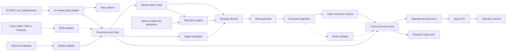

# q-trad pre-implementation architecture

**Document type:** PREPLAN  
**Status:** Draft for review; not an implementation commitment  
**Current context:** 2 July 2026, Australia/Sydney  
**Primary scope:** intraday research and paper trading, with holdings measured in minutes to hours  
**Initial integration:** IG Markets market data and demo environment  
**Future integration:** IG live and Interactive Brokers (IBKR), subject to separate readiness gates

## How to use this document

This document establishes the vocabulary, boundaries, invariants, unresolved decisions and validation gates needed to produce a later `PLAN.md`. It deliberately does not select every implementation detail or imply that a toy strategy is suitable for live trading.

The following labels are normative:

- **DECIDED** — an architectural constraint unless explicitly revised.
- **PROPOSED** — a preferred starting point requiring confirmation in `PLAN.md`.
- **OPEN** — insufficiently specified or requiring a research spike.
- **DEFERRED** — deliberately outside the first vertical slice.

---

## 1. Executive summary

q-trad is a broker-neutral, event-driven framework for collecting market data, running intraday strategy experiments, simulating execution, attributing outcomes to the components that caused them, and eventually submitting guarded live orders. It is not initially an alpha-research programme, a high-frequency trading system, or a complete portfolio-management platform.

The main architectural objective is to establish one canonical internal language for instruments, market data, decisions, orders, fills, positions and P&L while preserving broker-specific facts at the edges. The same signal strategy and strategy sleeve contracts should run in historical replay, live-data paper trading and live trading. “The same contracts” does not mean “the same outcomes”: clocks, feed quality, latency, liquidity, broker rules and fills differ by environment and must remain explicit.

The first runnable slice should prove a traceable chain:

> IG market update → normalised market event → strategy decision → sleeve instruction → allocation/risk decision → paper order → simulated fill → virtual position and P&L → operator-console drill-down

It must also prove the negative path: an unallocated strategy continues to run in shadow mode, remains visible, produces hypothetical instructions and paper outcomes, but cannot create a live broker order.

### Main non-goals for the first phase

- Finding or claiming profitable signal strategies.
- Building a sophisticated market-state model or regime classifier.
- Optimising allocation using unstable covariance estimates or recent performance.
- Reproducing exchange-level queue dynamics from IG quote or bar data.
- Supporting every IG or IBKR product and order type.
- Building a distributed microservice estate, Kubernetes deployment, mobile application or multi-user entitlement system.
- Treating backtest, paper and live results as economically equivalent.
- Allowing unattended live trading before reconciliation, recovery, risk and operational gates are met.

### Recommended architectural stance

**PROPOSED:** build a modular monolith first. Run ingestion, strategy orchestration, paper execution, accounting, projections and the query API as separately testable Python modules in one deployable runtime, with PostgreSQL and a file-based research store as external dependencies. Split processes only where failure isolation or independent lifecycle warrants it—initially the long-running IG ingestion worker and the operator-console/API process are plausible process boundaries.

**DECIDED:** the broker account is not the source of truth for sleeve or signal-strategy attribution. Broker positions can net activity from several internal owners. q-trad therefore needs internal virtual ledgers, plus a distinct broker-account ledger and reconciliation process.

---

## 2. Terminology and conceptual cleanup

### 2.1 Wording translation

| Earlier or overloaded wording | Use in q-trad | Reason |
|---|---|---|
| Front end | **Operator console** | It is an operational and analytical control surface, not merely a presentation tier. |
| Trader selection layer | **Allocation engine** | The component assigns or withholds capital/risk budgets; it does not “select traders” as people. |
| Trader | **Strategy sleeve** or **strategy controller** | A sleeve owns policy and coordinates subordinate signal strategies. |
| Algorithm | **Signal strategy** | This component decides desired exposure or entry/exit intent. |
| Order algorithm | **Execution algorithm** | Reserved for order placement and order-working logic. |
| Regime view | **Market-state model** or **regime classifier** | Names the output and acknowledges that classification is a model, not an objective market fact. |
| Broker integration | **Broker adapter** | Translates canonical requests/events to and from IG- or IBKR-specific semantics. |
| Fake/demo broker | **Paper execution engine** | q-trad-owned simulated fills. An IG demo account remains an external broker environment, not q-trad paper execution. |
| Database/backend | **Canonical event store**, **operational projections**, and **research data store** | These stores have different integrity, query and retention needs. |
| Trade | **Order**, **fill**, **position change**, or **round trip**, as appropriate | “Trade” is too ambiguous for an audit trail. |
| P&L | **Realised**, **unrealised**, **gross**, **cost**, or **net P&L**, with currency and valuation time | A bare P&L number is not sufficiently defined. |
| Paper mode | **Execution mode: PAPER** | A runtime route to q-trad’s paper execution engine. |
| Shadow mode | **Capital mode: SHADOW** | A strategy continues to evaluate and is paper-accounted but receives no deployable allocation. |

### 2.2 Major component definitions

- **Operator console:** a read-mostly control surface for health, decisions, exposures, attribution, orders, fills and P&L. Mutating controls are narrowly scoped and audited.
- **API/backend services:** application services that coordinate commands and expose stable query contracts; they are not the canonical store.
- **Market data adapter:** obtains live or historical data from a provider and emits raw adapter records plus normalised market events.
- **Canonical event store:** append-oriented record of accepted domain facts and commands, with stable identifiers, ordering metadata and schema versions.
- **Operational projection:** a rebuildable, query-optimised view such as current positions, latest strategy health or open orders.
- **Research data store:** immutable or versioned columnar datasets and derived features suitable for replay and analysis.
- **Instrument master:** q-trad’s identity and specification registry. It maps a stable internal instrument ID to time-bounded broker/provider identifiers and contract details.
- **Market-state model:** a versioned component that turns observable market features into labelled state and confidence/quality metadata. In v1 it is trivial scaffolding.
- **Allocation engine:** converts sleeve eligibility and portfolio context into explicit capital or risk budgets. It never emits broker orders.
- **Strategy sleeve:** a controller that owns a coherent mandate, evaluates one or more signal strategies, and resolves their instructions according to declared policy.
- **Signal strategy:** deterministic decision logic, given an input event stream, configuration, state and clock. It emits an intent or target, not a broker-specific order.
- **Intent:** a versioned statement of desired economic action or target exposure with provenance, validity and rationale fields.
- **Execution algorithm:** converts approved execution instructions into one or more canonical orders and manages their working lifecycle.
- **Risk guardrail:** a deterministic pre-trade or runtime check that approves, clips, rejects or halts activity and records why.
- **Paper execution engine:** a simulator that accepts canonical orders and emits canonical order/fill events using an explicit fill model.
- **Broker adapter:** a boundary that translates canonical instruments and order operations into a broker API, then converts broker callbacks and snapshots back into canonical events.
- **Virtual ledger:** q-trad’s accounting view for one attributable owner, such as a signal strategy or sleeve, independent of broker netting.
- **Broker ledger:** q-trad’s reconstructed view of broker-reported orders, fills, positions, cash and charges.
- **Reconciliation:** comparison of canonical internal state, adapter observations and broker state, producing explicit breaks rather than silently overwriting history.
- **Run:** one identifiable execution of a configured graph in `BACKTEST`, `PAPER` or `LIVE` execution mode.

### 2.3 Modes are separate dimensions

Avoid a single `mode` field that mixes unrelated concepts.

| Dimension | Initial values | Meaning |
|---|---|---|
| Execution mode | `BACKTEST`, `PAPER`, `LIVE` | Clock/data source and where approved orders are routed. |
| Capital mode | `ALLOCATED`, `SHADOW`, `DISABLED` | Whether a sleeve/strategy may influence deployable exposure. |
| Data mode | `HISTORICAL_REPLAY`, `LIVE`, `DELAYED`, `STALE` | Origin and freshness of market data. |
| Broker environment | `NONE`, `IG_DEMO`, `IG_LIVE`, `IBKR_PAPER`, `IBKR_LIVE` | External account endpoint, if any. |

**Invariant:** `SHADOW` always routes its hypothetical orders to an isolated paper ledger. It must not become live merely because the enclosing run uses live market data or has a live broker adapter.

---

## 3. Core critique of the idea

### 3.1 What is sensible

1. **Infrastructure before profitability is the correct ordering.** Data provenance, accounting, replay, safety and inspectability are prerequisites for trustworthy research.
2. **A small liquid universe is operationally appropriate.** It contains symbol mapping, session and data-quality work without immediately creating a subscription or reconciliation problem.
3. **Layering signal generation, allocation and execution is sound.** It prevents a moving-average example from becoming coupled to IG order fields or portfolio policy.
4. **Keeping inactive components in shadow mode is useful.** It allows readiness and behavioural comparison without granting capital.
5. **IG-first adoption with an IBKR portability requirement is feasible if portability means internal boundaries, not product equivalence.**
6. **Drill-down by causal ownership is essential.** Portfolio totals alone conceal strategy interaction, internal crossing and broker netting.

### 3.2 What is missing

- A precise internal instrument and product model. An IG cash CFD, IG dated future and an IBKR cash FX, future, ETF or CFD are not interchangeable exposures.
- The initial Australian legal entity/account capabilities, market-data entitlements, account currency and whether CFDs are available at IBKR for that account.
- An accounting policy: cost basis, currency conversion, spread/commission/financing treatment and valuation source.
- A strategy conflict policy when signal strategies or sleeves want opposing exposure in the same instrument.
- A definition of “capital” for leveraged products. Notional, margin, loss budget and risk limit are different.
- Expected bar resolutions and whether decisions consume bid/ask quotes, midpoint bars or broker-provided candles.
- Service-level objectives for data staleness, restart recovery and alerting.
- Operator identity and approval semantics for eventual live controls.
- A credible source and licensing policy for historical data beyond constrained broker backfill.
- A failure/recovery specification for ambiguous submissions, late fills and broker corrections.

### 3.3 What is risky or too vague

#### “Broker-neutral”

Broker-neutral must not mean a lowest-common-denominator API that pretends all products and orders are equal. The core should express economic intent and a conservative canonical order subset, while adapters expose capabilities and reject unsupported translations. Broker-native extensions may exist in an explicitly namespaced field, but signal strategies must not depend on them.

#### Hierarchical strategy control

Allocation engine → sleeve → signal strategy is useful for attribution but can become ceremony. With one toy strategy, every layer risks being a pass-through object. Retain the interfaces and identifiers, but implement only one trivial policy per layer until two genuinely different children require aggregation.

#### Market-state switching

A market-state label can encourage false precision and hidden look-ahead. In v1 it should be a deterministic placeholder whose output is recorded, versioned and never presented as truth. Sophisticated regime work is **DEFERRED**.

#### Covariance-aware allocation

Short samples, changing correlations, costs and correlated strategy errors make optimiser outputs unstable. The first allocator should be a capped equal-risk or fixed-weight baseline with minimum history/health gates. Optimisation is **DEFERRED** until it beats a simple baseline under time-ordered, cost-aware validation.

#### “Paper trading”

There are at least three different tests:

1. historical replay through q-trad’s paper execution engine;
2. live market data through q-trad’s paper execution engine;
3. orders sent to IG demo or IBKR paper.

They reveal different defects. None proves live fill quality.

#### Attribution under netting

If two signal strategies respectively want +2 and -1 units, the broker may see only +1. q-trad must retain both virtual allocations and any internal netting decision. It must not invent two broker fills where only one occurred without an explicit allocation method. This is a central design problem, not a reporting detail.

### 3.4 What should be deferred

- Statistical regime classification, strategy ranking and automated strategy retirement.
- General mean-variance or machine-learning allocation.
- Smart order routing, exchange microstructure simulation and order-book queue models.
- Multi-account, multi-user and multi-tenant operation.
- Corporate actions, options, complex derivatives and broad multi-asset support.
- High-availability clustering and geographically redundant deployment.
- Tick-scale distributed processing.
- Automated live failover between brokers.

### 3.5 Interfaces or stubs first

| Area | First implementation |
|---|---|
| Market-state model | Constant or simple volatility bucket; record model/version/features. |
| Allocation engine | Fixed weights/caps plus health and data-freshness gates. |
| Strategy sleeve | One explicit child-selection/aggregation policy. |
| Signal strategies | Moving-average crossover and breakout placeholders only. |
| Execution algorithm | Immediate canonical marketable order or conservative limit-order stub; no smart working. |
| Risk | Hard deterministic limits and kill switches, not VaR optimisation. |
| Paper execution | Quote/bar-aware deterministic fill model with costs and explicit limitations. |
| Broker adapter | IG market data first; order endpoints initially disabled behind capability and safety gates. |
| Analytics | Correct attribution, exposure and P&L decomposition before advanced ratios. |

---

## 4. System context and principles

### 4.1 Context



Arrows show information flow, not deployment units. The canonical event store is the durable audit boundary; an in-process event dispatcher may carry events during v1, provided accepted events are durably recorded before dependent irreversible actions.

For later live submission, persist the approved order command and an outbox/dispatch record in one transaction before the broker call. Dispatch and acknowledgement are separate events. This closes the crash window between “decision recorded” and “external side effect attempted”.

### 4.2 Principles and invariants

1. **Broker-neutral core, broker-aware boundary.** Canonical types never contain `epic`, `dealId`, `conId` or IB order classes as primary identity. Mapping tables and adapter metadata preserve them.
2. **Semantic consistency, not simulated equivalence.** Backtest, paper and live use common domain commands/events and strategy contracts; environment-specific clocks, data quality, execution and costs are explicit.
3. **Decisions precede orders.** Signal strategies emit intents. Sleeves aggregate them. The allocation engine sets budgets. Risk approves executable quantity. Execution algorithms create orders. Broker adapters translate orders.
4. **Attribution is first-class.** Every intent, allocation, risk decision, order and fill carries causation/correlation identifiers and the responsible run, sleeve and signal-strategy identifiers where applicable.
5. **Append facts; rebuild views.** Events are immutable. Corrections are new events. Current-state tables are projections that can be regenerated.
6. **Idempotency at every external boundary.** Duplicate input or callback handling must not create duplicate fills, positions or orders.
7. **UTC internally.** Store instants as timezone-aware UTC. Preserve source timezone/session calendar metadata. Display Australia/Sydney or venue time only at presentation boundaries.
8. **Two timestamps are insufficient only when provenance is lost.** Market events should normally carry source/event time, adapter receive time and persisted time; commands also carry decision time.
9. **No silent coercion.** Unsupported order features, stale data, missing mappings and unknown broker outcomes generate explicit denial, quarantine or reconciliation events.
10. **Live is default-deny.** The absence of configuration, credentials, mapping, health or approval prevents live submission.
11. **Observability is domain-level.** Logs alone are not enough. Heartbeats, lag, state transitions, rejections, reconciliation breaks and model decisions are queryable facts.
12. **Determinism where practical.** Historical replay fixes input dataset version, configuration, code version, clock and random seed. Paper randomness, if introduced, is seeded and recorded.
13. **Money and quantity are not binary floats.** Use decimal/fixed-precision values with explicit currency, unit, multiplier and rounding rules.
14. **Capability negotiation.** Adapters publish supported data types, order types, time-in-force values, modification semantics and account features.
15. **One source of causal truth.** The canonical event store owns q-trad history; research tables and UI projections may be rebuilt and must not mutate it.
16. **Reconciliation does not rewrite attribution.** Broker facts can correct broker-ledger state but cannot silently reassign internal ownership.

---

## 5. Proposed layered architecture

### 5.1 Operator console

- **Purpose:** show current and historical system state, causal drill-down, health and guarded controls.
- **Inputs:** query-layer DTOs, streamed health/status updates, authenticated operator commands.
- **Outputs:** views; audited commands such as pause sleeve, acknowledge alert or arm/disarm a future live route.
- **State owned:** presentation preferences and command UI state only; never positions or P&L truth.
- **Failure modes:** stale display, misleading aggregation, cached mode label, duplicate command, unavailable API.
- **Implement now:** portfolio/sleeve/strategy/instrument/order drill-down, mode badges, freshness indicators and paper/shadow results.
- **Stub/open:** live arming, role-based access and mobile layout.

### 5.2 API/backend services

- **Purpose:** enforce application workflows around domain commands and expose stable query contracts.
- **Inputs:** operator commands, adapter messages, scheduled jobs and query requests.
- **Outputs:** validated domain commands, accepted events and query DTOs.
- **State owned:** short-lived workflow state and idempotency records; durable facts remain in stores.
- **Failure modes:** partial workflow, duplicate request, stale projection, incompatible schema.
- **Implement now:** health, run control, read/query endpoints, replay-safe command handlers and idempotency keys.
- **Stub/open:** multi-user authorisation and remote public API.

### 5.3 Market data ingestion services

- **Purpose:** collect raw provider messages, normalise them and monitor continuity/freshness.
- **Inputs:** IG REST responses, Lightstreamer updates and later historical/IBKR feeds.
- **Outputs:** raw records; canonical quote/bar/instrument-status events; gap and heartbeat events.
- **State owned:** connection/session status, subscription registry, cursors and deduplication window.
- **Failure modes:** disconnect, expired token, quota breach, reordering, duplicates, field omission, stale-but-connected stream.
- **Implement now:** small IG universe, rate budgeting, reconnect/backoff, raw capture, normalisation and gap detection.
- **Stub/open:** IBKR data adapter, tick/depth support and multi-provider consolidation.

### 5.4 Canonical event store

- **Purpose:** durable audit record of accepted commands, domain events and external observations.
- **Inputs:** validated events with identity, causation, sequence and schema metadata.
- **Outputs:** ordered streams for recovery, replay, projections and audit.
- **State owned:** immutable event envelopes, stream versions, adapter offset/idempotency records and projection checkpoints.
- **Failure modes:** write unavailability, duplicate event, ordering conflict, schema incompatibility, unbounded growth.
- **Implement now:** PostgreSQL append-only event table, per-stream optimistic sequencing, JSON payload plus indexed envelope fields, backups and projection rebuild.
- **Stub/open:** partition strategy at scale, cryptographic tamper evidence and external event broker.

### 5.5 Research data store

- **Purpose:** efficient time-series analysis and reproducible datasets without loading operational tables.
- **Inputs:** raw capture, validated canonical market events and versioned derived datasets/features.
- **Outputs:** immutable Parquet datasets, manifests and replay iterators.
- **State owned:** dataset versions, partitions, lineage, quality results and feature definitions.
- **Failure modes:** silent mutation, partition overlap, leakage, mixed schemas, missing lineage.
- **Implement now:** local Parquet partitioned by provider/data type/instrument/date, queried with DuckDB or Polars; manifest hashes and coverage reports.
- **Stub/open:** object storage, catalog service, licensed third-party history and
  candle-outlier detection.

**OPEN:** detect implausible candle spikes before datasets are approved for backtesting.
The quality result should retain enough tick-level lineage to identify whether a minute's
high or low came from a single anomalous tick rather than sustained prices. Detection
must not rewrite raw capture or canonical events. If normalised data is later justified,
publish it as a separate versioned derived dataset with the detection rule, affected
observations and source lineage recorded in its manifest.

### 5.6 Instrument master and symbol mapping

- **Purpose:** separate stable economic identity from provider symbols and time-bounded tradable contracts.
- **Inputs:** curated definitions, IG market metadata and later IBKR contract details.
- **Outputs:** canonical `Instrument`, `TradableContract`, `VenueListing` and mapping resolutions.
- **State owned:** IDs, asset/product type, currencies, tick/size rules, multiplier, session calendar, validity dates and provider aliases.
- **Failure modes:** wrong contract, expired alias, currency/multiplier error, ambiguous symbol or mapping drift.
- **Implement now:** explicit entries for the small universe, effective-dated IG EPIC mappings, validation against broker metadata and fail-closed resolution.
- **Stub/open:** automated discovery, continuous futures and cross-provider equivalence.

### 5.7 Market-state model interface

- **Purpose:** expose versioned market-state observations without embedding regime logic in sleeves.
- **Inputs:** approved market features, clock and instrument/basket context.
- **Outputs:** `MarketStateObservation` with label, scores, confidence/quality, feature timestamp and model version.
- **State owned:** declared rolling state and model artefact version.
- **Failure modes:** stale features, look-ahead, unstable labels, missing output or incompatible model.
- **Implement now:** constant state or deterministic volatility bucket, with full provenance.
- **Stub/open:** training pipeline, probabilistic regimes and allocator use.

### 5.8 Allocation engine interface

- **Purpose:** set sleeve-level deployable budgets and shadow status using eligibility, exposure and policy.
- **Inputs:** sleeve health/readiness, virtual-ledger metrics, current exposure, hard portfolio limits and optional market-state observations.
- **Outputs:** versioned allocation decisions containing budget type, amount, constraints, validity and rationale.
- **State owned:** policy configuration, latest accepted allocation and cooldown/eligibility state.
- **Failure modes:** unstable weights, stale inputs, over-allocation, accidental shadow promotion, divide-by-zero/currency errors.
- **Implement now:** fixed capped allocation and explicit zero allocation for shadow sleeves; simple health/data gates.
- **Stub/open:** covariance estimation, optimisation, automatic promotion and adaptive capital.

### 5.9 Strategy sleeve interface

- **Purpose:** coordinate subordinate signal strategies under one mandate and preserve child attribution.
- **Inputs:** signal intents, market-state observations, sleeve configuration, allocation budget and virtual positions.
- **Outputs:** sleeve-level desired targets or explicitly rejected/suppressed child intents.
- **State owned:** child lifecycle, aggregation policy, sleeve target and declared readiness.
- **Failure modes:** contradictory children, double counting, stale child, unclear priority or accidental activity while disabled.
- **Implement now:** one sleeve with a deterministic aggregation policy and at least one shadow child.
- **Stub/open:** dynamic child selection and complex internal netting.

### 5.10 Signal strategy interface

- **Purpose:** transform ordered market events into attributable desired exposure.
- **Inputs:** canonical market events, read-only position/ledger view, configuration and injected clock.
- **Outputs:** `SignalIntent` such as target quantity/notional or flatten, with validity and reason.
- **State owned:** minimal serialisable rolling indicator state and last decision.
- **Failure modes:** exception, NaN, look-ahead, repeated intent storm, stale input or non-recoverable state.
- **Implement now:** deterministic moving-average crossover and optional breakout placeholder.
- **Stub/open:** training, parameter search and any profitability claim.

### 5.11 Execution algorithm interface

- **Purpose:** convert an approved execution instruction into canonical order commands and manage order working.
- **Inputs:** approved target delta, market snapshot, adapter capabilities and working-order state.
- **Outputs:** submit/modify/cancel commands and execution-algorithm status events.
- **State owned:** parent instruction, child orders, deadlines and completion status.
- **Failure modes:** duplicate submission, stale quote, partial fill loop, unsupported modification or runaway repricing.
- **Implement now:** deterministic single-order policy with explicit time-in-force and maximum staleness.
- **Stub/open:** TWAP/VWAP, adaptive limit working and venue selection.

### 5.12 Risk checks and guardrails

- **Purpose:** prevent orders or runtime states that breach declared safety constraints.
- **Inputs:** proposed instruction/order, prices, positions, cash/margin proxy, mode, health and limits.
- **Outputs:** approve, clip, deny, halt or require operator acknowledgement, always with reason codes.
- **State owned:** versioned limit set, halt state and breach/acknowledgement history.
- **Failure modes:** stale exposure, inconsistent units, fail-open dependency, limit bypass or alert flood.
- **Implement now:** allowed universe, size/notional caps, aggregate gross/net caps, price sanity, data freshness, order-rate limit, daily loss stop and default-deny live route.
- **Stub/open:** broker-margin replica, scenario risk, VaR and cross-asset stress.

### 5.13 Paper execution engine

- **Purpose:** turn canonical orders into simulated order and fill events under an explicit model.
- **Inputs:** canonical orders, quote/bar events, instrument rules, costs, latency and session state.
- **Outputs:** acknowledgements, rejections, partial/full fills, cancellations, fees and model diagnostics.
- **State owned:** simulated venue order book/state, deterministic sequence, fill model and virtual account state.
- **Failure modes:** look-ahead fills, impossible prices, fills during closed/stale markets, ignored spread, optimistic liquidity and duplicate fills.
- **Implement now:** deterministic quote-aware market/limit model for the chosen data; configurable latency, spread, slippage and fees; no fill if evidence is insufficient.
- **Stub/open:** queue position, depth consumption and broker-specific margin liquidation.

### 5.14 Broker adapters

- **Purpose:** isolate external connectivity, capability discovery and translation.
- **Inputs:** canonical subscription/order commands, credential/configuration and broker callbacks/snapshots.
- **Outputs:** normalised events, raw evidence, capability descriptors and reconciliation snapshots.
- **State owned:** sessions, subscriptions, broker ID mappings, request throttles and unresolved command registry.
- **Failure modes:** authentication expiry, outage, rate limit, ambiguous submit, out-of-order callback, broker correction and semantic mismatch.
- **Implement now:** IG market data and instrument metadata; keep IG order submission disabled until a later explicit gate. If demo order connectivity is explored, isolate it from q-trad paper accounting.
- **Stub/open:** production IG execution and all IBKR connectivity.

### 5.15 Analytics, metrics and reporting

- **Purpose:** calculate operational health, exposure, attribution, P&L and comparable paper/shadow diagnostics.
- **Inputs:** canonical events, prices, instrument metadata and projection checkpoints.
- **Outputs:** query projections, time-series metrics, alerts and reproducible reports.
- **State owned:** rebuildable aggregates, valuation snapshots and metric-definition versions.
- **Failure modes:** double counting, mixed currencies, survivorship bias, stale marks, inconsistent metric windows.
- **Implement now:** event counts/lag, positions, gross/net exposure, realised/unrealised/cost P&L and drawdown by portfolio/sleeve/strategy/instrument.
- **Stub/open:** advanced performance attribution, factor models and allocator optimisation metrics.

---

## 6. Data handling plan

### 6.1 Data flow

1. Capture the provider payload or a lossless practical representation before normalisation.
2. Add adapter receipt metadata without mutating provider fields.
3. Validate identity, timestamp, numeric ranges and schema.
4. Resolve the provider identifier through the effective-dated instrument mapping.
5. Emit a canonical event or quarantine record with a reason.
6. Append accepted events to the canonical event store.
7. Update operational projections idempotently.
8. Materialise versioned research partitions asynchronously.

Do not make the research data store part of the live order path.

### 6.2 Live ingestion

For IG, use REST for session establishment, market/instrument metadata, snapshots and constrained history; use Lightstreamer for prices, account and trade notifications where relevant. The official guide states that streaming uses session-derived CST/X-SECURITY-TOKEN credentials rather than OAuth bearer tokens directly, and the server address returned by `/session` must not be hard-coded. It also documents a default 40 simultaneous subscription limit and the need to handle reconnect/re-authentication ([IG streaming guide](https://labs.ig.com/streaming-api-guide.html)).

Each subscription requires:

- a stable subscription specification in configuration;
- connection/session identity;
- expected fields and update semantics;
- last source/receive timestamp;
- reconnect count and gap interval;
- data-quality status: `HEALTHY`, `DELAYED`, `STALE`, `GAPPED`, `QUARANTINED`;
- a rate/quota budget for REST recovery calls.

Connection health is not data health. A connected stream with no updates during an active expected session must become stale according to instrument-specific thresholds.

### 6.3 Backfill

Backfill has three uses: cold-start warm-up, gap repair and research history. They require separate policies.

- **Warm-up:** request only enough data to initialise rolling strategy state.
- **Gap repair:** identify exact missing intervals and backfill idempotently; never overwrite raw live capture.
- **Research:** produce a versioned dataset and coverage report; broker history is a seed, not assumed to be a permanent warehouse.

IG’s published defaults currently include 10,000 historical data points per week, 30 non-trading requests per account per minute and 60 non-trading requests per application per minute. Availability varies by resolution; for example, the official FAQ indicates materially shorter retention for minute data than daily data ([IG API FAQ](https://labs.ig.com/faq.html)). These are operational inputs to a runtime quota manager, not constants embedded in domain code.

**PROPOSED:** start recording the live feed immediately and treat local capture as the primary growing intraday history. A later `PLAN.md` must choose whether licensed third-party data is required.

### 6.4 Raw versus normalised storage

| Store | Content | Mutation policy | Main use |
|---|---|---|---|
| Raw capture | Provider payload, headers/field names, adapter version, receive time | Append only; redact secrets | Forensics and re-normalisation |
| Canonical event store | Validated domain event envelope and payload | Append correction events; no in-place fact edits | Audit, recovery and projections |
| Operational projections | Current positions, latest status, open orders, metrics | Rebuildable/updatable | Operator queries |
| Research data store | Normalised market data, derived bars/features, manifests | Immutable versioned datasets | Replay and analysis |
| Quarantine | Invalid/unmapped payload plus reason | Append and resolve explicitly | Data-quality workflow |

Secrets, session tokens and full credentials must never enter raw capture or logs.

### 6.5 Time and session conventions

- `event_time`: when the provider says the observation or business event occurred.
- `received_time`: when q-trad first received it, measured by a UTC system clock.
- `persisted_time`: when the canonical store committed it.
- `decision_time`: when a model or strategy emitted an intent.
- `effective_time`: when a configuration/allocation becomes active.

All are timezone-aware UTC instants. Where a provider supplies only local wall time, store the source timezone and conversion method and reject ambiguous daylight-saving times unless disambiguated.

Session boundaries belong to an effective-dated calendar attached to the tradable contract. “Trading day” must never mean the host’s local calendar date. FX week boundaries, IG out-of-hours sessions and futures maintenance breaks are different. Australia/Sydney is a display/operator timezone, not a storage timezone.

Record clock skew and use a monotonic clock for durations/timeouts. The wall clock is for event instants.

### 6.6 Quote, tick, bar and event conventions

- A quote has bid/ask prices and optional sizes. Do not invent a last-traded price.
- A trade tick is a reported transaction, not a quote update.
- An IG indicative/OTC price must be labelled by provider and price basis; it is not automatically an exchange trade.
- A bar declares price basis (`BID`, `ASK`, `MID`, `TRADE`), interval, open/close convention, source and completeness.
- Bars use half-open intervals `[start, end)` and are emitted only after the end boundary unless explicitly marked provisional.
- Derived midpoint is `(bid + ask) / 2` only when both sides are valid and contemporaneous under a declared tolerance.
- Corrections create a new revision; historical replay pins the chosen revision policy.
- Missing intervals remain gaps. Do not forward-fill executable prices.
- Strategy warm-up events are marked so that a strategy cannot submit executable intents before readiness.
- Every ordered stream has an adapter sequence where available and a q-trad stream sequence regardless.

**OPEN:** the v1 decision resolution and whether canonical bars are built from quote updates or consumed from IG’s aggregate fields.

### 6.7 Schema versioning and identifiers

Each event envelope should contain at least:

```text
event_id, event_type, schema_version
stream_id, stream_version
run_id, environment
event_time, received_time, persisted_time
correlation_id, causation_id
producer, producer_version
payload
```

Use globally unique internal IDs (UUIDv7 or equivalent sortable IDs is **PROPOSED**). External IDs are scoped tuples such as `(broker, account, environment, external_order_id)`.

Schema changes follow:

- additive compatible change where possible;
- explicit version bump for semantic change;
- upcaster for replay of old events;
- fixture/contract tests for every supported version;
- no reuse of a field with changed meaning.

Database migrations modify store structure; event upcasting handles historical payload semantics. They are separate concerns.

### 6.8 Instrument identity and broker symbol mapping

A useful minimum model separates:

1. `EconomicInstrument` — e.g. an equity index or currency pair.
2. `TradableContract` — a specific CFD, cash FX contract, future or ETF with product semantics.
3. `ProviderListing` — a data/broker-specific identifier valid over time.

Minimum fields include asset class, product type, base/quote or settlement currency, contract multiplier, price/quantity precision, minimum increment/size, expiry where applicable, session calendar, valuation method and effective dates.

Example mappings are not assumptions of equivalence:

```text
EconomicInstrument: EUR/USD
  -> IG OTC rolling FX contract, EPIC=<effective-dated value>
  -> IBKR IDEALPRO cash FX contract, conId=<effective-dated value>
```

The different children can have different financing, spread, margin, trading hours and execution behaviour. A mapping may say “related exposure” without saying “substitutable contract”.

### 6.9 Orders and execution events

Keep distinct:

- `SignalIntent`: desired exposure from a signal strategy.
- `SleeveTarget`: resolved sleeve request.
- `AllocationDecision`: budget and eligibility.
- `RiskDecision`: approved/clipped/denied quantity.
- `ExecutionInstruction`: target delta handed to an execution algorithm.
- `OrderCommand`: submit/modify/cancel request.
- `OrderStateEvent`: created, submitted, acknowledged, partially filled, filled, cancel-pending, cancelled, rejected, expired or unresolved.
- `FillEvent`: immutable execution with quantity, price, fees, liquidity/source metadata and external IDs.
- `FillAllocationEvent`: explicit assignment of an external fill to virtual owners.

An HTTP success is not a fill. A timeout after submission is `UNRESOLVED`, not `REJECTED`; the adapter must query/reconcile before retrying. Client order IDs must be idempotent and stable across safe retries.

### 6.10 Position, cash and P&L

Maintain at least two accounting planes:

- **Virtual attribution plane:** per signal strategy, sleeve and total portfolio.
- **Broker reconciliation plane:** broker/account/product facts as reported and reconstructed.

Position events derive from allocated fills; current positions are projections. Cash events include deposits, withdrawals, fees, financing, interest and realised proceeds as applicable. P&L calculations must state:

- owner and account plane;
- instrument and product;
- valuation price/basis/time;
- native currency and reporting currency;
- FX conversion source/time;
- gross realised and unrealised P&L;
- spread, commission, financing and other costs;
- net P&L;
- calculation version.

**PROPOSED:** use weighted-average cost for the first virtual ledger because it is simple and deterministic, while preserving fill-level history so another method can be calculated later.  
**OPEN:** jurisdictional/tax reporting is outside v1 and may require different lot accounting.

### 6.11 Retention and archival

- Canonical order/fill/risk/allocation events: retain indefinitely.
- Raw broker/account messages relevant to trading: retain indefinitely, with secret redaction.
- Raw market updates: retain locally while storage is practical; compact/archive by policy without deleting manifests.
- Normalised intraday data: retain indefinitely for the chosen small universe.
- Logs: shorter operational retention; do not rely on logs for audit.
- Backups: automated PostgreSQL backups plus tested restoration; research manifests and Parquet files copied to separate storage.

**OPEN:** exact retention periods, storage budget and off-site target.

### 6.12 IG-first to IBKR-capable migration concerns

- IG EPICs and deal references versus IBKR contract IDs, perm IDs and order IDs.
- OTC CFD quotes versus exchange, IDEALPRO or SMART-routed market data.
- Position-opening/closing semantics and netting versus product/account-specific position rules.
- Different quantity units, multipliers, minimums and price increments.
- Spread/financing-heavy CFD costs versus commission/exchange/borrow/interest models.
- Account currencies, margin and buying-power semantics.
- Different order types, time-in-force, outside-session rules and modification behaviour.
- Data permissions, pacing and historical retention.
- IBKR TWS/Gateway lifecycle, authentication and scheduled interruptions.

IBKR’s current TWS API documentation describes a socket connection through TWS or IB Gateway, simulated paper behaviour that can differ from live, request pacing and historical-data limitations ([IBKR TWS API documentation](https://www.interactivebrokers.com/campus/ibkr-api-page/twsapi-doc/)). These differences support the adapter/capability design; they are not details to flatten into one broker model.

---

## 7. Interface design

The following Python-like protocols communicate contracts, not framework or library choices. Domain values such as `Money`, `Quantity`, `Price` and IDs are immutable validated types.

### 7.1 Shared domain types

```python
from collections.abc import AsyncIterator, Sequence
from dataclasses import dataclass
from datetime import datetime
from decimal import Decimal
from typing import Literal, Mapping, Protocol

ExecutionMode = Literal["BACKTEST", "PAPER", "LIVE"]
CapitalMode = Literal["ALLOCATED", "SHADOW", "DISABLED"]

@dataclass(frozen=True)
class EventMeta:
    event_id: str
    run_id: str
    correlation_id: str
    causation_id: str | None
    event_time: datetime
    received_time: datetime
    schema_version: int

@dataclass(frozen=True)
class CapabilitySet:
    market_data_types: frozenset[str]
    order_types: frozenset[str]
    time_in_force: frozenset[str]
    supports_modify: bool
    supports_fractional_quantity: bool
    extensions: Mapping[str, object]
```

### 7.2 Broker adapter

```python
class BrokerAdapter(Protocol):
    @property
    def capabilities(self) -> CapabilitySet: ...

    async def connect(self) -> None: ...
    async def disconnect(self) -> None: ...
    async def health(self) -> "AdapterHealth": ...

    async def submit(self, command: "SubmitOrder") -> "SubmissionReceipt": ...
    async def modify(self, command: "ModifyOrder") -> "CommandReceipt": ...
    async def cancel(self, command: "CancelOrder") -> "CommandReceipt": ...

    async def events(self) -> AsyncIterator["BrokerEvent"]: ...
    async def snapshot(self) -> "BrokerAccountSnapshot": ...
    async def resolve_instrument(
        self, mapping: "ProviderListing"
    ) -> "ExternalInstrument": ...
```

`SubmissionReceipt` means only that q-trad has a definitive local/remote outcome or an unresolved state. It does not imply broker acceptance or fill.

### 7.3 Market data adapter

```python
class MarketDataAdapter(Protocol):
    @property
    def capabilities(self) -> CapabilitySet: ...

    async def connect(self) -> None: ...
    async def subscribe(self, requests: Sequence["DataSubscription"]) -> None: ...
    async def unsubscribe(self, subscription_ids: Sequence[str]) -> None: ...
    async def events(self) -> AsyncIterator["CanonicalMarketEvent"]: ...

    async def backfill(self, request: "BackfillRequest") -> AsyncIterator[
        "CanonicalMarketEvent"
    ]: ...
    async def health(self) -> "AdapterHealth": ...
```

Raw capture occurs inside or immediately beside the adapter before canonical events are yielded.

### 7.4 Paper execution engine

```python
class PaperExecutionEngine(Protocol):
    @property
    def model_version(self) -> str: ...

    async def accept(self, command: "CanonicalOrderCommand") -> None: ...
    async def on_market_event(self, event: "CanonicalMarketEvent") -> None: ...
    async def events(self) -> AsyncIterator["ExecutionEvent"]: ...
    async def snapshot(self) -> "PaperAccountSnapshot": ...
    async def recover(self, events: Sequence["DomainEvent"]) -> None: ...
```

The engine must expose enough diagnostics to explain which market event and rule caused each fill.

### 7.5 Strategy sleeve

```python
class StrategySleeve(Protocol):
    @property
    def sleeve_id(self) -> str: ...
    @property
    def capital_mode(self) -> CapitalMode: ...

    def on_signal_intents(
        self,
        intents: Sequence["SignalIntent"],
        market_state: "MarketStateObservation",
        context: "SleeveContext",
    ) -> Sequence["SleeveTarget"]: ...

    def snapshot_state(self) -> Mapping[str, object]: ...
    def restore_state(self, state: Mapping[str, object]) -> None: ...
```

### 7.6 Signal strategy

```python
class SignalStrategy(Protocol):
    @property
    def strategy_id(self) -> str: ...
    @property
    def required_history(self) -> "HistoryRequirement": ...

    def on_market_event(
        self,
        event: "CanonicalMarketEvent",
        context: "ReadOnlyStrategyContext",
    ) -> Sequence["SignalIntent"]: ...

    def readiness(self) -> "ReadinessStatus": ...
    def snapshot_state(self) -> Mapping[str, object]: ...
    def restore_state(self, state: Mapping[str, object]) -> None: ...
```

The context supplies an injected clock and read-only views. Direct database access, broker access and wall-clock calls are prohibited.

### 7.7 Market-state model

```python
class MarketStateModel(Protocol):
    @property
    def model_id(self) -> str: ...
    @property
    def model_version(self) -> str: ...

    def observe(
        self,
        features: "FeatureSnapshot",
        as_of: datetime,
    ) -> "MarketStateObservation": ...
```

The observation records feature cut-off time so tests can detect look-ahead.

### 7.8 Allocation engine

```python
class AllocationEngine(Protocol):
    @property
    def policy_version(self) -> str: ...

    def allocate(
        self,
        sleeves: Sequence["SleeveStatus"],
        portfolio: "PortfolioSnapshot",
        limits: "PortfolioLimits",
        market_state: "MarketStateObservation | None",
        as_of: datetime,
    ) -> Sequence["AllocationDecision"]: ...
```

Allocation decisions are budgets with expiry/effective time, not quantities disguised as money.

### 7.9 Metrics publisher

```python
class MetricsPublisher(Protocol):
    async def publish_counter(
        self, name: str, increment: Decimal, labels: Mapping[str, str]
    ) -> None: ...

    async def publish_gauge(
        self, name: str, value: Decimal, labels: Mapping[str, str]
    ) -> None: ...

    async def publish_domain_health(self, event: "HealthEvent") -> None: ...
```

Keep metric labels bounded; do not put order IDs or instrument values with unbounded cardinality into infrastructure metrics. Detailed facts belong in events/projections.

### 7.10 Operator-console query layer

```python
class OperatorQueryService(Protocol):
    async def portfolio_overview(self, query: "OverviewQuery") -> "PortfolioView": ...
    async def sleeve_detail(self, sleeve_id: str, query: "TimeQuery") -> "SleeveView": ...
    async def strategy_detail(
        self, strategy_id: str, query: "TimeQuery"
    ) -> "StrategyView": ...
    async def instrument_detail(
        self, instrument_id: str, query: "TimeQuery"
    ) -> "InstrumentView": ...
    async def order_trace(self, order_id: str) -> "OrderTraceView": ...
    async def health_overview(self) -> "SystemHealthView": ...
    async def event_trace(self, correlation_id: str) -> Sequence["EventView"]: ...
```

Query results carry `as_of`, projection version and staleness so the UI cannot imply freshness it does not have.

### 7.11 Contract rules that must be tested

- Adapters never leak provider classes across the port.
- Reprocessing one external update is idempotent.
- A shadow intent cannot reach a live adapter.
- Every canonical order traces to one risk decision and one or more attributable intents.
- Every fill is unique by scoped external identity or explicit synthetic identity.
- Projection rebuild from the same event stream is deterministic.
- Replay with fixed dataset/config/code/seed emits the same decision sequence.
- Unsupported capabilities are denied before submission.
- An unresolved order is reconciled before any retry that could duplicate exposure.

---

## 8. Minimal vertical slice

### 8.1 Scope

**DECIDED:** the first data-foundation universe is AUD/USD, EUR/USD, USD/JPY, GBP/USD, Australia 200, US 500 and FTSE 100. Their canonical IDs are respectively `fx:aud-usd`, `fx:eur-usd`, `fx:usd-jpy`, `fx:gbp-usd`, `index:australia-200`, `index:us-500` and `index:ftse-100`. Exact IG Australia EPICs, product types and sessions must be discovered and validated against account metadata rather than hard-coded from display names.

Run:

- one trivial market-state model;
- one allocation engine with fixed capped budgets;
- one allocated strategy sleeve containing a moving-average crossover signal strategy;
- one shadow strategy sleeve containing a breakout signal strategy;
- one deterministic execution algorithm;
- one q-trad paper execution engine;
- no live broker order route.

Using two one-child sleeves keeps the first causal and accounting paths unambiguous. Selection among multiple signal strategies inside one sleeve remains an interface-level capability until a real aggregation policy is required.

### 8.2 End-to-end sequence

1. Validate configuration and instrument mappings.
2. Authenticate to IG demo and retrieve instrument metadata.
3. Backfill only the strategy warm-up window within quota.
4. Subscribe to live data and persist raw plus canonical events.
5. Build complete canonical bars under the chosen convention.
6. Mark strategies ready only when continuity and warm-up requirements pass.
7. Emit versioned market-state observations and signal intents.
8. Each sleeve records child intents and applies a deterministic policy.
9. The allocator gives the allocated sleeve a fixed budget and records zero deployable budget for the shadow sleeve.
10. Risk clips or denies requests using hard limits.
11. The execution algorithm creates canonical paper orders.
12. The paper engine emits acknowledgements and fills from subsequent eligible market data, with model evidence.
13. Virtual ledgers update positions, cash and P&L.
14. Projections expose health and causal drill-down to the console.
15. Restart the runtime, recover state from events/checkpoints and continue without duplicate decisions or fills.

### 8.3 Toy components

- **Market-state model:** `NORMAL` unless recent realised range exceeds a fixed, documented threshold; then `HIGH_RANGE`. It does not control capital in the first acceptance run.
- **Allocator:** fixed maximum budget to one sleeve if data and strategy health are good; otherwise zero. Shadow remains zero.
- **Moving-average crossover:** emits target direction after complete bars and sufficient warm-up.
- **Breakout placeholder:** emits a hypothetical target after a prior-window high/low breach; always shadow.
- **Execution algorithm:** one immediate paper order to reach approved target, with a cooldown against churn.

These components validate interfaces only.

### 8.4 Explicit non-scope

- No strategy training service is needed. “Running placeholder strategies as soon as data exists” is sufficient.
- No optimiser, machine learning, tick-depth simulator or live IG order.
- No claim that paper P&L estimates likely live P&L.
- No automatic capital promotion based on shadow performance.

### 8.5 Acceptance criteria

The slice is complete only when all of these are demonstrated:

- Market events for the configured universe are raw-captured and canonically persisted with three timestamps and mapping provenance.
- Gaps, stale streams and reconnections are visible.
- Historical warm-up cannot trigger an executable paper order.
- The allocated toy strategy produces a complete trace from market event to P&L.
- The shadow toy strategy produces visible intents, paper orders/fills and virtual P&L in an isolated ledger, but zero deployable exposure.
- Portfolio → sleeve → signal strategy → instrument → order → fill navigation works.
- Paper, shadow and future-live labels cannot be visually confused.
- Duplicate input and process restart tests do not duplicate fills or positions.
- A deliberately unsupported instrument/order is denied with a reason.
- A deliberately stale feed halts new exposure.
- Projections can be deleted and rebuilt from canonical events.
- A fixed historical replay is deterministic.
- Daily P&L reconciles from fill-level arithmetic under the documented accounting method.

### 8.6 Suggested validation gates

| Gate | Evidence required |
|---|---|
| G0 — contracts | Domain vocabulary, IDs, mode matrix and event schemas approved. |
| G1 — data | 24+ hours across relevant sessions with coverage, gap and timestamp report. |
| G2 — replay | Deterministic replay and projection rebuild from pinned data. |
| G3 — paper execution | Fill-model tests for spread, latency, gaps, session close and limits. |
| G4 — attribution | Allocated and shadow ledgers reconcile to their events; netting example explained. |
| G5 — operations | Restart, token expiry, disconnect and stale-stream drills pass. |
| G6 — console | Required drill-down and freshness/mode labels pass operator review. |

Later IG demo-order, IG live and IBKR gates must be separate.

---

## 9. Operator console plan

### 9.1 Pragmatic v1

**PROPOSED:** a server-rendered FastAPI/Jinja or HTMX console with Plotly charts, rather than a separate single-page application. This minimises contracts and build tooling while retaining drill-down. If interactivity becomes limiting, the stable query API permits a later React/TypeScript client.

### 9.2 Pages

#### System overview

- Runtime, code/config version and execution/broker/data modes.
- Global state: `RUNNING`, `DEGRADED`, `HALTED`, `RECOVERING`.
- IG connection, subscription status, last event, lag, gaps and quota budget.
- Event-store/projection health and checkpoint lag.
- Active alerts, risk halt state and last reconciliation result.

#### Portfolio and allocation

- Reporting-currency equity/P&L with valuation time.
- Gross/net exposure, hard-limit utilisation and data freshness.
- Sleeve allocation budget, used budget, capital mode and reason.
- Allocated versus shadow results separated, never summed as deployable portfolio P&L.

#### Sleeve detail

- Mandate/config version, state, allocation history and child strategies.
- Child intent contribution, suppressed/conflicting intent and sleeve target.
- Sleeve virtual position, exposure, realised/unrealised/cost P&L and drawdown.

#### Signal-strategy detail

- Strategy version/config, readiness, last input and last decision.
- Capital mode, market-state observation used and warm-up status.
- Intent timeline, hypothetical/allocated position and virtual P&L.
- Exceptions, rejected intents and state recovery history.

#### Instrument detail

- Canonical identity, provider mapping, product semantics and session.
- Current bid/ask, freshness and recent canonical bars with price basis.
- Exposure by sleeve/strategy, working orders and recent fills.
- Gap/quality timeline.

#### Orders and fills

- Filterable order blotter by execution mode, capital mode, sleeve, strategy, instrument and status.
- Causal timeline: intent → target → allocation → risk → instruction → order → acknowledgement → fill → ledger.
- External IDs and raw evidence available to authorised diagnostics, with secrets redacted.
- Unresolved/duplicate/correction/reconciliation flags.

#### P&L and attribution

- Gross, costs and net; realised and unrealised.
- Portfolio/sleeve/strategy/instrument hierarchy.
- Currency, mark source, calculation version and `as_of`.
- Separate comparable views for allocated paper and shadow paper.

### 9.3 Visual mode distinction

Use text plus colour; colour alone is insufficient.

- `PAPER / ALLOCATED`: blue badge and solid line.
- `SHADOW / PAPER`: grey or purple badge and dashed line.
- `LIVE`: red badge, persistent page frame and broker/account identifier.
- `BACKTEST`: neutral badge plus dataset/run identifier.
- `STALE` or `DELAYED`: amber badge next to the affected value.

“IG DEMO” must not be labelled simply “PAPER”; it is a broker environment and can coexist with q-trad paper accounting.

### 9.4 Controls

Implement now:

- start/stop a paper run;
- pause/resume a strategy or sleeve;
- acknowledge an alert;
- request a projection rebuild or controlled backfill through an audited job;
- global paper halt.

Deferred:

- enable live trading;
- edit limits inline;
- manual order ticket;
- strategy parameter optimisation;
- public/mobile console and notification workflow.

Every mutation uses an idempotency key, records operator/time/reason and shows the resulting event, not just a success toast.

### 9.5 Omit from v1

- Candlestick workstation features, technical indicator catalogue and chart drawing.
- Social/news feeds.
- Complex optimiser surfaces and “AI insights”.
- Broker statement replacement.
- Tax reports.
- Multi-user custom dashboards.

---

## 10. Open-source component review

This review is current to 2 July 2026 and should be refreshed before `PLAN.md`, particularly package versions, licences, release activity and adapter maturity.

### 10.1 NautilusTrader

**What it is:** a high-performance, event-driven trading platform with Python-facing APIs and a Rust core. Its documented architecture uses domain-driven design, messaging and ports/adapters; its live and backtest environments share strategy and execution concepts. Current documentation includes an IBKR TWS API adapter and detailed execution/reconciliation semantics ([architecture](https://nautilustrader.io/docs/latest/concepts/architecture/), [live trading](https://nautilustrader.io/docs/latest/concepts/live/), [IBKR integration](https://nautilustrader.io/docs/latest/integrations/ib/)).

**Where it fits:** strongest primary architectural reference and a serious candidate engine/component if adopting its domain model is acceptable.

**Assessment:** serious component, but not an automatic foundation. It has no first-class IG adapter in the documented integration list, and adopting it would make q-trad’s sleeve/allocation/event model conform to a substantial external runtime. Rust/Python packaging and framework-specific concepts increase learning and integration cost.

**Recommendation:** **borrow from conceptually now**—especially environment parity, adapter boundaries, typed value objects, execution state and reconciliation. Run a bounded spike after the vertical-slice contracts are drafted: implement one canonical instrument, event and toy strategy mapping. **Do not adopt wholesale before that fit test.**

### 10.2 QuantConnect LEAN

**What it is:** a mature open-source C# algorithmic trading engine with Python strategy support, local/cloud tooling, data models, brokerage models and backtest/live execution. Its brokerage contribution model explicitly separates symbol mapping, brokerage limitations, streaming, history, fees and transaction behaviour ([engine overview](https://www.quantconnect.com/docs/v2/writing-algorithms/key-concepts/algorithm-engine), [brokerage architecture](https://www.quantconnect.com/docs/v2/lean-engine/contributions/brokerages)).

**Where it fits:** reference for brokerage capability models, portfolio accounting, order lifecycles, test harnesses and reality/fill modelling.

**Assessment:** serious platform, but a poor default core for this Python-first bespoke hierarchy. The engine is C#-centred, the framework is extensive, and the convenient LEAN CLI/local workflows have platform/account coupling. Implementing and maintaining an IG brokerage integration would be substantial.

**Recommendation:** **architectural and test reference; do not use as q-trad’s core foundation in v1.** Reassess only if replacing bespoke control with LEAN’s portfolio and strategy runtime becomes desirable.

### 10.3 Backtrader

**What it is:** a popular pure-Python backtesting/live-trading framework with indicators, data feeds and broker simulation.

**Where it fits:** toy strategy examples and a readable reference for event-driven backtest concepts.

**Assessment:** not a suitable live-capable core. Its official repository still documents an old `IbPy`-based IB integration and GPL-3.0 licensing; its abstractions predate the audit, async connectivity and broker-reconciliation requirements here ([repository](https://github.com/mementum/backtrader), [IB live documentation](https://www.backtrader.com/docu/live/ib/ib/)). Its own IB documentation also illustrates why broker cash, values and trade attribution do not behave like the simulator.

**Recommendation:** **avoid as the core and do not use its IB integration.** Borrow only simple example logic or compare backtest results during validation, subject to licence review.

### 10.4 `trading-ig`

**What it is:** an unofficial BSD-3-Clause Python wrapper around IG REST and Streaming APIs. It includes optional rate-limiting support and simplifies authentication and endpoint access ([repository](https://github.com/ig-python/trading-ig), [rate-limit FAQ](https://trading-ig.readthedocs.io/en/stable/faq.html)).

**Where it fits:** seed dependency inside an IG adapter, not a domain model.

**Assessment:** useful and lightweight, but its own README states that it is not an IG project, is used at the user’s risk, and has limited maintainer support. Wrapper objects, retry policy and streaming lifecycle must not leak into q-trad. Endpoint behaviour must be contract-tested against demo, and q-trad must own idempotency, raw capture, quotas and reconciliation.

**Recommendation:** **wrap behind q-trad’s IG adapter after a short spike.** Keep a narrow anti-corruption layer so direct official-client code or another library can replace it.

### 10.5 `ib_async`

**What it is:** an unofficial modern asyncio interface that implements the IBKR TWS API protocol and keeps orders, executions, positions and tickers synchronised with TWS/IB Gateway. Current documentation identifies version 2.1.0 and requires Python 3.10+ plus a running TWS or IB Gateway ([documentation](https://ib-api-reloaded.github.io/ib_async/readme.html), [API](https://ib-api-reloaded.github.io/ib_async/api.html)).

**Where it fits:** future seed dependency inside an IBKR adapter.

**Assessment:** a strong Python ergonomic option, but it remains an unofficial dependency over a complex stateful broker API. Automatic synchronisation is not a substitute for q-trad’s canonical event recording and reconciliation. TWS/Gateway operations, permissions, pacing, client IDs and reconnect semantics remain q-trad concerns.

**Recommendation:** **preferred IBKR adapter seed for a later spike**, compared directly with NautilusTrader’s IBKR adapter and the official `ibapi`. Do not choose until required IBKR products and deployment model are known.

### 10.6 Overall recommendation

| Role | Recommendation |
|---|---|
| Primary architectural reference | NautilusTrader, with LEAN as a second reference for brokerage/reality models. |
| Initial IG adapter seed | `trading-ig`, wrapped and contract-tested; official IG docs remain authoritative. |
| Future IBKR adapter seed | `ib_async` candidate; compare with NautilusTrader adapter and official `ibapi`. |
| Core foundations to avoid in v1 | Backtrader; wholesale LEAN adoption; direct dependency of domain code on `trading-ig` or `ib_async`. |
| Decision rule | Own the q-trad domain contracts and data. Treat external libraries as replaceable adapter/runtime choices. |

---

## 11. Risks and safeguards

| Risk | Consequence | Required safeguard | Validation |
|---|---|---|---|
| Broker/API limits | Dropped data, blocked requests or delayed reconciliation | Central per-adapter quota manager, bounded queues, backoff and priority classes | Quota exhaustion test |
| Broker outage/auth expiry | Blind strategy or unresolved orders | State machine, re-authentication, halt new exposure, reconcile on recovery | Forced disconnect/token-expiry drill |
| Data gaps | Invalid indicators and paper fills | Gap events, readiness reset, no executable forward-fill, targeted backfill | Synthetic missing-interval test |
| Stale-but-connected feed | Trading on old prices | Instrument/session-aware freshness guard and independent heartbeat | Freeze updates while socket remains open |
| Clock/timezone error | Wrong bars, sessions or P&L day | UTC instants, venue calendars, DST fixtures and clock-skew metrics | DST/session boundary tests |
| Duplicate/missing fills | Wrong exposure and P&L | Scoped external IDs, idempotent consumers, snapshots and reconciliation | Duplicate, reordered and late callback fixtures |
| Ambiguous submission | Duplicate live position after retry | `UNRESOLVED` state, stable client ID, query before retry | Timeout-after-acceptance simulation |
| Broken paper model | False confidence | Explicit model/version, conservative assumptions, evidence-linked fills and benchmark scenarios | Hand-calculated golden tests |
| Silent strategy failure | Missing or stale decisions | Heartbeats, readiness state, exception event, expected-output monitor and auto-disable | Inject exception/deadlock-equivalent timeout |
| Accidental live order | Financial loss | No live credentials in dev; separate environment/account; default-deny adapter; two-stage arming; hard caps; persistent red UI; kill switch | Negative tests proving all bypass paths fail |
| Poor auditability | Cannot explain an outcome | Append-only events, causation IDs, raw evidence, config/code version and immutable fill facts | Select random fill and reconstruct full trace |
| Projection error | Misleading console | Rebuildable projections, checkpoint visibility and reconciliation totals | Drop/rebuild and compare |
| Mapping error | Trade wrong product/size | Effective-dated curated mappings, metadata validation and fail-closed ambiguity | Deliberate alias/multiplier mismatch |
| Currency/accounting error | Wrong P&L and allocation | Decimal types, explicit currencies, FX marks and calculation version | Multi-currency golden ledger |
| Hierarchy too complex | Slow delivery and pass-through abstractions | One implementation per interface, no separate service without operational reason | Architecture review after vertical slice |
| Shadow leakage | Hypothetical intent reaches broker | Type/routing invariant, isolated ledger and route-level denial | Property test across mode matrix |
| Overfitting allocator/regime | Fragile capital decisions | Fixed baseline, time-ordered validation and no automatic promotion | Compare later model against baseline after costs |
| Secret leakage | Account compromise | Secret manager/env injection, redaction tests and no payload logging at auth endpoints | Automated secret scan and log fixture test |

### Live-readiness safeguards are a later gate

Before any live route is enabled, require at least:

- separate live deployment configuration and credentials;
- explicit broker account allow-list and instrument allow-list;
- read-only start followed by reconciliation;
- maximum order quantity/notional and daily loss limits enforced outside strategy code;
- operator arming with expiry and reason;
- dry-run display of canonical-to-broker translation;
- tested cancel-all and halt behaviour;
- restart with working orders and existing positions;
- broker statement/fill reconciliation;
- monitoring/notification independent of the operator-console browser;
- a deliberately tiny supervised live canary.

---

## 12. OPEN QUESTIONS

All items in this section are genuinely **OPEN**. `PLAN.md` must either resolve them, assign a research spike, or explicitly defer them.

### 12.1 Broker semantics

- **OPEN-B01:** Which Australian IG legal entity, account type, base currency and demo/live API capabilities apply?
- **OPEN-B02:** Which exact IG products and EPICs represent the initial economic universe, and are they rolling cash CFDs or dated contracts?
- **OPEN-B03:** Is IG live intended as the first possible live broker, or only an optional supervised milestone before IBKR?
- **OPEN-B04:** Are guaranteed stops, force-open/net-off semantics or attached orders required? Proposed v1 answer is no.
- **OPEN-B05:** Which IBKR products should later represent index exposure: futures, ETFs, CFDs or another product?
- **OPEN-B06:** What IBKR account, market-data subscriptions and API deployment path will be available?
- **OPEN-B07:** Must externally/manual broker orders be imported and attributed, or merely reconciled as unowned broker activity?
- **OPEN-B08:** Is one broker account permitted to contain q-trad and manual positions in the same instrument? Proposed safeguard is no.

### 12.2 Data model

- **DECIDED-D01:** The initial economic instruments and canonical IDs are fixed in section 8.1; effective IG provider listings remain an account-metadata validation concern.
- **OPEN-D02:** Decision/bar resolutions and required warm-up lengths.
- **OPEN-D03:** Whether v1 strategies consume provider bars or q-trad-derived bid/ask/mid bars.
- **OPEN-D04:** Required historical depth and acceptable data source/licensing cost.
- **OPEN-D05:** Session calendars for each selected IG contract, including out-of-hours treatment.
- **OPEN-D06:** Reporting currency and FX translation policy.
- **OPEN-D07:** Weighted-average versus FIFO virtual cost basis; weighted-average is proposed.
- **OPEN-D08:** Treatment of overnight financing, spread and estimated versus confirmed costs in paper P&L.
- **OPEN-D09:** Retention/storage budget and off-site backup target.
- **OPEN-D10:** Whether canonical events require tamper-evident hashes in the first post-slice phase.

### 12.3 Allocation logic

- **OPEN-A01:** What does a sleeve budget represent: notional cap, margin cap, loss budget, volatility budget or a combination?
- **OPEN-A02:** At what cadence may allocations change?
- **OPEN-A03:** What minimum readiness/history is required before a sleeve is eligible?
- **OPEN-A04:** How are opposing targets across sleeves netted and external fills allocated back?
- **OPEN-A05:** May a shadow strategy affect allocated exposure indirectly? Proposed answer for v1 is no.
- **OPEN-A06:** What human approval is required to move `SHADOW` to `ALLOCATED`?
- **OPEN-A07:** What baseline must later covariance-aware allocation beat?

### 12.4 Regime logic

- **OPEN-R01:** Is a market-state model needed at all in the first vertical slice beyond contract proof?
- **OPEN-R02:** Is state defined per instrument, asset class, sleeve or portfolio?
- **OPEN-R03:** How are confidence, stale features and `UNKNOWN` represented?
- **OPEN-R04:** Can state only annotate decisions initially, rather than control them? This is proposed.
- **OPEN-R05:** What time-ordered validation would justify allowing state to control allocation?

### 12.5 Paper execution model

- **OPEN-P01:** What market data is available for defensible fills: bid/ask updates, IG aggregate fields or bars only?
- **OPEN-P02:** Default latency and slippage assumptions for each product.
- **OPEN-P03:** Whether partial fills should be modelled in v1. Proposed answer: only if data supports a defensible rule.
- **OPEN-P04:** How to model IG spread, minimum stop distance, financing and market closure.
- **OPEN-P05:** Whether paper execution should mimic an IG product or remain a generic conservative model with product-specific cost plugins.
- **OPEN-P06:** How broker-demo fills will be compared with q-trad paper fills without treating either as ground truth.

### 12.6 Observability and UI

- **OPEN-O01:** Browser-only local operator console or LAN-accessible deployment?
- **OPEN-O02:** Notification channels for critical halts/outages after the vertical slice.
- **OPEN-O03:** Required metric history and refresh frequency.
- **OPEN-O04:** Which controls require confirmation, reason text or later dual approval?
- **OPEN-O05:** Maximum tolerable projection lag and market-data staleness by instrument/session.

### 12.7 Deployment and operations

- **OPEN-X01:** Primary host: Windows/WSL, native Linux, local server or cloud VM?
- **OPEN-X02:** Required unattended operating hours and acceptable downtime.
- **OPEN-X03:** Secret storage mechanism for local and later hosted deployment.
- **OPEN-X04:** Whether PostgreSQL extensions such as TimescaleDB are acceptable; plain PostgreSQL is sufficient initially.
- **OPEN-X05:** Backup destination, recovery-point objective and recovery-time objective.
- **OPEN-X06:** Whether ingestion and strategy runtime must be isolated processes in the first slice.
- **OPEN-X07:** How software/config releases are promoted and rolled back.

### 12.8 Testing and validation

- **OPEN-T01:** Golden broker payload fixtures may contain account data; what redaction policy and storage location are acceptable?
- **OPEN-T02:** What continuous demo soak duration is required before an IG order-connectivity spike?
- **OPEN-T03:** What live canary criteria, capital cap and supervised duration would eventually be acceptable?
- **OPEN-T04:** Which invariants receive property-based tests versus example tests?
- **OPEN-T05:** What independent calculation will validate virtual-ledger P&L?
- **OPEN-T06:** What failure-injection tooling is acceptable for connection, clock and database faults?

---

## 13. Roadmap to `PLAN.md`

### 13.1 Stage 0 — resolve architecture decisions

Must be decided before coding domain behaviour:

- initial economic universe and exact IG contracts;
- mode matrix and shadow isolation;
- canonical instrument/order/event vocabulary;
- bar price basis, interval and session conventions;
- virtual-ledger accounting and reporting currency;
- allocation budget meaning;
- minimum paper fill model;
- local deployment target and secret handling.

Outputs:

- architecture decision records (ADRs);
- event and interface schemas;
- instrument mapping seed;
- acceptance tests stated as executable scenarios;
- resolved/deferred OPEN-question register.

### 13.2 Stage 1 — scaffold immediately

Can begin once the core identifiers and mode rules are approved:

- repository/tooling, linting, typing and tests;
- immutable domain value types and event envelope;
- PostgreSQL event-store migration and projection harness;
- research-store manifest and Parquet layout;
- adapter ports, fake adapters and broker payload fixtures;
- health/readiness model;
- minimal query API and static console shell;
- Docker Compose for PostgreSQL and application profiles.

### 13.3 Stage 2 — research spikes

Required before committing relevant implementations:

1. `trading-ig` authentication, Lightstreamer reconnect, quota and payload behaviour in the actual IG demo account.
2. Exact instrument metadata and session behaviour for the proposed universe.
3. Provider bars versus q-trad quote-derived bars.
4. Paper fill evidence available from IG data.
5. NautilusTrader fit test against q-trad’s sleeve/allocation/attribution contracts.
6. PostgreSQL event throughput and Parquet materialisation on representative live capture.
7. Later only: `ib_async` versus NautilusTrader/official `ibapi` for the required IBKR products.

Each spike must have a time box, question, fixture/evidence and adopt/reject outcome. Spike code is disposable unless it meets production tests.

### 13.4 Stage 3 — first vertical slice

Implement in this order:

1. instrument master and data contracts;
2. IG raw capture and normalisation;
3. canonical persistence and data-quality projections;
4. deterministic replay;
5. toy market-state/strategy/sleeve/allocation flow;
6. risk guardrails and paper execution;
7. virtual accounting and P&L;
8. operator-console drill-down;
9. restart, duplicate and failure drills.

Do not add a second infrastructure product merely to imitate the final architecture.

### 13.5 Stage 4 — harden paper operation

After the slice works:

- multi-day soak and gap repair;
- richer reconciliation and accounting tests;
- paper-model sensitivity reports;
- alert delivery and backup/restore drills;
- compare allocated baseline with shadow strategies;
- introduce a second sleeve only to validate real aggregation/conflict requirements;
- decide whether NautilusTrader replaces or supplies selected engine components.

### 13.6 Stage 5 — broker execution gates

Sequence independently:

1. IG demo order adapter in a dedicated test run;
2. reconcile q-trad paper, IG demo and expected order lifecycle;
3. supervised IG live canary only if deliberately chosen;
4. IBKR data/execution spike and paper account;
5. IBKR live canary under its own readiness review.

Passing an IG gate does not pass an IBKR gate.

### 13.7 Items that wait until after the first slice

- meaningful market-state research;
- covariance-aware allocation;
- strategy ranking/promotion automation;
- sophisticated execution algorithms;
- broad universe and additional asset classes;
- third-party historical vendor;
- distributed message broker;
- separate JavaScript console;
- live trading.

---

## 14. Proposed repository and module structure

```text
q-trad/
├── PREPLAN.md
├── PLAN.md                         # created after PREPLAN decisions
├── README.md
├── pyproject.toml
├── compose.yaml
├── .env.example                    # names only; no secrets
├── docs/
│   ├── adr/
│   ├── contracts/
│   ├── operations/
│   └── research-spikes/
├── config/
│   ├── instruments/
│   ├── strategies/
│   ├── limits/
│   └── environments/
├── src/qtrad/
│   ├── domain/
│   │   ├── events.py
│   │   ├── identifiers.py
│   │   ├── instruments.py
│   │   ├── market_data.py
│   │   ├── orders.py
│   │   ├── accounting.py
│   │   └── modes.py
│   ├── application/
│   │   ├── commands.py
│   │   ├── orchestration.py
│   │   ├── recovery.py
│   │   └── reconciliation.py
│   ├── ports/
│   │   ├── broker.py
│   │   ├── market_data.py
│   │   ├── event_store.py
│   │   ├── clock.py
│   │   └── metrics.py
│   ├── adapters/
│   │   ├── ig/
│   │   ├── ibkr/                   # placeholder only initially
│   │   ├── replay/
│   │   ├── postgres/
│   │   └── parquet/
│   ├── strategies/
│   │   ├── signals/
│   │   ├── sleeves/
│   │   ├── market_state/
│   │   └── allocation/
│   ├── execution/
│   │   ├── algorithms/
│   │   ├── paper/
│   │   └── risk/
│   ├── accounting/
│   ├── projections/
│   ├── analytics/
│   ├── api/
│   ├── console/
│   └── runtime/
├── migrations/
├── tests/
│   ├── unit/
│   ├── contract/
│   ├── integration/
│   ├── replay/
│   ├── property/
│   ├── failure/
│   ├── golden/
│   └── fixtures/
├── data/
│   ├── raw/                        # ignored; manifests tracked
│   ├── research/                   # ignored; manifests tracked
│   └── quarantine/                 # ignored
└── scripts/
    ├── dev/
    ├── operations/
    └── data/
```

### Service/deployment decomposition

Start with these runtime roles from one codebase:

1. **`qtrad-ingest`** — IG session, subscriptions, raw capture and canonical market events.
2. **`qtrad-engine`** — strategies, sleeves, allocation, risk, paper execution, accounting and projections.
3. **`qtrad-api`** — query endpoints, console and audited run controls.
4. **`qtrad-jobs`** — backfill, research materialisation, projection rebuild and reports.
5. **PostgreSQL** — canonical events, idempotency records, operational projections and job metadata.

For the first developer run, roles 1–4 may run in one process profile. The module boundaries and durable events matter more than separate containers. Split ingestion first if its reconnect/blocking behaviour threatens the engine.

---

## 15. Recommended first-version technologies

| Concern | Proposed technology | Reason / constraint |
|---|---|---|
| Language/runtime | Python 3.13 or currently supported 3.12+ after dependency check | Fast iteration, typing and broad adapter/data ecosystem. |
| Packaging | `uv` with `pyproject.toml` | Reproducible, fast solo-developer workflow. |
| Domain validation | Dataclasses plus focused value objects; Pydantic at I/O boundaries | Avoid binding the domain model to serialisation machinery. |
| Async runtime | `asyncio` | Natural fit for streaming and broker callbacks; keep CPU work off event loop. |
| Operational database | PostgreSQL | Transactions, JSONB, indexing, mature backup and enough initial time-series capability. |
| Migrations | Alembic/SQLAlchemy Core | Explicit schema evolution; avoid heavy ORM domain coupling. |
| Research store | Parquet + DuckDB and/or Polars | Inspectable local columnar analysis without operating another service. |
| API | FastAPI | Typed local API and simple async integration. |
| Operator console | Jinja/HTMX + Plotly initially | One deployable Python-first UI with adequate drill-down. |
| Metrics | Prometheus client + structured logs; optional Grafana | Infrastructure health; domain facts remain queryable events. |
| Tests | pytest, Hypothesis, time-machine/freezegun equivalent, testcontainers | Example, property, clock and real-database contract testing. |
| Static quality | Ruff, Pyright and ty | Fast, enforceable checks with two independent type checkers. |
| Local deployment | Docker Compose for PostgreSQL and optional app profiles | Reproducible without microservice theatre. |
| IG connectivity | `trading-ig` behind an adapter, subject to spike | Useful seed, replaceable and unofficial. |
| Future IBKR | `ib_async` spike; retain alternative path | Modern async API, but no early dependency. |

Do not introduce Kafka, Redis, TimescaleDB, Kubernetes, Celery or a separate React build until a measured requirement justifies each one. PostgreSQL advisory/job tables and in-process dispatch are adequate starting points; that decision should be revisited if process isolation or throughput makes it false.

The performance path is:

1. profile;
2. vectorise research work with Polars/NumPy;
3. batch persistence and reduce serialisation overhead;
4. isolate CPU-bound work;
5. move a proven hot domain component to Rust or adopt a mature engine such as NautilusTrader.

Minutes-to-hours holding periods do not justify premature low-latency infrastructure.

---

## 16. Build now / defer now

| Build now | Defer now |
|---|---|
| Canonical IDs, value types, modes and event envelope | Universal multi-broker product ontology |
| Curated instrument master for a tiny universe | Automatic global instrument discovery |
| IG live data ingestion, raw capture and gap handling | Broad/tick-depth market-data estate |
| Canonical event store and rebuildable projections | Distributed event broker |
| Parquet research datasets and manifests | Data lake/catalogue platform |
| Deterministic historical replay | Massive parameter sweeps |
| Toy signal strategies and trivial state model | Alpha invention and regime research |
| Fixed capped allocator and shadow isolation | Covariance/ML optimisation |
| Hard risk guardrails | Full broker margin replica and VaR |
| Conservative paper execution with model evidence | Exchange queue simulation |
| Virtual ledgers and P&L decomposition | Tax-lot/reporting system |
| Operator health and causal drill-down | Full trading workstation UI |
| Restart, idempotency and failure tests | High-availability cluster |
| Adapter capability contracts | IBKR implementation before product decisions |
| Explicit live safety design | Live order submission |

---

## 17. Suggested first-run checklist

Before starting:

- [ ] Confirm execution mode is `PAPER`, capital modes are explicit and live adapter construction is disabled.
- [ ] Validate IG environment, credentials source, account ID and redaction.
- [ ] Validate every instrument mapping, product type, currency, multiplier, precision and session.
- [ ] Confirm UTC clock health and database migration version.
- [ ] Confirm research/raw storage paths and free space.
- [ ] Record code commit, dependency lock hash and configuration hash.

During warm-up:

- [ ] Record IG capability/quota snapshot and subscription status.
- [ ] Verify raw and canonical events for each instrument.
- [ ] Verify bar price basis, interval completeness and no look-ahead.
- [ ] Keep strategies `NOT_READY` until required history and continuity pass.
- [ ] Display data lag, gap status and projection checkpoint.

Before enabling paper orders:

- [ ] Confirm allocation/risk limits and reporting currency.
- [ ] Trace one synthetic intent through every layer without a fill.
- [ ] Confirm the shadow route cannot resolve to a live broker adapter.
- [ ] Confirm stale data denies new exposure.

At shutdown/restart:

- [ ] Stop new intents, settle/cancel according to paper policy and checkpoint projections.
- [ ] Restart from canonical events/state snapshots.
- [ ] Verify no duplicate intent, order, fill or position.
- [ ] Produce a run manifest, coverage report and reconciliation summary.

---

## 18. Decision record for the next review

The next iteration should not broaden scope. It should annotate this document with:

1. accepted/rejected terminology and principles;
2. answers to the blocking OPEN questions;
3. chosen initial instruments and data/bar convention;
4. accepted accounting and allocation-budget definitions;
5. results of the IG and NautilusTrader spikes;
6. revised vertical-slice acceptance criteria;
7. explicit ADRs that `PLAN.md` can turn into ordered work packages.

Only after those decisions should `PLAN.md` estimate implementation stages, dependencies and deliverables.
