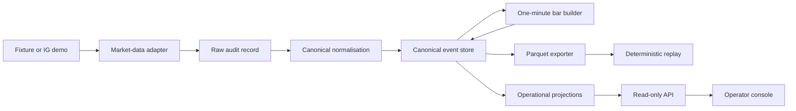

# Implemented architecture

**Status:** data foundation, IG PRICE streaming and historical backfill implemented;
reconnect lifecycle remediation implemented and qualified by a 24-hour seven-instrument
soak.

This document describes implemented reality, not the complete aspiration in `PREPLAN.md`.

## System boundary

The current deployment is one modular Python application with several command roles and one PostgreSQL instance. Parquet files form the research data store.

The in-progress capture-operations release keeps the same image and modular monolith but
adds a dedicated demo-only collector deployment. Its PostgreSQL volume is capture-only;
development, tests, research and later paper workloads must not write to it. Its approved
instrument set is a hashed runtime capture-universe configuration rather than an implicit
hard-coded deployment selection.
On the OCI collector, PostgreSQL bind-mounts a dedicated iSCSI-backed XFS filesystem at
`/srv/qtrad/postgres`; systemd requires that mount before starting capture services, so a
storage connection failure cannot redirect database writes onto the boot volume.

The supported VS Code development environment uses a Compose-backed Dev Container.
The source tree is the only host bind mount; PostgreSQL, the Python virtual environment,
dependency caches and Codex state use named volumes. At initialisation, the host's global
Codex `AGENTS.md` is copied through a gitignored workspace staging file into the
container-local Codex state. No credentials or other host Codex state are copied. The host
Docker socket is not mounted. PostgreSQL runs as the existing `db` sidecar on the private
Compose network. Dev Container setup registers Tilth, Context7 and the repository-scoped
GitHub MCP server through the Codex CLI rather than editing Codex configuration text.

The Dev Container and OCI collector are Tailscale peers. Tailscale ACLs allow the Dev
Container to reach TCP/22 on the collector, exposed through MagicDNS as
`q-trad-capture`, without a WSL socket proxy. The collector may make only the separately
allowed outbound connection to the operator's Beszel hub port. Beszel supplies
supplemental host/container telemetry; application readiness, backup verification and OCI
alarms remain independent operational evidence.



## Dependency direction

```text
domain ← ports ← application ← adapters/runtime/API
```

- `domain`: immutable values and deterministic transformations.
- `ports`: provider-agnostic I/O contracts.
- `application`: ingestion, bar, gap, quota and replay workflows.
- `adapters`: IG, PostgreSQL persistence and read-model queries, fixtures and Parquet.
- `runtime/API`: configuration, composition, commands and read-only presentation.

Only these data-phase packages exist. Strategy, allocation, risk and execution
packages are intentionally absent.
Automated architecture tests enforce that domain, ports and application modules do not
reverse this dependency direction.

## Data stores

- PostgreSQL `raw` schema: redacted provider input.
- PostgreSQL `canonical` schema: immutable domain events.
- PostgreSQL `reference` schema: instrument and provider-listing projections.
- PostgreSQL `read_model` schema: rebuildable quote, bar, health and gap views.
- PostgreSQL `ops` schema: runs, quotas, checkpoints and manifests.
- Parquet filesystem: versioned research/replay datasets.

Raw messages and their canonical event or quarantine result are committed in
one PostgreSQL transaction. Each canonical stream uses optimistic versions and
an advisory transaction lock. Projection checkpoints advance in the same
transaction as event projection.

## Market-data semantics

- Quotes preserve provider event time and q-trad receive time.
- One-minute intervals are UTC and half-open: `[start, end)`.
- Bid, ask and midpoint bars are separate.
- Midpoint samples require bid and ask timestamps within five seconds.
- A five-second watermark closes a bar.
- Late samples create a later revision.
- Missing prices are not forward-filled.
- A healthy-stream silence over two minutes creates a gap event.
- IG historical bars retain `IG_HISTORICAL` provenance.
- Market-bar projection identity includes provenance and the complete source listing,
  so overlapping quote-derived and historical series remain distinct.

## Public surfaces

- Standard-library CLI under `python -m qtrad`.
- Read-only FastAPI endpoints under `/api/v1`.
- Jinja/HTMX operator console at `/`.
- No order, fill, position or broker-execution interface.

## Safety boundary

Only IG demo market-data surfaces are in scope. There is no canonical order port, broker execution adapter or live IG endpoint.

IG listing discovery remains fail-closed. Candidates must use the canonical
instrument's quote currency, and the adapter validates an explicit standard-contract
preference for each instrument rather than selecting a mini or alternate-currency
contract from minimum size alone.

The seven-instrument stream uses one Lightstreamer connection with seven
`PRICE:{account identifier}:{epic}` subscriptions and the `Pricing` data adapter.
The deprecated `MARKET` and `L1` subscriptions are not used. Account identifiers are
required at the provider boundary but are removed from persisted subscription labels.
Concurrent streaming connections for the same IG API key are an operational safety violation.

The adapter owns one explicit, generation-tagged connection lifecycle. Transport
`CONNECTED` is not readiness: `READY` additionally requires every expected subscription
to acknowledge and deliver a recently received healthy quote. Readiness and staleness are
tracked per required subscription so an active instrument cannot mask a silent one, while
quiet overnight sessions have bounded grace before degradation. Callbacks from superseded
generations are ignored and per-generation partial quote state is reset. A prolonged
`DISCONNECTED:WILL-RETRY` has an application watchdog; terminal disconnect and prolonged
staleness close the old client, refresh the IG REST session and rebuild one stream.

REST connection and stream recovery share capped exponential full-jitter retries across
recreated client objects. Fatal credential/API-key codes fail closed, while retryable
failure cycles use a finite retry budget and cooldown rather than hammering the provider.
`STALLED`, `DISCONNECTED:WILL-RETRY` and `DISCONNECTED:TRYING-RECOVERY` all degrade the
connection, preserve current channel evidence while the library attempts recovery, and
require fresh healthy updates from every instrument before readiness is restored.
Exhausted recovery is
propagated through the record iterator and finalises the ingestion run as `FAILED`;
natural completion is invalid for an unbounded stream. Shutdown invalidates the active
generation, retains client ownership while unsubscribing, disconnects and waits for
confirmed transport closure.

Synchronous provider calls run as named daemon operations with explicit deadlines rather
than in asyncio's default executor, and adapter-owned REST requests have bounded default
HTTP connect/read timeouts unless a call explicitly overrides them. An unresolved timeout
poisons the lifecycle and prevents another connection from being created in that process.
Local HTTP and `trading-ig` rate-limiter resources are stopped even if remote logout
fails, and a process-level regression proves an abandoned provider call cannot keep the
command resident. ADR 0011 records this containment decision. The
pinned Lightstreamer 1.0.3 disposal defect is repaired narrowly at the adapter boundary
because IG's deployed server is not compatible with an unverified client upgrade.
Queue insertion remains non-blocking; overflow is counted and reported as degraded
health without blocking the provider callback. ADR 0010 records these decisions.

Historical requests use IG's v2 UTC date format. Each source, interval and price basis
has a deterministic canonical stream identity, making overlapping backfills idempotent.
Operator-supplied and provider-reported historical allowances are stored separately.
