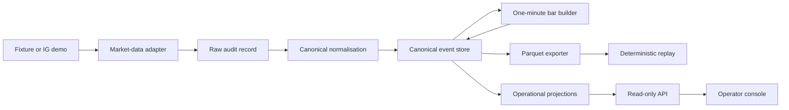

# Implemented architecture

**Status:** data foundation, IG PRICE streaming and historical backfill implemented;
reconnect lifecycle remediation implemented and qualified by a 24-hour seven-instrument
soak.

This document describes implemented reality, not the complete aspiration in `PREPLAN.md`.

## System boundary

The current deployment is one modular Python application with several command roles and one PostgreSQL instance. Parquet files form the research data store.

The in-progress capture-operations release keeps the same image and modular monolith but
adds a dedicated demo-only collector deployment. Its PostgreSQL volume is capture-only;
development, tests, research and later paper workloads must not write to it. Its approved
instrument set is a hashed runtime capture-universe configuration rather than an implicit
hard-coded deployment selection.
On the OCI collector, PostgreSQL bind-mounts a dedicated iSCSI-backed XFS filesystem at
`/srv/qtrad/postgres`; systemd requires that mount before starting capture services, so a
storage connection failure cannot redirect database writes onto the boot volume.

The supported VS Code development environment uses a Compose-backed Dev Container.
The source tree is the only host bind mount; PostgreSQL, the Python virtual environment,
dependency caches and Codex state use named volumes. At initialisation, the host's global
Codex `AGENTS.md` is copied through a gitignored workspace staging file into the
container-local Codex state. No credentials or other host Codex state are copied. The host
Docker socket is not mounted. PostgreSQL runs as the existing `db` sidecar on the private
Compose network. Dev Container setup registers Tilth, Context7 and the repository-scoped
GitHub MCP server through the Codex CLI rather than editing Codex configuration text.

The Dev Container and OCI collector are Tailscale peers. Tailscale ACLs allow the Dev
Container to reach TCP/22 on the collector, exposed through MagicDNS as
`q-trad-capture`, without a WSL socket proxy. The collector may make only the separately
allowed outbound connection to the operator's Beszel hub port. Beszel supplies
supplemental host/container telemetry; application readiness, backup verification and OCI
alarms remain independent operational evidence.

Capture releases are built outside the collector. GitHub CI uses an isolated PostgreSQL
service for migrations and integration tests; a separately protected manual workflow
publishes one multi-platform application image under the source commit SHA and reports its
OCI index digest. The collector's deployment descriptor consumes only that digest and its
instance principal needs repository-read permission, not image-publication permission.
Compose sends `SIGINT` to the unbounded ingestion role and allows a 90-second stop window so
the adapter can verify disconnect and persist a terminal run before restart or host shutdown.

PostgreSQL additionally publishes host port 15432 only on `127.0.0.1` for exceptional SSH-tunnel
inspection. Migration `0004` supplies the non-login `qtrad_capture_reader` privilege role: it can
select from canonical, reference, read-model and operations schemas, cannot access raw capture and
cannot write. The operator creates and rotates a separate login member interactively; collector
application credentials are never reused. Immutable Parquet manifests and snapshots remain the
normal research interface.

Schema-version-2 research manifests are content-authenticated records rather than mutable export
indexes. Export requires an exact half-open UTC range; the canonical hash binds that range, the
selected universe/configuration, application version and
image identity, exact file set and hashes, semantic bar hash, grouped coverage and observed live
and historical-coverage evidence. Replay verifies the manifest, file bytes, decoded bars, row/time
bounds and partition ownership. New files live under `bars-v2/`; a rolled-back application that
still writes the legacy `bars/` layout cannot overwrite them. Legacy manifests remain readable,
and migration `0006` keeps its added columns nullable so the previous application INSERT remains
valid after a forward migration. Export records a run and manifest and therefore executes only
against an isolated writable database copy, not the collector or its read-only tunnel role.

The loopback-only API also provides bounded canonical-event pages for later isolated consumers.
Pages carry feed-schema, capture-source, universe, configuration and high-water identity while
excluding raw records. Consumers connect through an SSH/Tailscale tunnel and maintain their own
cursors; the collector does not host downstream write schemas or a second message-broker product.
The provider-neutral consumer contract strictly decodes saved JSON pages into canonical event
envelopes, pins all four identity fields and advances only from the exact requested cursor. It
accepts non-contiguous global positions and concurrent-append empty pages, while rejecting replay,
cursor skips, identity drift, high-water regression, contradictory continuation evidence,
malformed events and raw-record fields. The current `feed verify` role is offline only; no network
request or downstream persistence is involved. The separate `feed probe` role uses a bounded async
HTTP client to fetch exactly one page through an operator-established tunnel. It accepts only a
literal IPv4 or IPv6 loopback URL with an explicit port, disables redirects and ambient proxies,
bounds total duration and decoded bytes, and does not persist its candidate cursor.
Universe/configuration fields are the current API serving identity rather than per-event
provenance for the source's older history. A release change is therefore an explicit, caught-up
cursor rebind on the same capture source; source changes require an independent cursor and schema
changes require a new consumer contract.

Candidate-universe review is a separate, non-authoritative IG demo REST workflow. The
`instruments review` command loads a hashable catalogue containing no provider epics, enumerates
relevant account-visible listings and emits a bounded, hash-addressed JSON manifest. It records
canonical product, expiry and market-state classifications, bounded economics and stable rejection
codes, but excludes volatile snapshots and credentials. Multiple eligible listings remain visible
for operator choice: the workflow cannot select a listing, update PostgreSQL, produce an approved
capture universe or start a stream.
An independent promotion command accepts only the exact catalogue, the hash-verified review and a
complete operator-authored selection set. It revalidates every selected candidate and renders an
undeployed TOML universe that binds the source review and selection hashes. It has no provider,
database, Git or deployment side effect, and refuses to infer a missing selection.

The capture database is backed up daily as a PostgreSQL custom archive accompanied by a
checksum and a JSON manifest that binds the capture-universe hash and both deployed image
digests. Object Storage lifecycle rules implement daily/weekly retention. A weekly verifier
downloads the latest daily set and restores it into a networkless, tmpfs-backed PostgreSQL
container selected by the manifest digest. Backup and restore status files are atomic local
evidence inputs to the health watcher; they are not substitutes for the remote objects or a
successful restore.

New backup manifests additionally use the self-hashed `qtrad-capture-backup-v2` contract to bind
capture-source, universe name, migration and source database identity. An operator can download one
complete object set and import it only into a new local `qtrad_research_*` database. The importer
verifies source/universe expectations, archive and manifest hashes, restores without source grants,
checks migration and counts, revokes public connect and writes immutable import evidence. A research
export can require that evidence and binds its import/archive identity into the research manifest.
ADR 0019 records this collector-to-research boundary.



## Dependency direction

```text
domain ← ports ← application ← adapters/runtime/API
```

- `domain`: immutable values and deterministic transformations.
- `ports`: provider-agnostic I/O contracts.
- `application`: ingestion, bar, gap, quota and replay workflows.
- `adapters`: IG, PostgreSQL persistence and read-model queries, fixtures and Parquet.
- `runtime/API`: configuration, composition, commands and read-only presentation.

Only these data-phase packages exist. Strategy, allocation, risk and execution
packages are intentionally absent.
Automated architecture tests enforce that domain, ports and application modules do not
reverse this dependency direction.

## Data stores

- PostgreSQL `raw` schema: redacted provider input.
- PostgreSQL `canonical` schema: immutable domain events.
- PostgreSQL `reference` schema: instrument and provider-listing projections.
- PostgreSQL `read_model` schema: rebuildable quote, bar, health and gap views.
- PostgreSQL `ops` schema: runs, quotas, checkpoints and manifests.
- Parquet filesystem: immutable, content-authenticated research/replay datasets with separate
  legacy `bars/` and current `bars-v2/` namespaces.

Raw messages and their canonical event or quarantine result are committed in
one PostgreSQL transaction. Each canonical stream uses optimistic versions and
an advisory transaction lock. Projection checkpoints advance in the same
transaction as event projection.

Lightstreamer raw PRICE messages contain only fields marked changed in that callback, including
an explicitly changed null. The IG adapter maintains a bounded, per-generation merged field state
for canonical quote construction; an explicit null removes the prior field and its side-specific
timestamp. Existing full-state raw messages remain immutable. ADR 0018 records this boundary.

A read-only PostgreSQL storage inspector can write bounded, hash-verified snapshots of capture
counts, physical relation/index sizes and recent JSONB payload samples. Offline comparison reports
physical growth per new raw message while retaining database-wide and relation-specific deltas.
It neither mutates the database nor replaces release qualification evidence.
Snapshot schema version 2 remains compatible with saved version-one evidence and additionally
compares JSONB payload size with PostgreSQL's JSON text rendering and reports per-index byte/scan
deltas. These are decision inputs only; a changed PostgreSQL statistics-reset timestamp invalidates
scan deltas.
Offline comparison derives raw, canonical and combined heap/index/auxiliary growth from those
physical snapshots and reports both per-message and per-relation-row normalisation. It also exposes
the canonical-event/raw-message ratio rather than assuming a one-to-one interval.
`docs/CAPTURE_STORAGE_AUDIT.md` keeps uniqueness and audit retention outside the optimisation
boundary.

## Market-data semantics

- Quotes preserve provider event time and q-trad receive time.
- One-minute intervals are UTC and half-open: `[start, end)`.
- Bid, ask and midpoint bars are separate.
- Midpoint samples require bid and ask timestamps within five seconds.
- A five-second watermark closes a bar.
- Late samples create a later revision.
- Missing prices are not forward-filled.
- A healthy-stream silence over two minutes creates a gap event.
- IG historical bars retain `IG_HISTORICAL` provenance.
- Market-bar projection identity includes provenance and the complete source listing,
  so overlapping quote-derived and historical series remain distinct.

## Public surfaces

- Standard-library CLI under `python -m qtrad`.
- `instruments review` emits a non-overwriting candidate manifest; it is not instrument sync.
- `instruments promote` verifies explicit review-bound selections and emits undeployed TOML.
- `research export --universe PATH --start UTC --end UTC` writes a bounded schema-version-2 manifest
  from an isolated writable
  database copy; `replay --manifest PATH` verifies that identity before deterministic replay.
- `research export --snapshot-import-evidence PATH` additionally verifies and binds the restored
  collector source, universe, database and archive identity.
- `feed verify` checks saved page sequences and reports the final cursor without network I/O.
- `feed probe` validates one bounded page through a literal-loopback tunnel without acknowledging
  its candidate cursor.
- `storage snapshot` writes non-overwriting, release-bound physical storage evidence;
  `storage compare` verifies and compares two saved observations without database access.
- Read-only FastAPI endpoints under `/api/v1`.
- Jinja/HTMX operator console at `/`.
- No order, fill, position or broker-execution interface.

## Safety boundary

Only IG demo market-data surfaces are in scope. There is no canonical order port, broker execution adapter or live IG endpoint.

IG listing discovery remains fail-closed. Candidates must use the canonical
instrument's quote currency, and the adapter validates an explicit standard-contract
preference for each instrument rather than selecting a mini or alternate-currency
contract from minimum size alone.
The separate listing-review path has no preferred-epic input and deliberately performs no
minimum-size selection. A generated manifest always carries `selection_authority=false`; only a
later, reviewed capture-universe release with an explicit epic for every instrument can enter sync
or ingestion. Review discovery applies global search and detail request budgets in addition to
per-instrument candidate bounds. Missing, zero or negative minimum-size economics are invalid;
the adapter never substitutes product economics.

The seven-instrument stream uses one Lightstreamer connection with seven
`PRICE:{account identifier}:{epic}` subscriptions and the `Pricing` data adapter.
The deprecated `MARKET` and `L1` subscriptions are not used. Account identifiers are
required at the provider boundary but are removed from persisted subscription labels.
Concurrent streaming connections for the same IG API key are an operational safety violation.

The adapter owns one explicit, generation-tagged connection lifecycle. Transport
`CONNECTED` is not readiness: `READY` additionally requires every expected subscription
to acknowledge and deliver a recently received healthy quote. Readiness and staleness are
tracked per required subscription so an active instrument cannot mask a silent one, while
quiet overnight sessions have bounded grace before degradation. Callbacks from superseded
generations are ignored and per-generation partial quote state is reset. A prolonged
`DISCONNECTED:WILL-RETRY` has an application watchdog; terminal disconnect and prolonged
staleness close the old client, refresh the IG REST session and rebuild one stream.

REST connection and stream recovery share capped exponential full-jitter retries across
recreated client objects. Fatal credential/API-key codes fail closed, while retryable
failure cycles use a finite retry budget and cooldown rather than hammering the provider.
`STALLED`, `DISCONNECTED:WILL-RETRY` and `DISCONNECTED:TRYING-RECOVERY` all degrade the
connection, preserve current channel evidence while the library attempts recovery, and
require fresh healthy updates from every instrument before readiness is restored.
Exhausted recovery is
propagated through the record iterator and finalises the ingestion run as `FAILED`;
natural completion is invalid for an unbounded stream. Shutdown invalidates the active
generation, retains client ownership while unsubscribing, disconnects and waits for
confirmed transport closure.

The HTTP readiness query also binds operational evidence to the API's loaded capture-universe
configuration hash. A healthy adapter, fresh quotes or a running ingestion record from another
configuration cannot make the served release ready.

Synchronous provider calls run as named daemon operations with explicit deadlines rather
than in asyncio's default executor, and adapter-owned REST requests have bounded default
HTTP connect/read timeouts unless a call explicitly overrides them. An unresolved timeout
poisons the lifecycle and prevents another connection from being created in that process.
Local HTTP and `trading-ig` rate-limiter resources are stopped even if remote logout
fails, and a process-level regression proves an abandoned provider call cannot keep the
command resident. ADR 0011 records this containment decision. The
pinned Lightstreamer 1.0.3 disposal defect is repaired narrowly at the adapter boundary
because IG's deployed server is not compatible with an unverified client upgrade.
Queue insertion remains non-blocking; overflow is counted and reported as degraded
health without blocking the provider callback. ADR 0010 records these decisions.

Historical requests use IG's v2 UTC date format, but the former implicit all-universe
"last N minutes" command is no longer an operational surface. A strict non-overwriting plan
binds an exact UTC `[start, end)` range to a capture-universe hash, configured and effective
IG demo listing identity, one-minute resolution, request chunks and timestamped quota evidence.
The operator must inspect the canonical JSON and repeat its SHA-256 before registration.
Execution claims only that persisted hash and cannot rediscover a listing, change the range or
silently substitute an instrument.

Each listing, interval and price basis has a deterministic canonical stream identity. An
identical overlapping result is idempotent; a changed historical result appends a
`MarketBarCorrected` stream revision. Plan-scoped historical coverage attempts include the
listing effective version, `IG_HISTORICAL` provenance, basis, resolution, interval and plan
hash. They are exposed through a bounded read-only API independently of observed live-stream
gaps, which backfill never closes or rewrites. Operator-supplied and provider-reported
historical allowances are stored separately.
