# Engineering Architecture Report: Spatio-Temporal Graph Neural Network & Stacked LSTM Framework for Multi-Asset Intraday Trading

---

## Executive Summary

This report outlines a deep learning framework designed to predict next-step log returns for a portfolio of 24 highly correlated global spot indices and major forex pairs.

Standard sequential architectures (like pure LSTMs) struggle to scale linearly when modeling large asset baskets due to a parameter explosion when tracking cross-asset correlations. Conversely, traditional statistical models fail to capture deep, non-linear temporal dynamics.

The proposed architecture solves these limitations by implementing a Spatio-Temporal Graph Neural Network (ST-GNN) combined with a Stacked Long Short-Term Memory (LSTM) network.

By treating the asset universe as a dynamic graph, the GNN isolates spatial cross-asset relationships, while the Stacked LSTM maps temporal momentum. To handle shifting global liquidity patterns without data contamination, the trading day is split into two specialized session models (APAC and Atlantic) that utilize an overlapping warm-up window.

---

## 1. Core Structural Architecture

The architecture models the asset universe as a dynamic graph $\mathcal{G} = (\mathcal{V}, \mathcal{E})$, where:

* **Nodes ($\mathcal{V}$):** The 24 tracked assets (spot indices and forex pairs).

* **Edges ($\mathcal{E}$):** The mathematical and structural linkages between those assets.

The network processes information in two distinct stages: spatial convolution (GNN) followed by temporal sequence learning (LSTM).

### Complete Network Data Flow

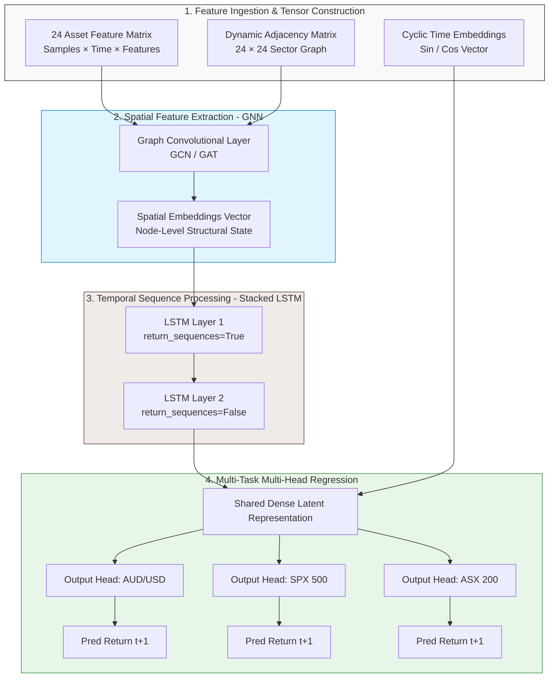

---

## 2. Intraday Data Massaging & Feature Engineering

Using raw, unadjusted 1-minute time bars introduces high kurtosis, extreme noise, and structural bias into deep learning architectures. The pipeline employs specific feature enrichment methods to mitigate these issues.

### Mathematical Pipeline and Tensor Shapes

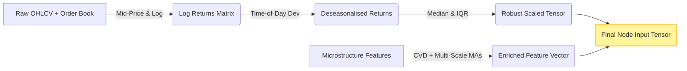

### Proposed Inputs at Each Node (Feature Matrix Dimension)

Every node (asset) in the graph contains a feature vector consisting of 6 primary elements at each time step $t$:

1. Stationary Price Signal: Log Returns ($R_t = \ln(P_{\text{mid}, t} / P_{\text{mid}, t-1})$). Mid-price handles bid-ask bounces.
2. Deseasonalised Volatility Factor: $R_t / \sigma_{\text{minute}}$, where $\sigma_{\text{minute}}$ is the historical standard deviation for that specific minute of the trading day. This flattens the diurnal "U-shape" volatility curve.
3. Order Book Momentum: Cumulative Volume Delta (CVD). This metric captures net aggressive buying versus net aggressive selling inside the 1-minute bar to reveal hidden directional pressure.
4. Multi-Scale Trend Context: The ratio of the current price to the 1-hour Volume Weighted Average Price (VWAP) and 4-hour VWAP. This anchors the 1-minute bar within its broader macro trend.
5. Cyclic Time Embedding (Sin): $\sin(2\pi \cdot \text{Minute} / 1440)$.
6. Cyclic Time Embedding (Cos): $\cos(2\pi \cdot \text{Minute} / 1440)$.

---

## 3. Global Session Separation Strategy

To manage the shifting correlation structures and varying volatility regimes between Eastern and Western markets, the framework utilizes two distinct models. Rather than enforcing a hard boundary, an Overlapping Warm-Up Window is used to ensure temporal continuity.

### Session Lifecycle Handoff Architecture

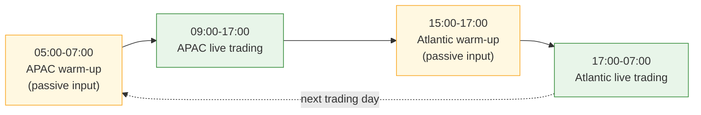

### Operational Execution Protocols

#### 1. APAC Session Model (09:00–17:00 AEST)

* **Focus Assets:** ASX 200, Nikkei 225, Hang Seng, AUD/USD, NZD/USD, USD/JPY.

* **Graph State:** The GNN's adjacency matrix focuses heavily on regional Asian equity markets and commodities-linked currencies.

* **Warm-up:** Starts passively ingesting data at 05:00 AEST (during the late US session) to prime its LSTM hidden states before executing live trades at the 09:00 AEST Australian open.

#### 2. Atlantic Session Model (17:00–07:00 AEST)

* **Focus Assets:** DAX 40, FTSE 100, S&P 500, Nasdaq 100, EUR/USD, GBP/USD.

* **Graph State:** The GNN shifts its internal edge weights to reflect transatlantic treasury flows, index dependencies, and European liquidity pools.

* **Warm-up:** Starts passively ingesting data at 15:00 AEST (during the quiet Asian afternoon) to build market context prior to the London pre-open.

---

## 4. Multi-Asset Predictive Integrity

A common question in quantitative deep learning is whether predicting all 24 assets inside a single framework degrades individual performance compared to training 24 isolated models.

### Performance Mechanics: Shared vs. Isolated Networks

| Architecture Type | Structural Advantage | Major Operational Limitation | Risk of Overfitting |
|---|---|---|---|
| 24 Isolated Models | Tailored specifically to one asset's unique idiosyncrasies. | Zero visibility into cross-market lead-lag dynamics. | Extremely High. Prone to capturing noise instead of signal. |
| Unified ST-GNN Framework | Learns generalized market regimes and sector rotations. Shared weights provide regularisation. | Can introduce negative transfer if highly heterogeneous assets are mixed. | Low. Multi-task learning filters out asset-specific noise. |

### Architectural Mitigation via Multi-Head Node Regression

To prevent highly volatile assets from dominating the loss function, the system decouples its final layer.

After processing shared information through the GNN and Stacked LSTM layers, the single tensor branches out into 24 independent feedforward output heads. Each head is dedicated to a specific asset, allowing for customized linear scaling while retaining the benefits of shared feature extraction.

---

## 5. Architectural Caveats, Blind Spots & Production Risks

Before moving this framework into production, five specific engineering and market risks must be managed:

### 1. Data Leakage During Robust Scaling

* **The Trap:** Applying Robust Scaling or Z-score normalization across the entire dataset before splitting it into training and testing segments leaks future mean and variance metrics into the past.

* **The Solution:** The scaling parameters (Median and IQR) must be calculated on a rolling historical training window and applied out-of-sample forward.

### 2. Microstructure Noise and Virtual Liquidity

* **The Trap:** Forex spot prices sourced from standard retail brokers exhibit artificial "mean reversion" because of localized bid-ask bounces rather than genuine institutional order flow.

* **The Solution:** Use institutional-grade, volume-aggregated feeds (e.g., LMAX or Saxo Bank) and calculate all inputs based on the Mid-Price or VWAP, rather than the raw closing trade price.

### 3. Structural Graph Dissimilarity (Negative Transfer)

* **The Trap:** Forcing a currency pair like USD/CHF and an equity index like the Nasdaq 100 to share identical latent hidden features can degrade accuracy because they respond to fundamentally different economic drivers.

* **The Solution:** Implement a Multi-Relational Graph Neural Network (R-GNN). This framework uses distinct types of edges to separate equity-to-equity correlations from forex-to-index relationships.

### 4. Macroeconomic Regime Shifts

* **The Trap:** An ST-GNN model trained during a calm, low-volatility period will often generate inaccurate forecasts during a sudden macroeconomic event (e.g., an unexpected central bank interest rate decision).

* **The Solution:** Incorporate an explicit Volatility Regime Classifier or an adversarial loss component that forces the model to generate robust representations across both high-volatility and low-volatility conditions.

### 5. Overnight Session Gaps in Spot Indices

* **The Trap:** When cash index markets close, the underlying futures markets continue trading at lower liquidity volumes, which can create large pricing gaps at the opening bell.

* **The Solution:** Avoid cash index data feeds. Utilize continuous, 24-hour synthetic CFD or front-month futures contract data to maintain a continuous, uninterrupted time series.

---

## 6. Implementation Blueprint

For deployment, the following stack is recommended:

* **Graph Processing:** PyTorch Geometric (PyG) to construct the spatial graph layers.

* **Sequence Processing:** PyTorch LSTM modules to handle temporal learning.

* **Data Structures:** Custom DGL (Deep Graph Library) spatio-temporal data loaders to manage the `[nodes, time steps, features]` 3D tensor inputs.

Here is the complete implementation blueprint. Section 1 covers the mathematical design of the Dynamic Adjacency Matrix, and Section 2 provides the fully structured, production-ready PyTorch & PyG (PyTorch Geometric) script.

---

### 6.1 Designing the Dynamic Adaptive Adjacency Matrix

A static adjacency matrix (e.g., hardcoding a 1 if two stocks are in the same sector) is too rigid for intraday FX and Index markets. Correlations shift rapidly between the Asian open and the US close.

To solve this, we implement an Adaptive Spatial Graph Embedding. The model learns two low-dimensional node embedding matrices, $E_1$ and $E_2 \in \mathbb{R}^{N \times d}$ (where $N$ is the number of assets, and $d$ is a small bottleneck dimension, typically 10). The dynamic adjacency matrix $\mathcal{A}_{\text{dyn}}$ is generated directly during the forward pass:

$$\mathcal{A}_{\text{dyn}} = \text{Softmax}(\text{ReLU}(E_1 \cdot E_2^T))$$

### Why This Engine Wins

* **No Manual Correlation Input Needed:** You do not need to feed rolling Pearson correlation matrices into the model. The network discovers hidden lead-lag dynamics automatically via gradient descent.

* **Asymmetric Relationships Allowed:** Because \(E_1\) and \(E_2\) are distinct, \(\mathcal{A}_{i,j} \neq \mathcal{A}_{j,i}\). The network can natively learn that movements in the S&P 500, represented by node \(i\), strongly influence the AUD/USD pair, represented by node \(j\), while movements in AUD/USD may have little influence on the S&P 500.

---

### 6.2 Comprehensive PyTorch / PyG Script Template

This script constructs the spatial-temporal tensor, implements the adaptive graph generation layer, stacks the LSTM components, and routes them to multi-head node regression layers.

```python
import torch
import torch.nn as nn
import torch.nn.functional as F
from torch_geometric.nn import GCNConv

class AdaptiveSpatioTemporalGNN(nn.Module):
    """ST-GNN architecture for multi-asset intraday forecasting.

    Combines adaptive graph structures, GCN spatial convolution,
    stacked LSTMs, and multi-head output layers.
    """

    def __init__(
        self,
        num_nodes=24,
        in_features=6,
        seq_len=60,
        hidden_dim=64,
        node_emb_dim=10,
    ):
        super().__init__()

        self.num_nodes = num_nodes
        self.seq_len = seq_len
        self.hidden_dim = hidden_dim

        # 1. Learnable node embeddings for dynamic adjacency generation.
        self.node_emb1 = nn.Parameter(torch.randn(num_nodes, node_emb_dim))
        self.node_emb2 = nn.Parameter(torch.randn(num_nodes, node_emb_dim))

        # 2. Spatial graph convolution layer.
        self.spatial_gcn = GCNConv(
            in_channels=in_features,
            out_channels=hidden_dim,
        )

        # 3. Stacked temporal LSTM network.
        self.lstm_layer1 = nn.LSTM(
            input_size=hidden_dim,
            hidden_size=hidden_dim,
            num_layers=1,
            batch_first=True,
        )
        self.lstm_layer2 = nn.LSTM(
            input_size=hidden_dim,
            hidden_size=hidden_dim,
            num_layers=1,
            batch_first=True,
        )

        # 4. One dedicated regression head per asset node.
        self.output_heads = nn.ModuleList(
            [
                nn.Sequential(
                    nn.Linear(hidden_dim, 32),
                    nn.ReLU(),
                    nn.Linear(32, 1),
                )
                for _ in range(num_nodes)
            ]
        )

    def compute_adaptive_adjacency(self):
        """Generate a dynamic, directed adjacency matrix."""
        raw_affinity = torch.mm(
            self.node_emb1,
            self.node_emb2.transpose(0, 1),
        )
        return F.softmax(F.relu(raw_affinity), dim=-1)

    def forward(self, x):
        """Run the forward pass.

        Args:
            x: Tensor shaped [batch, nodes, sequence, features].

        Returns:
            Tensor shaped [batch, nodes] containing next-step predictions.
        """
        batch_size, num_nodes, time_steps, in_features = x.shape

        if num_nodes != self.num_nodes:
            raise ValueError(
                f"Expected {self.num_nodes} nodes, received {num_nodes}."
            )

        # Step A: Dynamically construct the graph structure.
        adj_matrix = self.compute_adaptive_adjacency()
        edge_index = adj_matrix.nonzero().t().contiguous()
        edge_weight = adj_matrix[edge_index[0], edge_index[1]]

        # Step B: Apply the GCN to each batch/time slice independently.
        x_spatial = x.permute(0, 2, 1, 3).reshape(
            batch_size * time_steps,
            num_nodes,
            in_features,
        )

        spatial_outputs = []
        for time_slice in x_spatial:
            spatial_node_features = self.spatial_gcn(
                time_slice,
                edge_index,
                edge_weight,
            )
            spatial_outputs.append(spatial_node_features)

        gcn_out = (
            torch.stack(spatial_outputs)
            .reshape(batch_size, time_steps, num_nodes, self.hidden_dim)
            .permute(0, 2, 1, 3)
        )

        # Step C: Process each node's sequence through the stacked LSTMs.
        x_temporal = gcn_out.reshape(
            batch_size * num_nodes,
            time_steps,
            self.hidden_dim,
        )
        lstm1_out, _ = self.lstm_layer1(x_temporal)
        _, (lstm2_final_hidden, _) = self.lstm_layer2(lstm1_out)

        latent_vectors = lstm2_final_hidden.squeeze(0).reshape(
            batch_size,
            num_nodes,
            self.hidden_dim,
        )

        # Step D: Route each node's latent vector through its own head.
        final_predictions = []
        for node_idx, output_head in enumerate(self.output_heads):
            node_latent = latent_vectors[:, node_idx, :]
            final_predictions.append(output_head(node_latent))

        return torch.cat(final_predictions, dim=-1)
```

#### Verification and Execution Test

```python
if __name__ == "__main__":
    # Structural verification parameters.
    batch_size = 8
    assets = 24
    lookback = 60
    inputs = 6

    # Construct a mock multi-asset intraday tensor.
    mock_input_tensor = torch.randn(batch_size, assets, lookback, inputs)

    # Initialize the network architecture.
    trading_model = AdaptiveSpatioTemporalGNN(
        num_nodes=assets,
        in_features=inputs,
        seq_len=lookback,
    )

    # Execute a forward pass.
    predicted_returns = trading_model(mock_input_tensor)

    print("Execution check successful!")
    print(
        f"Input shape: {list(mock_input_tensor.shape)} "
        "-> [batch, assets, time, features]"
    )
    print(
        f"Output shape: {list(predicted_returns.shape)} "
        "-> [batch, next-step predictions]"
    )
```

---

### 6.3 Operational Data Pipeline Verification Checks

Before connecting this script to a live pricing loop, run these verification steps on your input tensor `x`:
1. Verify Vector Shapes: Ensure your time series dataloader yields dimensions explicitly scaled to `[batch size, 24, 60, 6]`. Any inversion between the asset index and lookback sequences will result in incorrect spatial calculations during graph operations.
2. Prevent Look-Ahead Leakage: Confirm that your `edge_index` updates depend only on past historical states. If you compute node embeddings using information from the target prediction window $t+1$, the system will generate unrealistically high backtest accuracy that instantly breaks down in live trading.

Here is the cleaned Markdown, structured to match the previous document.

---

---

## 7. Confidence Estimation and Production Controls

Production-grade deep learning systems require more than a point forecast. They must also estimate uncertainty, detect unfamiliar market conditions, and determine when the execution layer should ignore a prediction.

Confidence can be extracted and managed at three levels:

1. Internal model uncertainty
2. External regime gating
3. Conformal prediction intervals

---

## 7.1 Internal Model Confidence

By default, the final linear layer in the PyTorch model produces a point estimate, such as a predicted next-step return of $+0.0012$.

A point estimate does not indicate how certain the model is. To estimate confidence internally, the output layer can be modified to predict a probability distribution rather than a single value.

### 7.1.1 Gaussian Maximum Likelihood Estimation

Instead of predicting one return value, each asset-specific output head predicts two parameters:

* Mean: $\mu$
* Variance: $\sigma^2$

The mean represents the expected return, while the variance represents the model's estimated uncertainty.

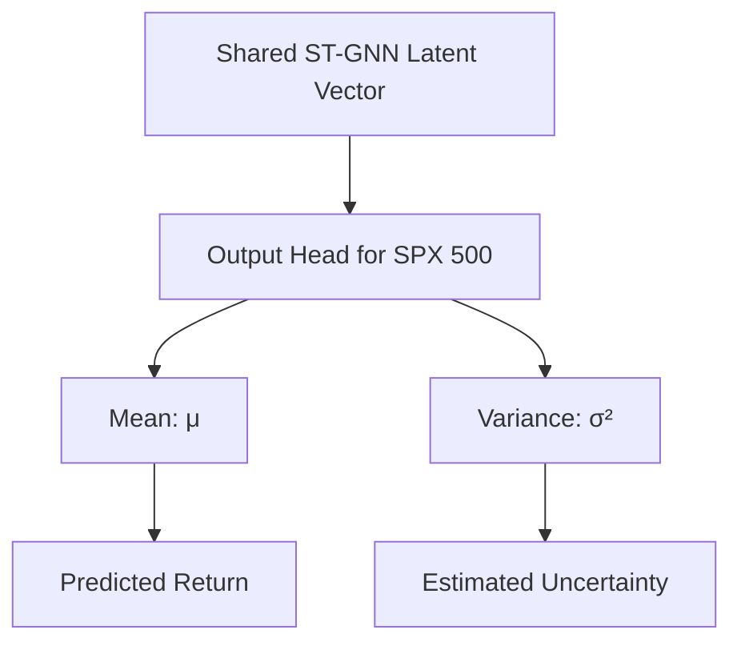

### Training Objective

The model is trained using a Gaussian Negative Log-Likelihood loss rather than standard Mean Squared Error.

For a target return $y$, predicted mean $\mu$, and predicted variance $\sigma^2$, the loss can be expressed as:

$$\mathcal{L}_{\text{NLL}} = \frac{1}{2} \left[ \log(\sigma^2) + \frac{(y-\mu)^2}{\sigma^2} \right]$$

A small predicted variance indicates that the model believes its forecast is precise. A large predicted variance indicates that the model considers the forecast uncertain.

### Execution Interpretation

Suppose the model predicts:

$$\mu = +0.02$$

If the associated variance is high:

$$\sigma^2 = 0.50$$

the execution algorithm should treat the forecast as low confidence and reduce the position size.

If the variance is comparatively small:

$$\sigma^2 = 0.01$$

the forecast is more concentrated, and the execution layer may permit a larger position, subject to the remaining risk controls.

---

### 7.1.2 Monte Carlo Dropout

Monte Carlo Dropout estimates uncertainty without requiring a probabilistic output head.

Dropout layers normally deactivate random neurons during training to reduce overfitting. Under Monte Carlo Dropout, dropout remains active during inference.

### Inference Procedure

For each input tensor:

1. Keep dropout enabled.
2. Run the same input through the model multiple times.
3. Collect the resulting predictions.
4. Calculate their mean and standard deviation.

For example, the system may perform 50 forward passes for the same 1-minute input window:

$$\hat{y}^{(1)}, \hat{y}^{(2)}, \ldots, \hat{y}^{(50)}$$

The final prediction is the sample mean:

$$\bar{y} = \frac{1}{K} \sum_{k=1}^{K} \hat{y}^{(k)}$$

The uncertainty estimate is the sample standard deviation:

$$s = \sqrt{ \frac{1}{K-1} \sum_{k=1}^{K} \left( \hat{y}^{(k)}-\bar{y} \right)^2 }$$

### Confidence Interpretation

* Tightly clustered predictions indicate higher confidence.
* Widely dispersed predictions indicate higher uncertainty.
* A sudden increase in prediction dispersion may indicate an unfamiliar market pattern or a regime shift.

The execution system can reduce exposure or decline the trade when the Monte Carlo standard deviation exceeds a predefined threshold.

---

## 7.2 External Regime Gating

A neural network should not be trusted solely because it reports high internal confidence.

Deep learning systems can remain highly confident when presented with market conditions that differ substantially from their training distribution. For this reason, production trading systems commonly use an independent regime-gating model.

The gating model acts as an operational engage or disengage switch for the ST-GNN.

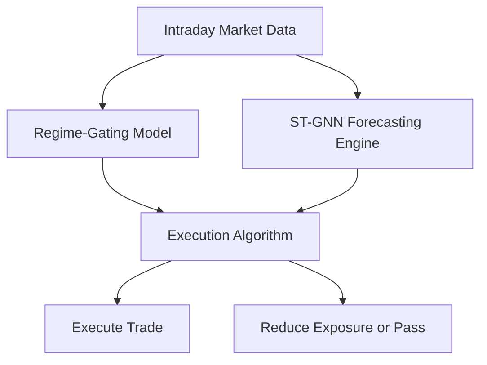

### 7.2.1 Hidden Markov Models and Gaussian Mixture Models

A separate statistical model, such as a Hidden Markov Model or Gaussian Mixture Model, can be trained on market-state variables rather than directional return targets.

Potential regime features include:

* Implied volatility levels
* Realized volatility
* Rolling cross-asset correlations
* Bid-ask spreads
* Order-book depth
* Time-of-day volatility
* Liquidity measures
* Market-session indicators

The regime model may classify the market into states such as:

| Regime   | Description                   | Example Execution State      |
| -------- | ----------------------------- | ---------------------------- |
| Regime 0 | Quiet and mean-reverting      | Normal execution             |
| Regime 1 | High-volatility trend         | Reduced or adjusted exposure |
| Regime 2 | Illiquid or disorderly market | Trading disabled             |
| Regime 3 | Session transition            | Passive warm-up mode         |

### Operational Guardrail

If the gating model identifies a regime in which the ST-GNN has historically underperformed, it can override the neural network.

This override should apply even when the ST-GNN reports high internal confidence.

The regime gate can control:

* Whether trading is enabled
* Maximum permitted position size
* Required confidence threshold
* Minimum liquidity
* Maximum spread
* Permitted asset groups
* Session-specific execution rules

---

## 7.3 Conformal Prediction

Conformal Prediction is a post-processing framework that converts point forecasts into prediction intervals.

Rather than predicting only:

$$\hat{y} = 0.05\\%$$

the system produces an interval such as:

$$[0.02\\%, 0.08\\%]$$

The interval is calibrated to achieve a specified empirical coverage level, such as 95%, under the assumptions of the chosen conformal method.

### Calibration Process

Conformal Prediction uses a separate calibration dataset that was not used to train the model.

For each calibration observation, the system calculates a nonconformity score, such as the absolute forecast error:

$$s_i = \left| y_i-\hat{y}_i \right|$$

A selected quantile of these calibration errors is then used to construct the prediction interval:

$$
[\hat{y}\_{t\+1} - q, \hat{y}\_{t\+1} + q]
$$

Here, $q$ is the calibrated nonconformity threshold.

### Why It Is Useful for Trading

Conformal intervals respond to recent forecast errors.

When volatility increases or model accuracy deteriorates:

* Calibration errors increase.
* Prediction intervals widen.
* Fewer trades satisfy the execution threshold.
* The strategy naturally becomes more selective.

### Execution Logic

Assume the strategy requires a minimum expected return of $0.03\\%$ to cover transaction costs and execution risk.

A trade may be permitted when the entire interval exceeds the threshold:

$$[0.04\\%, 0.08\\%]$$

A trade should normally be rejected when the interval crosses zero:

$$[-0.01\\%, 0.06\\%]$$

It should also be rejected when only part of the interval exceeds the cost threshold:

$$[0.01\\%, 0.05\\%]$$

This prevents the system from trading solely because the point estimate appears attractive.

---

## 7.4 Combined Production Architecture

A robust multi-asset system should combine internal uncertainty estimates with external market-state controls.

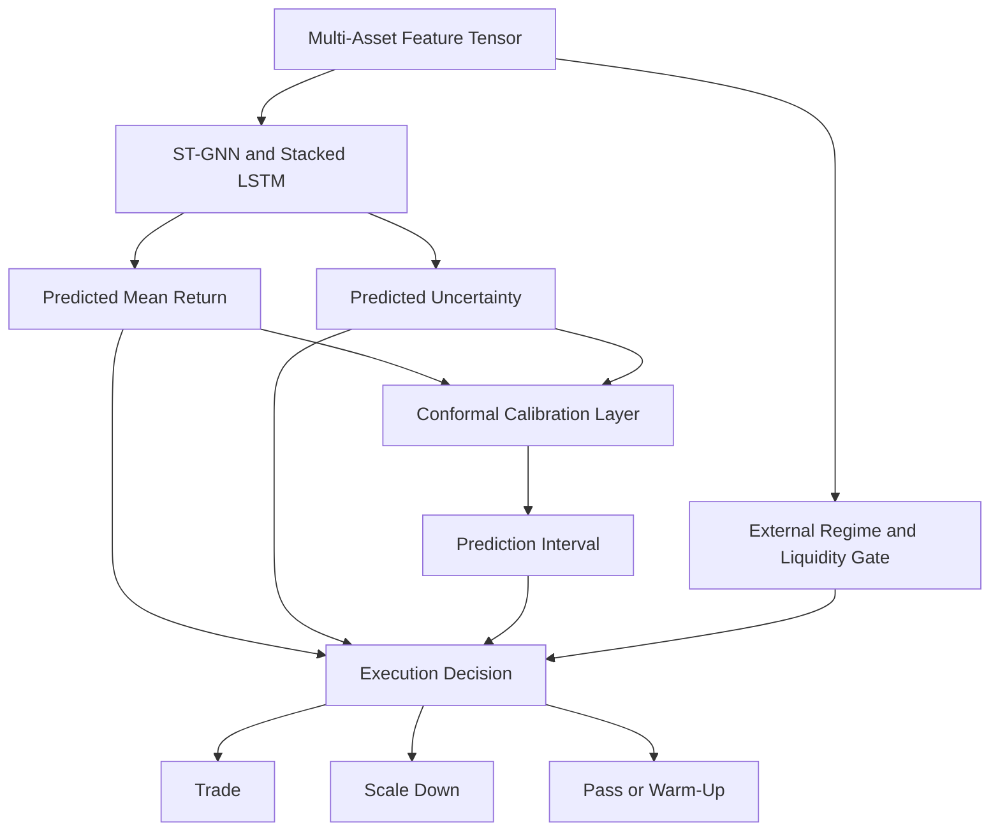

The execution decision can be based on all of the following:

* Expected return
* Predicted variance
* Monte Carlo Dropout dispersion
* Conformal prediction interval
* Current market regime
* Available liquidity
* Bid-ask spread
* Transaction-cost threshold
* Session state
* Asset-specific risk limits

---

## 7.5 Recommended Production Standard

For the 24-asset index and FX framework, a practical implementation should use a layered confidence architecture.

### Internal Confidence Layer

Use Gaussian Maximum Likelihood output heads so that every asset predicts:

$$\mu_i, \sigma_i^2$$

where:

* $\mu_i$ is the expected next-step return for asset $i$
* $\sigma_i^2$ is the predicted uncertainty for asset $i$

### Calibration Layer

Apply Conformal Prediction to recent out-of-sample residuals so that every forecast is accompanied by an empirically calibrated prediction interval.

### External Control Layer

Apply an independent volatility, liquidity, and regime filter.

The filter should override the neural network when:

* Liquidity falls below a minimum threshold.
* Bid-ask spreads widen excessively.
* A major central-bank announcement is approaching.
* Cross-asset correlations become unstable.
* The system enters a session handoff period.
* Recent model residuals exceed their permitted range.
* The detected regime falls outside the model's validated operating conditions.

During these periods, the framework should enter one of the following states:

* Normal execution
* Reduced exposure
* Passive warm-up
* Trading disabled

---

## 7.6 Confidence-Aware Position Sizing

Confidence should affect position sizing rather than serving only as a binary trade filter.

A simplified confidence-adjusted signal can be defined as:

$$z_i = \frac{\mu_i}{\sigma_i + \epsilon}$$

where:

* $\mu_i$ is the predicted return
* $\sigma_i$ is the predicted standard deviation
* $\epsilon$ prevents division by zero

The execution system can then scale the position according to the magnitude of $z_i$:

$$w_i = \operatorname{clip} \left( k z_i, -w_{\max}, w_{\max} \right)$$

where:

* $k$ is a risk-scaling coefficient
* $w_{\max}$ is the maximum permitted asset exposure
* $w_i$ is the final target position

This allows the same directional forecast to produce different trade sizes depending on the associated uncertainty.

---

## 7.7 Key Production Principle

Confidence should never be sourced from a single metric.

A production-grade decision should combine:

1. Model-reported uncertainty
2. Recent out-of-sample calibration performance
3. Independent regime classification
4. Liquidity and transaction-cost constraints
5. Portfolio-level risk limits

The ST-GNN should therefore be treated as a forecasting component inside a wider risk-controlled execution architecture, rather than as an autonomous trading decision-maker.

---

## 8. Conformal Prediction for Return Intervals

Conformal Prediction converts a standard machine learning point estimate into a calibrated prediction interval.

It can be applied to nearly any regression model, including the Spatio-Temporal GNN and Stacked LSTM framework, without requiring a specific parametric distribution for forecast errors.

The method measures how inaccurate, or *non-conforming*, the model has been on unseen calibration data. It then uses those historical errors to construct boundaries around future predictions.

Under the appropriate exchangeability assumptions, the resulting intervals provide finite-sample marginal coverage at a user-defined level.

For intraday financial time series, those assumptions may be weakened by serial dependence and regime changes. Production implementations should therefore use rolling calibration windows, time-aware conformal methods, or adaptive conformal techniques.

---

## 8.1 The Three Operational Data Splits

To construct conformal prediction intervals without contaminating the evaluation process, the historical data pipeline must be divided into three distinct segments.

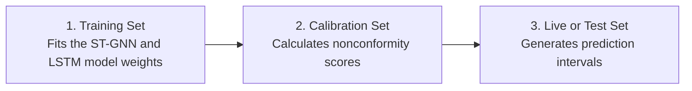

| Dataset          | Primary Purpose                        | Permitted Use                                   |
| ---------------- | -------------------------------------- | ----------------------------------------------- |
| Training set     | Train the base forecasting model       | Model fitting and hyperparameter development    |
| Calibration set  | Measure out-of-sample forecast errors  | Conformal threshold estimation                  |
| Live or test set | Evaluate or execute unseen predictions | Final interval generation and trading decisions |

The calibration set must not be used to update the base model after the nonconformity scores have been calculated unless the calibration procedure is also restarted.

---

## 8.2 Step-by-Step Mathematical Calculation

The following procedure describes split conformal prediction for a regression task such as next-step intraday log-return forecasting.

### 8.2.1 Step 1: Choose the Target Coverage Level

Define the desired marginal coverage level:

$$1-\alpha$$

where $\alpha$ is the permitted error rate.

For example, a target coverage level of 95% uses:

$$\alpha = 0.05$$

Under the required conformal assumptions, this means the generated interval is designed to contain the true future value with marginal probability of at least:

$$1-\alpha = 0.95$$

This does not mean that every rolling group of 100 financial predictions will contain exactly 95 correct intervals. The guarantee applies marginally across draws satisfying the conformal assumptions.

---

### 8.2.2 Step 2: Compute Calibration Nonconformity Scores

Pass the unseen calibration dataset through the already-trained ST-GNN model.

For each calibration observation $i$, calculate an absolute-error nonconformity score:

$$s_i = \left| y_i-\hat{y}_i \right|$$

where:

* $y_i$ is the observed log return for calibration sample $i$
* $\hat{y}_i$ is the model's point-estimate prediction
* $s_i$ is the corresponding nonconformity score

For a calibration set containing $n$ observations, the process produces:

$$s_1, s_2, \ldots, s_n$$

If the calibration dataset contains 1,000 time steps, the system calculates 1,000 nonconformity scores.

---

### 8.2.3 Step 3: Calculate the Quantile Threshold

Sort the calibration scores from smallest to largest:

$$s_{(1)} \leq s_{(2)} \leq \cdots \leq s_{(n)}$$

The finite-sample conformal rank is:

$$k = \left\lceil (n+1)(1-\alpha) \right\rceil$$

The conformal threshold is then selected as:

$$\hat{q} = s_{(k)}$$

When $k > n$, the threshold may be treated as infinite or handled according to the implementation's finite-sample convention.

An equivalent quantile level is:

$$\frac{\left\lceil (n+1)(1-\alpha) \right\rceil}{n}$$

using a higher-order empirical quantile rule.

### Example

Suppose:

$$n=999$$

and:

$$\alpha=0.05$$

Then:

$$k = \left\lceil (999+1)(0.95) \right\rceil = 950$$

The threshold is therefore the 950th smallest calibration error, not the 950th largest.

If:

$$s_{(950)}=0.0042$$

then:

$$\hat{q}=0.0042$$

---

### 8.2.4 Step 4: Construct the Live Prediction Interval

When the production model generates a new point estimate:

$$\hat{y}_{\text{new}}$$

construct a symmetric conformal interval:

$$\mathcal{C}_{\text{new}} = \left[ \hat{y}_{\text{new}}-\hat{q}, \; \hat{y}_{\text{new}}+\hat{q} \right]$$

For example, if:

$$\hat{y}_{\text{new}}=0.0015$$

and:

$$\hat{q}=0.0008$$

then:

$$\mathcal{C}_{\text{new}} = [0.0007, \; 0.0023]$$

---

## 8.3 Context-Aware Conformal Prediction

Basic split conformal regression produces a fixed-width interval.

If:

$$\hat{q}=0.0042$$

then every prediction receives a band of:

$$\pm 0.0042$$

This can be unsuitable for intraday trading because expected forecast uncertainty changes materially across:

* Quiet midday trading
* Market opens
* Session handoffs
* Macroeconomic announcements
* Volatility shocks
* Illiquid overnight periods

A context-aware implementation can combine Gaussian Maximum Likelihood output heads with normalized conformal scores.

---

### 8.3.1 Predict Conditional Scale

Modify each ST-GNN output head to predict:

* Expected return: $\hat{\mu}_i$
* Estimated standard deviation: $\hat{\sigma}_i$

The output for each asset becomes:

$$\hat{\mu}_i,\hat{\sigma}_i$$

The standard deviation must remain positive. A common implementation predicts a raw scale parameter and transforms it using a positive activation such as `softplus`.

---

### 8.3.2 Calculate Normalized Nonconformity Scores

For each calibration sample, calculate:

$$s_i = \frac{ \left| y_i-\hat{\mu}_i \right| }{ \hat{\sigma}_i+\epsilon }$$

where $\epsilon$ is a small numerical-stability constant.

These scores measure forecast error relative to the uncertainty predicted by the model.

---

### 8.3.3 Calculate the Scaled Quantile

Sort the normalized scores and calculate the conformal threshold:

$$\hat{q} = \operatorname{Quantile}_{1-\alpha} \left( s_1,\ldots,s_n \right)$$

using the finite-sample higher-rank correction described previously.

---

### 8.3.4 Generate a Dynamic Live Interval

For a new prediction, construct:

$$\mathcal{C}_{\text{new}} = \left[ \hat{\mu}_{\text{new}} - \hat{q}\hat{\sigma}_{\text{new}}, \; \hat{\mu}_{\text{new}} + \hat{q}\hat{\sigma}_{\text{new}} \right]$$

When the model estimates high uncertainty:

$$\hat{\sigma}_{\text{new}} \uparrow$$

the interval widens.

When the model estimates low uncertainty:

$$\hat{\sigma}_{\text{new}} \downarrow$$

the interval narrows.

This produces volatility-sensitive prediction bands rather than a constant-width interval.

---

## 8.4 Production Implementation Example

The following Python example calculates a split-conformal threshold and applies it to a live prediction.

```python
from __future__ import annotations

from typing import Tuple

import numpy as np
from numpy.typing import ArrayLike, NDArray

def calculate_conformal_threshold(
    calib_true: ArrayLike,
    calib_pred: ArrayLike,
    alpha: float = 0.05,
) -> float:
    """
    Calculate a split-conformal absolute-error threshold.

    Args:
        calib_true:
            Observed values from the calibration dataset.
        calib_pred:
            Point predictions for the calibration dataset.
        alpha:
            Target miscoverage rate. For example, alpha=0.05 requests
            a nominal 95% marginal coverage level.

    Returns:
        The finite-sample conformal error threshold.

    Raises:
        ValueError:
            If the arrays have different shapes, contain no observations,
            contain non-finite values, or alpha is outside (0, 1).
    """
    true_values: NDArray[np.float64] = np.asarray(
        calib_true,
        dtype=np.float64,
    )
    predictions: NDArray[np.float64] = np.asarray(
        calib_pred,
        dtype=np.float64,
    )

    if true_values.shape != predictions.shape:
        raise ValueError(
            "calib_true and calib_pred must have identical shapes."
        )

    if true_values.size == 0:
        raise ValueError("Calibration arrays must not be empty.")

    if not np.all(np.isfinite$true_values$):
        raise ValueError$"calib_true contains non-finite values."$

    if not np.all(np.isfinite(predictions)):
        raise ValueError$"calib_pred contains non-finite values."$

    if not 0.0 < alpha < 1.0:
        raise ValueError("alpha must be strictly between 0 and 1.")

    scores = np.abs$true_values - predictions$.reshape(-1)
    n_calibration = scores.size

    quantile_level = np.ceil(
        $n_calibration + 1$ * $1.0 - alpha$
    ) / n_calibration

    quantile_level = min$quantile_level, 1.0$

    q_hat = np.quantile(
        scores,
        quantile_level,
        method="higher",
    )

    return float$q_hat$

def generate_live_conformal_interval(
    live_prediction: float,
    q_hat: float,
) -> Tuple[float, float]:
    """
    Construct a symmetric conformal prediction interval.

    Args:
        live_prediction:
            Point prediction produced by the forecasting model.
        q_hat:
            Non-negative conformal calibration threshold.

    Returns:
        A tuple containing the lower and upper interval bounds.

    Raises:
        ValueError:
            If either input is non-finite or q_hat is negative.
    """
    if not np.isfinite$live_prediction$:
        raise ValueError$"live_prediction must be finite."$

    if not np.isfinite$q_hat$:
        raise ValueError$"q_hat must be finite."$

    if q_hat < 0.0:
        raise ValueError$"q_hat must be non-negative."$

    lower_bound = live_prediction - q_hat
    upper_bound = live_prediction + q_hat

    return lower_bound, upper_bound

if __name__ == "__main__":
    random_generator = np.random.default_rng(seed=42)

    # Simulate 1,000 out-of-sample 1-minute calibration targets.
    mock_calib_true = random_generator.normal(
        loc=0.0,
        scale=0.002,
        size=1_000,
    )

    # Add artificial model error to create calibration predictions.
    mock_calib_pred = mock_calib_true + random_generator.normal(
        loc=0.0,
        scale=0.0005,
        size=1_000,
    )

    # Calculate the nominal 95% conformal threshold.
    q_threshold = calculate_conformal_threshold(
        calib_true=mock_calib_true,
        calib_pred=mock_calib_pred,
        alpha=0.05,
    )

    # Simulate the next live ST-GNN return forecast.
    live_pred_return = 0.0015

    lower_bound, upper_bound = generate_live_conformal_interval(
        live_prediction=live_pred_return,
        q_hat=q_threshold,
    )

    print(
        "Calculated conformal threshold "
        f"$q_hat$: {q_threshold:.6f}"
    )
    print(
        "Live nominal 95% return interval: "
        f"[{lower_bound:.6f}, {upper_bound:.6f}]"
    )
```

---

## 8.5 Adaptive Conformal Implementation

The normalized version can be implemented by scaling calibration residuals using the predicted standard deviation.

```python
from __future__ import annotations

from typing import Tuple

import numpy as np
from numpy.typing import ArrayLike, NDArray

def calculate_scaled_conformal_threshold(
    calib_true: ArrayLike,
    calib_mean: ArrayLike,
    calib_std: ArrayLike,
    alpha: float = 0.05,
    epsilon: float = 1e-8,
) -> float:
    """
    Calculate a normalized conformal threshold using predicted scale.
    """
    true_values: NDArray[np.float64] = np.asarray(
        calib_true,
        dtype=np.float64,
    )
    predicted_means: NDArray[np.float64] = np.asarray(
        calib_mean,
        dtype=np.float64,
    )
    predicted_stds: NDArray[np.float64] = np.asarray(
        calib_std,
        dtype=np.float64,
    )

    if not (
        true_values.shape
        == predicted_means.shape
        == predicted_stds.shape
    ):
        raise ValueError(
            "Calibration arrays must have identical shapes."
        )

    if true_values.size == 0:
        raise ValueError("Calibration arrays must not be empty.")

    if not 0.0 < alpha < 1.0:
        raise ValueError("alpha must be strictly between 0 and 1.")

    if epsilon <= 0.0:
        raise ValueError("epsilon must be positive.")

    if np.any$predicted_stds < 0.0$:
        raise ValueError(
            "Predicted standard deviations must be non-negative."
        )

    if not all(
        np.all(np.isfinite(values))
        for values in (
            true_values,
            predicted_means,
            predicted_stds,
        )
    ):
        raise ValueError(
            "Calibration arrays must contain only finite values."
        )

    scaled_scores = (
        np.abs$true_values - predicted_means$
        / $predicted_stds + epsilon$
    ).reshape(-1)

    n_calibration = scaled_scores.size

    quantile_level = np.ceil(
        $n_calibration + 1$ * $1.0 - alpha$
    ) / n_calibration

    quantile_level = min$quantile_level, 1.0$

    q_hat = np.quantile(
        scaled_scores,
        quantile_level,
        method="higher",
    )

    return float$q_hat$

def generate_scaled_conformal_interval(
    predicted_mean: float,
    predicted_std: float,
    q_hat: float,
) -> Tuple[float, float]:
    """
    Construct a volatility-scaled conformal interval.
    """
    if predicted_std < 0.0:
        raise ValueError(
            "predicted_std must be non-negative."
        )

    values = $predicted_mean, predicted_std, q_hat$

    if not all(np.isfinite(value) for value in values):
        raise ValueError("All inputs must be finite.")

    if q_hat < 0.0:
        raise ValueError$"q_hat must be non-negative."$

    interval_width = q_hat * predicted_std

    lower_bound = predicted_mean - interval_width
    upper_bound = predicted_mean + interval_width

    return lower_bound, upper_bound
```

---

## 8.6 Execution Logic

The conformal interval can be used to reject trades whose expected return is not sufficiently separated from transaction costs and zero.

Assume the strategy requires a minimum net expected return of:

$$c=0.0010$$

where $c$ represents commissions, spreads, slippage, and the required safety margin.

### Long Entry Rule

Permit a long trade only when:

$$\text{Lower Bound}>c$$

For an interval:

$$[0.0012, \; 0.0028]$$

the long trade may proceed because the entire interval exceeds the required return threshold.

For an interval:

$$[0.0004, \; 0.0026]$$

the trade should be rejected because the lower bound does not cover the required cost threshold.

---

### Short Entry Rule

Permit a short trade only when:

$$\text{Upper Bound}<-c$$

For an interval:

$$[-0.0030, \; -0.0014]$$

the short trade may proceed.

For an interval:

$$[-0.0022, \; -0.0003]$$

the trade should be rejected because the entire interval does not exceed the negative cost threshold.

---

### Zero-Crossing Rule

If the interval contains zero:

$$\text{Lower Bound} \leq 0 \leq \text{Upper Bound}$$

the direction of the next return remains uncertain.

The default execution action should therefore be:

$$\text{Stay Flat}$$

---

## 8.7 Example Execution Filter

```python
from __future__ import annotations

from enum import Enum

class TradeDecision(str, Enum):
    LONG = "long"
    SHORT = "short"
    PASS = "pass"

def evaluate_conformal_trade(
    lower_bound: float,
    upper_bound: float,
    minimum_return: float,
) -> TradeDecision:
    """
    Convert a conformal interval into a directional trade decision.
    """
    if lower_bound > upper_bound:
        raise ValueError(
            "lower_bound must not exceed upper_bound."
        )

    if minimum_return < 0.0:
        raise ValueError(
            "minimum_return must be non-negative."
        )

    if lower_bound > minimum_return:
        return TradeDecision.LONG

    if upper_bound < -minimum_return:
        return TradeDecision.SHORT

    return TradeDecision.PASS
```

---

## 8.8 Production Considerations for Financial Time Series

Standard split conformal prediction assumes that calibration and future observations are exchangeable.

Intraday financial data commonly violates this assumption because of:

* Serial dependence
* Volatility clustering
* Structural breaks
* Intraday seasonality
* Session transitions
* Changing market microstructure
* Macroeconomic regime shifts

A production implementation should therefore consider:

1. Rolling calibration windows
2. Session-specific calibration sets
3. Asset-specific thresholds
4. Exponentially weighted calibration scores
5. Adaptive conformal inference
6. Block-based or time-series conformal methods
7. Coverage monitoring by asset and regime
8. Automatic execution shutdown when empirical coverage deteriorates

The system should continuously compare the nominal coverage level with realised out-of-sample coverage.

For a nominal target of 95%, a sustained realised coverage materially below 95% indicates that the calibration distribution no longer represents the live market environment.

---

## 8.9 Recommended Multi-Asset Configuration

For the 24-asset ST-GNN framework, conformal thresholds should not automatically be pooled across every asset.

A preferable hierarchy is:

* Asset-specific calibration where sufficient data is available
* Asset-class calibration for sparse instruments
* Session-specific calibration for APAC and Atlantic models
* Regime-specific calibration where adequate observations exist
* A global fallback threshold for operational continuity

This prevents a high-volatility instrument from producing excessively wide intervals for lower-volatility assets.

The final interval for asset $i$ at time (t) may therefore depend on:

$$\hat{\mu}\_{i,t}, \quad \hat{\sigma}\_{i,t}, \quad \hat{q}\_{i,s,r}$$

where:

* $i$ identifies the asset
* $s$ identifies the active trading session
* $r$ identifies the detected market regime
* $\hat{q}_{i,s,r}$ is the corresponding calibrated threshold

The resulting interval is:

$$\mathcal{C}\_{i,t} = \left[ \hat{\mu}\_{i,t} - \hat{q}\_{i,s,r}\hat{\sigma}\_{i,t}, \; \hat{\mu}\_{i,t} + \hat{q}\_{i,s,r}\hat{\sigma}\_{i,t} \right]$$

This produces prediction intervals that adapt to the asset, session, regime, and current forecast uncertainty.

---

## 9. Recent Research

### 9.1 Conformal Forecasting++

Recent breakthroughs in time-series conformal forecasting—specifically detailed in major 2025/2026 literature like "Relational Conformal Prediction for Correlated Time Series" (CoRel) and "Conformal Prediction for Time-series with Change Points" (CPTC)—provide vital architectural insights for our 24-asset intraday framework. [1, 2]

While these papers benchmark long-term, multi-scale, or monthly datasets to establish theoretical bounds, their core mathematical insights directly address the flaws of applying vanilla machine learning to live execution. Beyond the basic warning against overfitting, three structural lessons apply directly to our Spatio-Temporal GNN-LSTM framework: [3, 4, 5] 

---

### 9.2 Lesson 1: The “Exchangeability” Breakdown (The Sequential Error Loop)

Standard conformal prediction assumes data is exchangeable (meaning the order of your calibration data does not matter). Recent literature emphasizes that in time-series, this assumption fails catastrophically. [3, 4] 

* **The lesson:** If your model makes a massive error on an FX pair at 9:30 AM, its error at 9:31 AM is highly likely to be large as well, because financial errors cluster sequentially. [6] 
* **Framework implication:** You cannot use a static calibration threshold (q) calculated weeks ago. Your execution engine must use an Online Adaptive Learning Mechanism. It should update the quantile boundary dynamically at every time step using an asymmetric rolling loss wrapper (such as Adaptive Conformal Inference). This forces the confidence intervals to widen instantly if the model experiences a string of consecutive misses. [4, 6, 7] 

---

### 9.3 Lesson 2: Condition Uncertainty on Neighbours, Not Just the Target

The CoRel (Conformal Relational Prediction) framework published in 2025 introduces a massive paradigm shift for graph deep learning: Uncertainty is a spatial property, not just an isolated asset property. [1, 7] 

* **The lesson:** Standard models calculate a confidence band for the S&P 500 based only on the S&P 500's historical errors. The recent literature proves that your interval width for Asset A becomes dramatically tighter and more accurate if you condition its uncertainty on the prediction errors of its topological neighbors in the GNN graph. [1, 7] 
* **Framework implication:** Instead of running 24 isolated conformal calculations, you should pass the history of prediction errors of all 24 assets back through a secondary spatial graph layer. If the Nikkei 225 and ASX 200 are exhibiting highly chaotic, non-conforming errors during the APAC session, our model can use that spatial relationship to preemptively widen the confidence bands on AUD/USD before the currency pair's localized errors actually spike. [7] 

---

### 9.4 Lesson 3: The Danger of “Change Points” (Session Boundaries)

The CPTC (Conformal Prediction with Change Points) framework specifically highlights how black-box sequence models fail when confronting sudden shifts in underlying data-generating processes—known as Change Points. [8, 9] 

* **The lesson:** Long-term monthly models fail when micro-economic regimes shift. For our intraday network, the session handoffs (e.g., London pre-open at 5:00 PM AEST) act as daily change points. Standard rolling averages lag behind these shifts, causing confidence intervals to remain deceptively narrow right when the market structural dynamics alter completely. [8, 9] 
* **Framework implication:** Instead of letting the model slowly learn a regime shift after it occurs, incorporate a State Transition Prediction component. Because we have split our system into APAC and Atlantic models, the incoming model must instantly inflate its conformal interval widths during its initial 15-minute "live activation" window, gradually contracting them only after validating that its spatial-temporal hidden states have accurately synchronized with the new session's liquidity. [2, 10] 

---

### 9.5 Summary Checklist for System Design

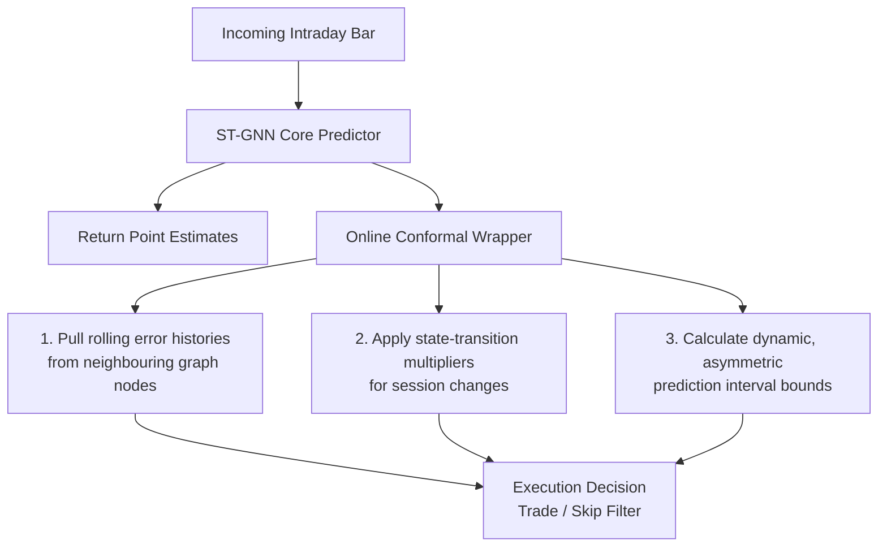

By implementing these modern spatial-conformal techniques, your system shifts from simply predicting price action to dynamically measuring how much the entire global asset network is structurally changing from one minute to the next. [1, 7] 
Would you like to explore how to write a code layer that calculates this rolling, multi-asset conformal error tracking to sit on top of your existing PyTorch network? [1, 7] 

### References

[1] [icml.cc](https://icml.cc/virtual/2025/poster/43601)
[2] [proceedings.neurips.cc](https://proceedings.neurips.cc/paper_files/paper/2025/file/12271b64c483ad8f6192eb6aaa102044-Paper-Conference.pdf)
[3] [arxiv.org](https://arxiv.org/html/2511.13608v1)
[4] [arxiv.org](https://arxiv.org/abs/2601.18509)
[5] [www.sciencedirect.com](https://www.sciencedirect.com/science/article/pii/S0360544226002811)
[6] [arxiv.org](https://arxiv.org/html/2601.18509v2)
[7] [openreview.net](https://openreview.net/forum?id=wwYDQ1vXcZ)
[8] [github.com](https://github.com/Rose-STL-Lab/CPTC)
[9] [arxiv.org](https://arxiv.org/html/2509.02844v1)
[10] [neurips.cc](https://neurips.cc/virtual/2025/poster/118881)

---

## 10. Spatio-Temporal Models Alone Are Not State of the Art

The spatio-temporal network does not replace single-time-series techniques; rather, the most powerful institutional systems use single-time-series models alongside the spatio-temporal network in a layered, hybrid architecture. [1] 

In quantitative finance, this is known as a Residual or Ensemble Framework. It combines the benefits of both worlds: local models handle highly reliable, short-term asset-specific patterns, while the spatio-temporal network captures broader, complex market dynamics.

---

### 10.1 The Risk of Relying Solely on the Spatio-Temporal GNN

While the spatio-temporal network excels at learning macro factors, sector rotations, and lead-lag relationships, its complexity introduces a significant vulnerability: it can overlook simple, powerful, localized signals. [2, 3] 

If a specific forex pair (like AUD/USD) experiences an immediate micro-level order book imbalance or a sharp short-term mean reversion, the heavy mathematical machinery of a GNN-LSTM/TCN can inadvertently smooth that signal out. The global graph layer is optimized to find patterns that explain the entire portfolio, meaning it occasionally sacrifices local accuracy for global consistency.

---

### 10.2 The Production Standard: The Residual Ensemble

To resolve this trade-off, production pipelines typically use single-asset models and multi-asset graph models concurrently. The system uses a two-step framework:

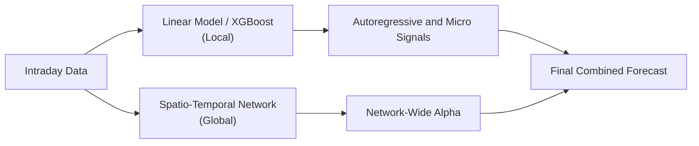

#### Step 1: The Base Layer (Single-Time-Series Model)

You run a simple, highly regularised single-time-series model—such as a Linear Ridge Regression or an ARIMA/GARCH variant—on each of your 24 assets individually.

* This model acts as a reliable baseline. Its job is to capture basic autoregressive features: short-term momentum, immediate mean reversion, and localized volatility spikes. [4] 

#### Step 2: The Residual Layer (Spatio-Temporal Network)

Instead of forcing your complex Spatio-Temporal GNN to predict the actual future price return, you train it to predict the errors (residuals) of your base model. [5, 6, 7] 

* The GNN asks: "What structural market context did the simple linear model miss because it cannot see the other 23 assets?"

#### Step 3: Linear Blending

Your final trading signal is simply the sum of both predictions: [8] 

$$\hat{Y}_{\text{final}} = \hat{Y}_{\text{Local Model (Simple)}} + \hat{Y}_{\text{Spatio-Temporal Model (Complex)}}$$

---

### 10.3 Operational Advantages of a Layered Architecture

1. A Safety Rail for Execution: If communication between your assets breaks down during low-liquidity periods, the GNN's output will become noisy. However, because your final signal is anchored by the localized model, your system avoids erratic, unhedged trading decisions.
2. Cleaner Scaling Parameters: It makes data processing more efficient. Your local models can run on raw, asset-specific features without needing global coordination, while the spatio-temporal network focuses exclusively on tracking normalized structural shifts across the network.
3. Easier Conformal Calibration: Calculating the conformal prediction intervals discussed earlier becomes significantly cleaner. You can apply your conformal uncertainty wrappers directly to the combined ensemble output, resulting in tighter, more reliable confidence bands.

In summary, you should not choose between single-time-series techniques and spatio-temporal networks. The most effective approach is to use simple single-series models to handle immediate, local price signals, and use the spatio-temporal graph network to capture the broader market relationships. [9] 
Would you like to see how to structure a PyTorch or Scikit-Learn pipeline to implement this residual training setup, where the deep learning network learns directly from the errors of a linear baseline?

### References

[1] [uplatz.com](https://uplatz.com/blog/the-million-token-revolution-an-in-depth-analysis-of-long-context-ai-models-and-their-strategic-implications/)
[2] [www.sciencedirect.com](https://www.sciencedirect.com/science/article/pii/S1474034625009127)
[3] [www.rs-online.com](https://www.rs-online.com/designspark/triggering)
[4] [lumel.com](https://lumel.com/blog/planning/snapshots-planning-forecasting-budgeting/)
[5] [link.springer.com](https://link.springer.com/chapter/10.1007/978-3-031-27852-5_5)
[6] [openreview.net](https://openreview.net/forum?id=wCNuEA5MSv)
[7] [www.mdpi.com](https://www.mdpi.com/2076-3417/14/18/8330)
[8] [www.sciencedirect.com](https://www.sciencedirect.com/science/article/pii/S0925231215016057)
[9] [research-repository.griffith.edu.au](https://research-repository.griffith.edu.au/bitstreams/9fedf517-af76-4e70-9d42-0e2346c84822/download)
## 11. 0DTE Volatility Data and Rolling Microstructure Features

Integrating 0DTE (Zero Days to Expiration) option volatility alongside rolling microstructure features shifts your model's inputs from trailing, reactive lag variables to predictive, forward-looking indicators. [1] 

In a Spatio-Temporal GNN framework, these metrics function as structural state variables. They tell the model how much risk the broader market is pricing in right now, and exactly how aggressively buyers and sellers are fighting over individual order books.

---

### 11.1 0DTE Volatility on the S&P 500

0DTE options on the S&P 500 (SPX) account for a massive percentage of total index option volume. Because these contracts expire at the closing bell of the current trading day, they are highly sensitive to sudden intraday movements. [2, 3] 

#### The Market Phenomenon: The Gamma Squeeze Loop

When massive institutional or retail flow buys short-dated 0DTE options, option market makers are forced to aggressively buy or sell the underlying S&P 500 futures to dynamically hedge their exposure (Delta hedging). Near the money, an option's Gamma spikes rapidly as expiration approaches. This creates a deterministic loop: 0DTE volume forces market makers to buy or sell, which drives the cash index, which in turn triggers momentum across your 24 global indices. [4, 5, 6, 7, 8] 

#### What Features to Extract

To feed this into your model, do not look at standard daily implied volatility (like the VIX). You must extract intraday 0DTE surface metrics sampled at the same frequency as your price bars (e.g., 1-minute or 5-minute increments): [9] 

* Intraday 0DTE Implied Volatility (IV) Skew: The difference in IV between out-of-the-money (OTM) 0DTE puts and OTM 0DTE calls. A steepening put skew reveals that institutional desks are aggressively buying same-day insurance, indicating a high probability of an impending intraday downward trend. [10, 11] 

* 0DTE Absolute Volatility Term Structure: The spread between 0DTE implied volatility and 1-day or 1-week option implied volatility. When 0DTE volatility spikes above longer-dated horizons, it signals that the market is positioning for a hyper-localized, near-immediate structural breakout.

* Net Intraday GEX (Gamma Exposure): An estimate of the cumulative gamma held by market makers across the 0DTE strike chain.

* High Positive GEX: Market makers trade against the trend (buying dips, selling rallies), which suppresses intraday volatility. The GNN should look for mean-reversion strategies.

* High Negative GEX: Market makers trade with the trend (selling dips, buying rallies), accelerating market moves. The GNN should pivot to momentum breakouts. [12, 13, 14, 15, 16] 

---

### 11.2 Core Rolling Microstructure Features

While 0DTE metrics provide a top-down view of overall market risk, rolling microstructure features provide a bottom-up look at order book dynamics. They capture liquidity shifts and order flow imbalances before they cause major price moves. [17] 

#### Feature 1: Order Imbalance and Flow Metrics

* Volume-Weighted Order Imbalance (VOI): Tracks changes in the accumulation of liquidity at the best bid and best ask relative to actual transacted volume. Positive VOI means buyers are aggressively adding limit orders at the bid while sellers are withdrawing orders from the ask, signaling near-term upward pressure.

* Trades-to-Quotes Ratio: The number of executed trades divided by the number of order modifications or cancellations. A sudden spike in this ratio means market participants are aggressively hitting market orders rather than passively adjusting limit orders, indicating an impending jump in volatility.

#### Feature 2: Intraday Volume and Liquidity Dynamics

* Rolling Amivud Illiquidity Measure: Calculated as the absolute return of the asset divided by its total volume over a rolling window:

$$\text{Illiquidity}_{t} = \frac{\vert{}R_t\vert{}}{\text{Volume}_t}$$
This tracks the price impact of a trade. If this metric rises across your 24 assets, it tells the GNN that order books are thinning, meaning even a small trade will trigger an outsized price jump. [18] 

* Volume Energy (Intraday Volume Deviation): The ratio of current 1-minute volume to the historical median volume for that exact minute of the day. This provides crucial context for the model: a sudden volume surge at a quiet time like 1:00 PM carries a completely different signal than the same surge during the busy market open.

#### Feature 3: Information Flow Algorithms

* VPIN (Volume-Cardinal Probability of Toxicity): An advanced metric that measures information asymmetry and toxic order flow by evaluating volume imbalances across standardized volume buckets. A high VPIN indicates that market makers are filling highly informed institutional orders, prompting them to wide their spreads and drain liquidity, which often precedes sudden flash crashes. [19] 

---

### 11.3 Structuring the Enriched Input Matrix

To prevent parameter explosion in the first layer of your Spatio-Temporal network, you structure these features hierarchically within your 3D Tensor [Batch, 24 Assets, Lookback, Features].

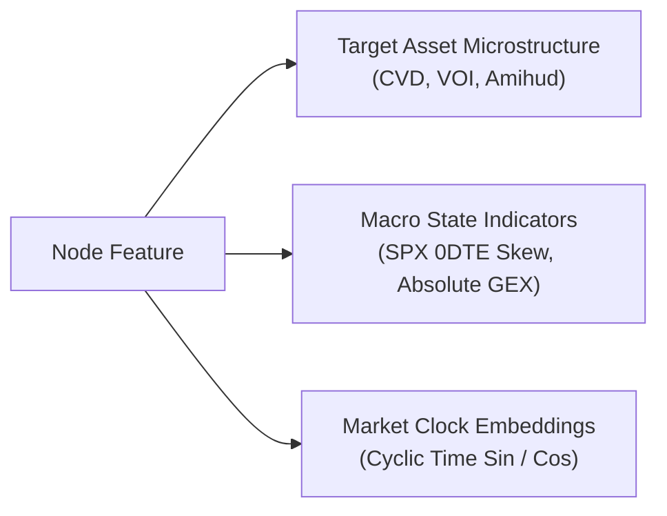

#### The Spatial Advantage

By feeding 0DTE macro metrics and localized microstructure variables into the GNN simultaneously, the network can easily map cross-asset dynamics. For example, if the SPX 0DTE skew suddenly tilts bearish and the VPIN of your major forex pairs concurrently spikes, the GNN will recognize this combination across the graph, allowing the Stacked LSTM or TCN layers to anticipate a systemic shift across global markets.

Are you planning to extract these intraday option metrics directly from historical consolidated options tape data (like OPRA), or do you have access to a real-time analytics provider that calculates pre-aggregated GEX and implied volatility surfaces?

### References

[1] [blog.roundhillinvestments.com](https://blog.roundhillinvestments.com/0dte-covered-call-etf-suite-faq)
[2] [papers.ssrn.com](https://papers.ssrn.com/sol3/Delivery.cfm/5223127.pdf?abstractid=5223127&mirid=1)
[3] [www.youtube.com](https://www.youtube.com/watch?v=ZbpKroy7Lmc)
[4] [resonanzcapital.com](https://resonanzcapital.com/insights/same-day-options-same-day-alpha-institutional-lessons-from-0-dtes-boom)
[5] [marketxls.com](https://marketxls.com/blog/the-ultimate-guide-to-0dte-options-strategy-risks-rewards)
[6] [optionalpha.com](https://optionalpha.com/blog/0dte-options-benefits-myths-risks)
[7] [www.vantagepointsoftware.com](https://www.vantagepointsoftware.com/blog/0dte-volmageddon/)
[8] [www.thefinanalytics.com](https://www.thefinanalytics.com/post/understanding-delta-and-its-role-in-options-trading-and-risk-management)
[9] [quantpedia.com](https://quantpedia.com/leveraged-etfs-in-low-volatility-environments/)
[10] [www.efmaefm.org](http://www.efmaefm.org/0EFMAMEETINGS/EFMA%20ANNUAL%20MEETINGS/2022-Rome/papers/EFMA%202022_stage-3032_question-Full%20Paper_id-329.pdf)
[11] [flashalpha.com](https://flashalpha.com/stock/v)
[12] [trendspider.com](https://trendspider.com/trading-tools-store/category/options/)
[13] [medium.com](https://medium.com/@navnoorbawa/gamma-scalping-and-the-volatility-risk-premium-citadels-alpha-engine-the-gamestop-squeeze-and-1d5360e67675)
[14] [www.sahmcapital.com](https://www.sahmcapital.com/news/content/a-guide-to-0-dte-spx-credit-spreads-by-decoding-market-maker-sentiment-using-gexgamma-advanced-algorithmic-analysis-2024-03-04)
[15] [menthorq.com](https://menthorq.com/guide/gex-meets-volatility-q-score/)
[16] [www.schwab.com](https://www.schwab.com/learn/story/zeroing-on-0dte-options-learn-basics)
[17] [www.epfl.ch](https://www.epfl.ch/schools/cdm/wp-content/uploads/2019/02/Cont-Swissquote2018.pdf)
[18] [www.sciencedirect.com](https://www.sciencedirect.com/science/article/abs/pii/S138641812500059X)
[19] [visualhft.com](https://visualhft.com/blog/getting-started-with-visualhft-real-time-market-microstructure-analysis/)

---

## 12. Direct 0DTE Volatility and GEX Pipeline

If you have access to real-time 0DTE trading data (such as the raw intraday option chain feeds for the S&P 500), you do not need a paid analytics service like SpotGamma or FlashAlpha. You can calculate 0DTE Implied Volatility Surfaces and Gamma Exposure (GEX) directly inside your data pipeline. [1, 2, 3, 4] 
This data can be processed into structured inputs for a Spatio-Temporal GNN-LSTM framework.

---

### 12.1 Reverse-Engineering 0DTE Volatility and GEX

Market makers hold inventory rather than directional directional views. When a retail or institutional trader buys a 0DTE contract, the market maker takes the short side. To remain delta-neutral, they are forced to dynamically buy or sell underlying index futures based on the option's Gamma. [1, 4, 5] 

#### Step A: Build the Implied Volatility Vector

To calculate Gamma, you first need the contract's Implied Volatility. For every strike (K) in your real-time 0DTE chain: [6, 7] 
1. Grab the current S&P 500 spot price (S) and the option's mid-price.
2. Set time-to-expiry (T) as the fraction of the remaining trading day (e.g., if there are 4 hours left in the session, T = 4 / 24 / 365).
3. Use a root-finding algorithm (like Newton-Raphson or Brent's method) to invert the Black-Scholes formula, solving for the volatility (σ) that matches the market mid-price. [8, 9, 10] 

This gives you your 0DTE IV Skew Feature: the difference between out-of-the-money Put IV and Call IV at any given minute.

#### Step B: Calculate Dynamic Net GEX

Once you have the IV (σ) for each strike, you calculate the standard Black-Scholes Gamma (Γ). The total market-maker dollar exposure for that specific contract is calculated using the following formula: [1, 6, 8, 11] 

$$\text{GEX}_{\text{strike}} = \Gamma \times \text{Open Interest (or Rolling Intraday Volume)} \times 100 \times S^2 \times 0.01$$
The standard industry assumption is that retail traders buy options and market makers sell them. Therefore: [4, 5] 

* **Calls:** Assume positive dealer exposure ($\text{GEX}_{\text{call}}$).
* **Puts:** Assume negative dealer exposure ($-\text{GEX}_{\text{put}}$). [11] 

$$\text{Net GEX}_{\text{strike}} = \text{GEX}_{\text{call}} - \text{GEX}_{\text{put}}$$
Summing the Net GEX across all strikes gives you a single macro state variable for that minute: [11] 
$$\text{Total Systemic GEX} = \sum (\text{Net GEX}_{\text{strike}})$$
```python
import numpy as np
import scipy.stats as si
def calculate_bs_gamma(S, K, T, r, sigma):
    """Calculates standard Black-Scholes Gamma for an option contract."""
    if T <= 0 or sigma <= 0:
        return 0
    d1 = (np.log(S / K) + (r + 0.5 * sigma ** 2) * T) / (sigma * np.sqrt(T))
    gamma = si.norm.pdf(d1) / (S * sigma * np.sqrt(T))
    return gamma
def compute_minute_gex(spot_price, strikes, call_vols, put_vols, ivs, T_remaining):
    """
    Computes Net Absolute Dollar GEX across a 0DTE chain for a single minute.
    Uses rolling intraday volume as a proxy for fast-moving 0DTE open interest.
    """
    total_net_gex = 0.0
    r = 0.045  # Current risk-free rate proxy
    
    for idx, K in enumerate(strikes):
        sigma = ivs[idx]
        gamma = calculate_bs_gamma(spot_price, K, T_remaining, r, sigma)
        
        # Calculate Dollar Gamma Exposure per contract unit
        # (Change in dollar-delta sensitivity per 1% move in the underlying index)
        dollar_gamma = gamma * 100 * (spot_price ** 2) * 0.01
        
        # Aggregate assuming market makers are short public volume flow
        call_gex = call_vols[idx] * dollar_gamma
        put_gex = put_vols[idx] * dollar_gamma
        
        total_net_gex += (call_gex - put_gex)
        
    return total_net_gex
```

---

### 12.2 Granular Rolling Microstructure Features

While 0DTE GEX tracks institutional hedging flows on the S&P 500, rolling microstructure features capture localized supply and demand imbalances for each of your 24 individual assets. [5, 12] 
Because you are using 1-minute bars, these features should be constructed using a multi-scale rolling lookback window (e.g., rolling 3-minute, 15-minute, and 60-minute windows) to provide the model with both short-term and medium-term context.

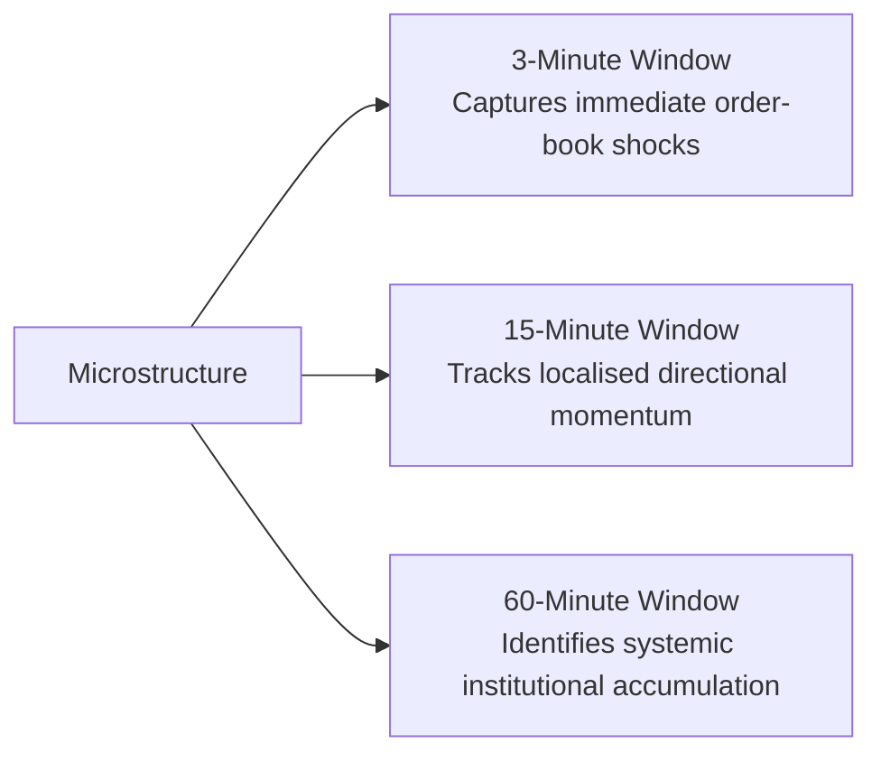

#### 12.2.1 Multi-Scale Cumulative Volume Delta

* **What it is:** Instead of looking at total volume, you look at the direction of the volume. For every transaction inside the 1-minute bar, determine if it occurred at the Ask (buyer-initiated aggression) or at the Bid (seller-initiated aggression) using a tick-direction algorithm.

* **Features:**

   * $\text{CVD}_{3\text{m}}$: Captures immediate order book shocks.
   * $\text{CVD}_{15\text{m}}$: Tracks localized directional momentum.
   * $\text{CVD}_{60\text{m}}$: Identifies systemic institutional accumulation.

#### 12.2.2 Microstructure Liquidity and Impact Slopes

* Rolling Bid-Ask Spread Elasticity: The rolling average of the bid-ask spread divided by the 1-minute volume. A widening spread on rising volume indicates that market makers are withdrawing liquidity, clearing the path for an aggressive price move.
* The Kyle’s Lambda Proxy: Calculated as the slope of a rolling linear regression: Log Return ~ Volume Delta. This measures the market's current depth. A steep slope means the order book is thin, indicating that incoming market orders will cause significant price movements.

#### 12.2.3 Structural Distribution Tail Features

* Rolling Realised Kurtosis (15-Minute Lookback): Measures the "fatness" of the tails of your 1-minute log returns over the last quarter-hour. High kurtosis indicates the presence of micro-jumps or flash shocks, alerting the GNN that the local asset is experiencing non-Gaussian noise.

---

### 12.3 Integrating the Features into the GNN Architecture

To integrate these components, organize your node feature vectors to balance macro conditions with local market dynamics.

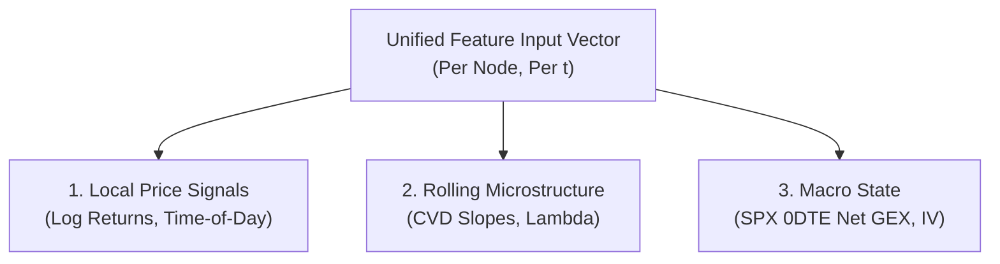

1. Local Price Signals: The asset's own log returns, normalized for time-of-day volatility.
2. Rolling Microstructure Features: The multi-scale CVD trends, Kyle's Lambda proxy, and asset-specific liquidity metrics.
3. Macro State Variables: The S&P 500 0DTE Net GEX and IV Skew metrics. Broadcast these identical values across all 24 nodes at time step t.

#### How the Model Processes the Data

When these features pass into the GNN layer, the network evaluates them in context.
If the Macro State indicates a Negative GEX Regime (where market makers' hedging tends to amplify market volatility), the GNN shifts its focus toward the Multi-Scale CVD Slopes across your equity indices, preparing the model for a potential rapid, synchronized breakout. Conversely, in a Positive GEX Regime, the network downweights momentum signals and prioritizes localized mean-reversion features. [5, 13, 14, 15] 

Would you like to focus on designing a PyTorch dataset pipeline that structures raw 0DTE option options strings alongside your 1-minute price bars, or should we examine how to build the residual ensemble training layout to run your single-series baselines next to this model?

### References

[1] [github.com](https://github.com/FlashAlpha-lab/gex-explained)
[2] [spotgamma.com](https://spotgamma.com/0dte-options-strategy-guide/)
[3] [github.com](https://github.com/FlashAlpha-lab/0dte-options-analytics)
[4] [dev.to](https://dev.to/tomasz_dobrowolski_35d32c/build-a-gex-dashboard-with-python-gamma-exposure-monitor-in-one-api-call-2e4p)
[5] [flashalpha.com](https://flashalpha.com/articles/guide-to-0dte-trading-strategies-real-time-data)
[6] [rpubs.com](https://rpubs.com/tmoran/GammaExposure)
[7] [romanornr.medium.com](https://romanornr.medium.com/options-trading-part-5-vega-volatility-risk-ea368b2dfb23)
[8] [www.youtube.com](https://www.youtube.com/watch?v=t2Qr4GdL3Hc&t=155)
[9] [www.tandfonline.com](https://www.tandfonline.com/doi/full/10.1080/1350486X.2023.2277960)
[10] [neuralakarshit.medium.com](https://neuralakarshit.medium.com/reversing-black-scholes-how-we-extract-implied-volatility-using-root-solving-algorithms-64fb68258c5a)
[11] <https://gexstream.com>
[12] [fattail.ai](https://fattail.ai/gamma-exposure-gex-explained/)
[13] [flashalpha.com](https://flashalpha.com/tools/gamma-exposure)
[14] [www.moomoo.com](https://www.moomoo.com/community/feed/moomoo-s-gex-the-simple-guide-for-everyday-traders-116567402348953)
[15] [menthorq.com](https://menthorq.com/guide/quant-data-shapes-dealer-flow/)

---

## 13 SOTA specialised algorithmic components

Moving beyond localised US equity microstructure and 0DTE options flow, state-of-the-art global macro and multi-asset intraday trading systems deploy specialised algorithmic components to manage 24-hour spot-index and foreign-exchange networks. [1]

The principal engineering layers missing from the current blueprint fall into three areas:

1. Execution, cost, and alpha separation
2. Advanced temporal-state modelling
3. Macroeconomic and cross-session context injection

---

### 1. Execution, Cost, and Alpha Separation

A high-quality predictive model can still lose money when the execution architecture is poorly optimised. State-of-the-art systems therefore separate alpha prediction from trade execution.

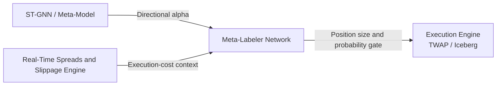

#### 1.1 Meta-Labeling: The Sizing Layer

State-of-the-art frameworks rarely send the direct output of a neural network to an execution engine. Instead, they apply Marcos López de Prado's concept of meta-labeling through a secondary machine-learning model, such as a lightweight gradient-boosted tree. [2, 3, 4]

* **How it works:** The primary ST-GNN determines trade direction, such as buy or sell. The meta-labeler evaluates current volatility, network-wide spreads, liquidity, and time of day to estimate whether the proposed trade is likely to remain profitable after transaction costs. [2, 5]
* **Impact:** The meta-labeler converts a directional point estimate into a position-sizing function. When the estimated probability of success is low, the position size is reduced to zero, filtering out low-conviction signals during quiet or illiquid periods. [2]

#### 1.2 Cross-Exchange and Platform Fragmentation Modelling

Spot indices and foreign-exchange instruments trade across fragmented global venues rather than through a single centralised exchange. [6]

* **Missing factor:** A one-minute price bar from a retail broker may differ materially from prices observed in institutional interbank pools such as EBS or Reuters Matching. State-of-the-art systems therefore include inter-venue liquidity spreads as explicit node features.
* **Impact:** When the spread between a retail CFD quote and the underlying futures or institutional market widens, the model interprets this as deteriorating liquidity. The conformal prediction bands can then widen, while the execution layer suppresses trades during periods of elevated slippage risk. [7]

---

### 2. Advanced Temporal Architectures

LSTMs are increasingly being replaced in high-frequency research pipelines because of sequential-processing latency, gradient degradation, and long-sequence bottlenecks. [8]

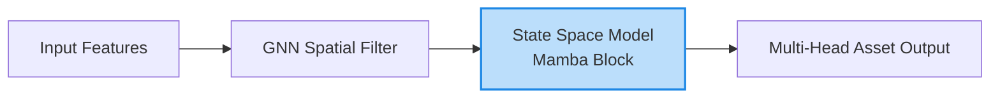

#### 2.1 Linear State Space Models

In modern trading architectures, the stacked LSTM can be replaced by a State Space Model, particularly a Mamba-based temporal layer. [4, 9]

* **Why it matters:** LSTMs process time steps sequentially, which creates an inference-latency bottleneck. Transformers support parallel processing but generally require quadratic computational complexity, (O(N^2)), making them expensive for long historical windows. [8]
* **Mamba advantage:** Mamba architectures process sequences with approximately linear complexity, (O(N)), while maintaining a recurrent hidden-state representation. Combining a GNN with Mamba produces a Graph-Mamba architecture capable of processing long intraday histories across all 24 assets with lower latency and reduced long-sequence degradation. [4, 8, 9]

---

### 3. Macro and Global Session Cross-Talk Features

For global spot indices and foreign-exchange pairs trading across a 24-hour cycle, local returns provide an incomplete representation of market conditions without broader macroeconomic context.

#### 3.1 Global Inter-Session Lag Vectors

During the APAC session, approximately 09:00–17:00 AEST, Asian indices and regional currency pairs remain influenced by the closing state of US markets several hours earlier.

* **Missing factor:** Explicit end-of-session static tensors.
* **Implementation:** When the APAC model initialises, its node features should include static vectors containing the final returns, realised volatility, and volume profiles of the preceding US session.
* **Purpose:** These vectors allow the GNN to condition current-session forecasts on whether Wall Street closed in a state of high-stress liquidation, neutral consolidation, or stable accumulation.

#### 3.2 Central-Bank and Scheduled-News Shock Vectors

The largest change points and distribution shifts in foreign exchange and global indices are often driven by scheduled macroeconomic releases, including US CPI, FOMC decisions, employment reports, and RBA rate announcements.

* **Missing factor:** An explicit macroeconomic time-to-event feature.
* **Implementation:** Add a continuous feature representing the time remaining until the next high-impact event:

$$
\operatorname{TtE}_t = \exp\left(-\lambda \cdot \text{Minutes Until Release}\right)
$$

* **Impact:** As a scheduled release approaches, the time-to-event value moves towards (1.0). The model can learn to associate high values with unstable liquidity and changing correlations, prompting the GNN to adjust node weights and the execution engine to reduce exposure before the event.

---

### 4. Expanded Global Architecture

The state-of-the-art components can be integrated into the multi-asset pipeline by running several specialised quantitative processes alongside the core neural network.

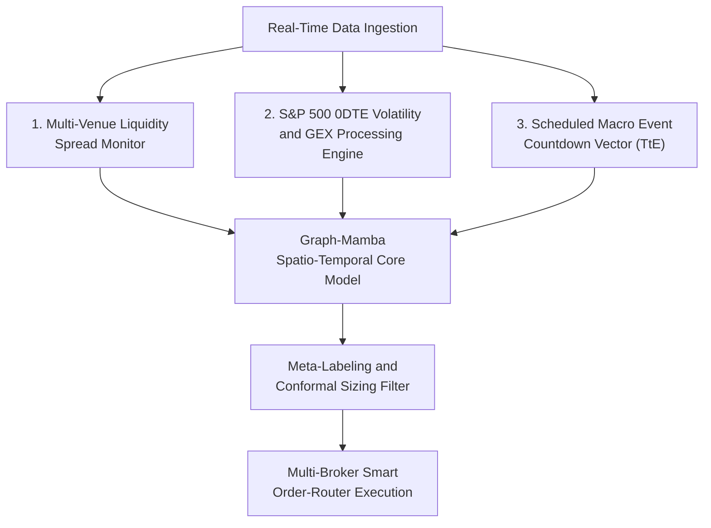

#### 4.1 Operational Data Flow

The complete production sequence is:

1. Real-time market data is collected from multiple venues.
2. Liquidity fragmentation, 0DTE volatility, GEX, and scheduled-event features are calculated.
3. The Graph-Mamba model produces multi-asset return forecasts.
4. Conformal intervals quantify forecast uncertainty.
5. The meta-labeler estimates post-cost trade profitability.
6. The sizing layer determines the permitted exposure.
7. The smart order router selects the execution venue and order type.

This design separates forecasting, uncertainty estimation, sizing, and execution into distinct but connected layers.

---

### References

[1] [OpenReview paper](https://openreview.net/pdf/1642ffb5db2aed311cb819e8593f578a35e45a15.pdf)

[2] [MDPI article](https://www.mdpi.com/2813-0324/12/1/12)

[3] [QuantT machine-learning-for-trading tutorial](https://www.quantt.co.uk/resources/machine-learning-for-trading-tutorial)

[4] [Gerald Grain article](https://www.geraldgrain.com/markets/stocks.php?article=abnewswire-2026-6-9-ai-trading-in-2026-key-trends-and-investor-predictions)

[5] [ResearchGate paper](https://www.researchgate.net/publication/401064709_Machine_Learning-based_Intraday_Trading_Strategy_using_Simple_Moving_Average_Crossovers_Traded_Volume_and_VWAP_Confirmations)

[6] [City Traders Imperium order-flow overview](https://citytradersimperium.com/order-flow-trading-analysis/)

[7] [Cracking Markets article](https://www.crackingmarkets.com/intraday-breakout-details-that-matter-exits-slippage-and-0dte-options/)

[8] [arXiv paper 2410.03707](https://arxiv.org/html/2410.03707v2)

[9] [arXiv paper 2502.06707](https://arxiv.org/html/2502.06707v1)

-------------------------

## 14 When & where to adopt Graph-Mamba

A Graph-Mamba or GNN+Mamba architecture is not a full replacement for the system we have designed. It is simply a modern substitute for one specific component: the temporal LSTM layer inside the neural network.

The structural blueprint we have established—the multi-task output heads, the dual APAC/Atlantic session models, the 0DTE volatility features, the conformal prediction intervals, and the residual ensemble layout—remains exactly the same.

To visualize this, think of the architecture as modular blocks. Upgrading to Mamba simply swaps out the temporal engine inside your neural network block while leaving the surrounding infrastructure intact:

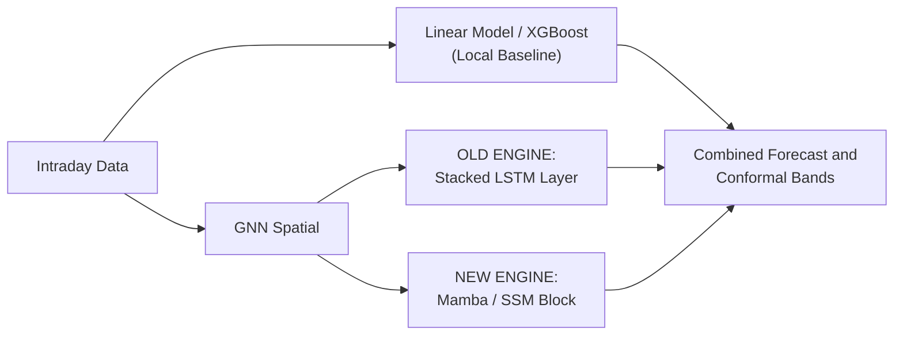

---

### Why Your First Plan (GNN-LSTM + Linear/XGBoost) is Still the Best First Step

While Mamba represents the state-of-the-art in deep learning research, starting your engineering exploration with a GNN-LSTM inside a Residual Ensemble is highly practical and remains the most logical path forward. [1]

#### 1. Code Maturity and Debugging Space

Building an intraday trading system is primarily an exercise in debugging data pipelines and preventing data leakage.

* **The Reality:** PyTorch’s LSTM and Scikit-Learn’s Linear/XGBoost architectures are mature, stable, and highly documented. If your model fails to converge, you can easily isolate whether the issue lies in your feature scaling, your graph data loader, or your target variable.
* **The Mamba Bottleneck:** Mamba requires specialized CUDA kernels that can be difficult to configure and optimize, especially when handling unconventional 3D Spatio-Temporal tensors (`[Batch, Nodes, Time, Features]`). Starting with Mamba introduces significant code complexity before you have even verified that your data contains a viable trading signal. [2, 3, 4]

#### 2. The Residual Architecture Protects You

Because you are using a Residual Ensemble (where the GNN-LSTM only tries to predict the errors of your simple linear or boosted model), the neural network's architecture is already heavily regularised.

* The simple baseline model handles the heavy lifting of capturing immediate price signals. The neural network's only job is to clean up the multi-asset spatial errors. For this specific task, an LSTM is more than capable of capturing the necessary sequence momentum.

---

### When and How You Scale to Mamba

Think of Mamba as an optimization path rather than a complete system redesign. You should stick to your original GNN-LSTM implementation until you hit two specific performance thresholds:

1. **The Sequence Length Wall:** If you find that 60 minutes of lookback data (60 bars) is insufficient, and you need to feed 6 hours of continuous 1-minute bars (360 bars) to capture long-range momentum, the LSTM's memory will degrade, and its training speeds will slow down dramatically. This is when you swap the LSTM for Mamba.
2. **Production Latency Issues:** If calculating the step-by-step recurrent loop of the LSTM across 24 assets takes too long during live streaming inference, swapping it for Mamba's linear-time processing will immediately clear that computational bottleneck.

### Summary Checklist for Deployment

Your exploration plan is solid. To execute it effectively:

* **Phase 1 (The Foundation):** Build the Linear/XGBoost baseline + GNN-LSTM residual ensemble. Use the 0DTE features and multi-scale microstructure inputs to capture market dynamics.
* **Phase 2 (The Guardrails):** Layer your Conformal Prediction wrapper over the combined ensemble output to generate your live confidence trading bands.
* **Phase 3 (The Optimization):** If the system shows positive backtesting results but suffers from slow training speeds or memory limitations over long historical sequences, open your PyTorch file and swap the `nn.LSTM` module out for a Mamba or Causal TCN block.

Would you like to start by writing the clean code layout for the Phase 1 Residual Ensemble architecture, showing exactly how the linear baseline and the GNN-LSTM pass data to one another?

### References

[1] [https://www.youtube.com](https://www.youtube.com/watch?v=r_NJchrl3Xo)

[2] [https://www.spheron.network](https://www.spheron.network/blog/mamba-3-state-space-model-gpu-cloud-deployment/)

[3] [https://arxiv.org](https://arxiv.org/html/2406.00209v1)

[4] [https://www.sciencedirect.com](https://www.sciencedirect.com/science/article/pii/S1746809426000960)

-----------------------

## 15 A summary of the key components of the idealised architecture described above

### Blueprint Specification: SOTA Multi-Asset Spatio-Temporal Residual Architecture

This document formalises the idealised, production-ready quantitative trading architecture for forecasting 24 global spot indices and forex pairs. It unifies our discussions on baseline models, spatial-temporal deep learning engines, forward-looking macro indicators, online uncertainty estimation, and structural risk filters into a single, cohesive blueprint.

---

### 1. High-Level Macro Framework

The system treats the market as an interconnected graph, separating local autoregressive signals from macro network-wide dynamics. It employs a Residual Ensemble Approach, using a complex deep learning engine to isolate and predict only the structural tracking errors of a simple, robust baseline model.

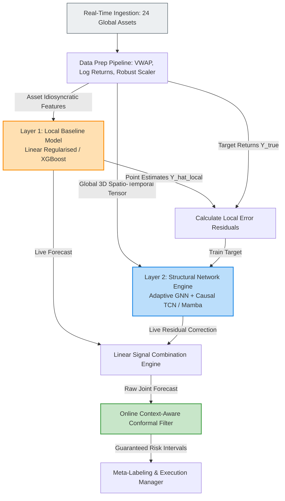

---

### 2. Granular Component Breakdown

#### Component 1: Data Massaging & Feature Pipeline

* **Pricing Anchors:** Ingests institutional-grade Mid-Prices or VWAP instead of raw transaction closes to eliminate artificial bid-ask bounces.
* **Stationarity & Scaling:** Transforms raw numbers into Log Returns, normalises them against a rolling time-of-day volatility factor to flatten the diurnal "U-shape" curve, and applies a Robust Scaler (Median & IQR) to prevent outlier flash jumps from compressing baseline features.
* **Node Feature Ingestion Matrix:** Every asset node in the graph constructs a 3D matrix `[Batch, 24, Lookback, Features]` containing:

  * **Local Microstructure:** Multi-scale Cumulative Volume Delta ($\text{CVD}*{3\text{m}}$, $\text{CVD}*{15\text{m}}$, $\text{CVD}_{60\text{m}}$) to capture order-flow aggression, alongside Kyle's Lambda proxies to map real-time liquidity depth.
  * **Systemic Macro Descriptors:** SPX 0DTE option implied volatility surfaces, dynamic Put/Call skews, and absolute Net Gamma Exposure (GEX) metrics to track institutional hedging loops.
  * **Context Variables:** Cyclic time embeddings ($\sin$/$\cos$) and a continuous macroeconomic Time-to-Event (TtE) decay vector for upcoming central bank releases.

#### Component 2: The Two-Step Residual Ensemble Engine

* **Layer 1 (The Local Baseline):** A regularised Ridge Regression or individual XGBoost head running on single-asset historical statistics. It captures immediate autoregressive properties and mean-reverting signals.
* **Layer 2 (The Structural Global Model):** A deep network trained explicitly to predict what Layer 1 misses.

  * **Spatial Layer:** An Asymmetric Adaptive Graph Neural Network. It automatically generates a dynamic adjacency matrix via low-dimensional node embeddings ($\mathcal{A}_{\text{dyn}} = \text{Softmax}(\text{ReLU}(E_1 E_2^T))$), learning shifting global lead-lag patterns without manual correlation inputs.
  * **Temporal Layer:** A Causal Temporal Convolutional Network (TCN) or a Linear State Space Model (Mamba) block. This replaces traditional Stacked LSTMs to unlock parallel training, prevent gradient saturation over long lookback windows, and guarantee linear time complexity ($O(N)$) during high-frequency data streams.

#### Component 3: Shifting Session Lifecycles

* **Rigid Separation, Fluid Ingestion:** Splits the 24-hour cycle into two specialized network profiles: an APAC Model (09:00–17:00 AEST) and an Atlantic Model (17:00–07:00 AEST) to manage shifting global liquidity pools.
* **Overlapping Warm-Up Windows:** Models initiate passively 2 hours prior to live deployment (e.g., the Atlantic model starts ingesting data at 15:00 AEST). This pre-populates the recurrent or causal temporal states with active market memory, preventing cold-start prediction degradation at the session opening bell.

#### Component 4: Online Conformal Certainty & Risk Gating

* **Adaptive Variance Calibration:** Modifies the neural network's terminal layer into a multi-head format where each asset possesses a dedicated output predicting both Expected Return ($\mu$) and Volatility Variance ($\sigma^2$) via a Negative Log-Likelihood loss function.
* **Spatially Conditioned Conformal Bands:** Wraps the final joint ensemble output in a Conformal Prediction framework. It tracks rolling, out-of-sample errors of an asset's topological graph neighbors to calculate an active error quantile ($\hat{q}$).
* **Dynamic Bands:** Generates mathematically guaranteed live prediction intervals:

$$
\text{Live Interval}

=

\left[
\hat{y}*{\text{new}} - \left(\hat{q} \cdot \hat{\sigma}*{\text{new}}\right),
;;
\hat{y}*{\text{new}} + \left(\hat{q} \cdot \hat{\sigma}*{\text{new}}\right)
\right]
$$

---

### 3. Real-Time Execution Loop

The structural data flow during a live intraday 1-minute streaming interval operates as an automated step-by-step pipeline:

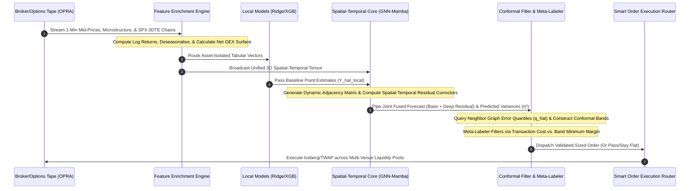

---

### 4. Phase-Based Implementation Strategy

To manage code complexity and ensure thorough debugging, do not attempt to construct this entire system in a single production sprint. Follow this iterative implementation schedule:

* **Phase 1 (The Baseline):** Build the real-time data pipelines, data massaging steps, and local regression models. Verify that your logging infrastructure is free from data leakage.
* **Phase 2 (The Graph Integration):** Implement the Spatial Adaptive GNN alongside a mature Stacked LSTM temporal engine. Convert your training configuration into the Residual Ensemble format, forcing the network to model only the baseline's errors.
* **Phase 3 (The Guardrails):** Layer the Conformal Prediction intervals over the network output. Introduce the APAC and Atlantic overlapping data windows to handle global session changes smoothly.
* **Phase 4 (The SOTA Scale):** Open your core model architecture file and replace the `nn.LSTM` blocks with a faster Causal TCN or Mamba block to optimize lookback depth and execution speeds.

We have established the complete structural framework for this multi-asset system. Would you like to proceed by writing the PyTorch dataset infrastructure required to assemble the 3D Spatio-Temporal tensor, or should we design the Meta-Labeling classification network used to size your trades before execution?

---

## 16 Meta-Labeling classification network used to size trades

The Meta-Labeling classification network acts as an algorithmic gatekeeper and sizing engine. It does not predict direction (the ensemble model handles that). Instead, it evaluates the current market environment and the core model's state to answer a binary question: "Given current market frictions, volatility, and network structure, will this specific trade hit its profit target before getting stopped out?" [1] [1]

By framing this as a secondary machine learning layer, you separate the alpha generation (the trend prediction) from the execution logic (the probability of success). [2]

---

### 1. The Core Data Blueprint: Feature Engineering for the Gatekeeper

The Meta-Labeler requires features that describe market friction, structural volatility, network stress, and model certainty. Unlike the core model, it also ingests the live state of the core model itself.

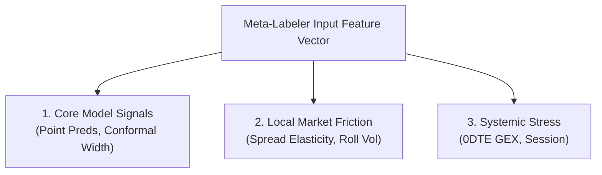

#### Category 1: Core Model Internal States

* **The Raw Predicted Signal Edge:** The absolute distance between the combined ensemble forecast ($\hat{y}_{\text{final}}$) and your minimum execution cost threshold.
* **Conformal Interval Width ($2 \cdot \hat{q} \cdot \hat{\sigma}$):** The width of your mathematically guaranteed boundary. A wide interval implies high model uncertainty.
* **Spatial Graph Discrepancy:** The variance of the predictions across the target asset's closest topological neighbors in the GNN. If the neighbors disagree, the network structure is fragmented.

#### Category 2: Local Market Friction & Microstructure

* **Bid-Ask Spread Elasticity:** The current 1-minute spread divided by average 1-minute volume. This measures immediate liquidity holes.
* **Rolling Realised Volatility of Volatility (Vol-of-Vol):** Captures whether volatility is stable or accelerating exponentially.
* **Kyle's Lambda Proxy:** The slope of the local order book's depth profile.

#### Category 3: Systemic Global Macro State

* **SPX 0DTE Net GEX State:** Whether option market makers are in a short-gamma (volatility-amplifying) or long-gamma (volatility-suppressing) regime.
* **Macro Time-to-Event (TtE):** The continuous exponential decay clock approaching scheduled global data releases.
* **Session Transition Indicator:** A continuous feature indicating how close the timeline is to a session handoff (e.g., the London pre-open), where relationships shift.

---

### 2. The Target Variable: Triple-Barrier Method

You cannot train a Meta-Labeler using simple fixed-horizon returns. In intraday trading, an asset can easily spike toward a profit target but hit a hidden stop-loss or get trapped in a flat market first.

To train the model cleanly, you implement Marcos López de Prado's Triple-Barrier Method [1] to generate the true training labels ($Y_{\text{meta}}$): [3]

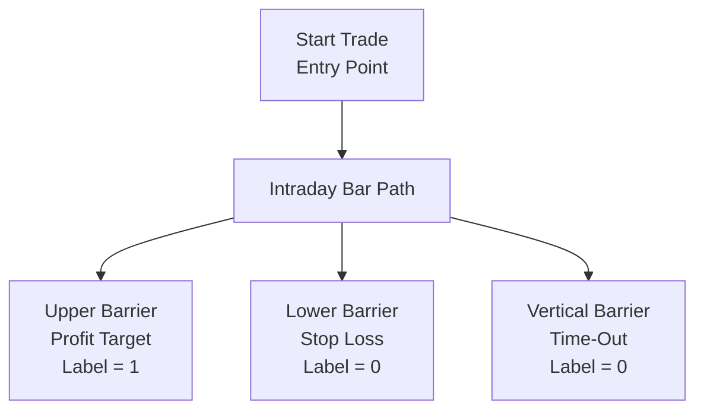

1. **Upper Barrier:** Set dynamically based on the current asset volatility (e.g., $+2.0 \cdot \text{Robust Volatility}$). If the price hits this barrier first, the trade is a success (Label = 1). [4, 5]
2. **Lower Barrier:** Set dynamically as your stop-loss (e.g., $-1.5 \cdot \text{Robust Volatility}$). If the price hits this barrier first, the trade is a failure (Label = 0). [6]
3. **Vertical Barrier:** A strict time-out limit (e.g., exactly 30 minutes or 30 intraday bars). If neither the profit target nor the stop-loss is triggered before the time-out, the position is market-closed (Label = 0). [7, 8]

---

### 3. The Architecture: LightGBM vs. Deep Multi-Head Classifier

Because tabular market friction data contains sharp discontinuities and non-linear thresholds (e.g., "If Spread > X AND Vol-of-Vol > Y, dump the trade"), a Gradient Boosted Decision Tree (LightGBM) is the industry-standard choice for the Meta-Labeler over deep neural networks. [9]

To output sizing metrics across all 24 assets without maintaining 24 separate scripts, you structure a single, centralized Multi-Task LightGBM Classifier or a light, shared Deep Multi-Layer Perceptron (MLP) with independent asset heads.

```mermaid
flowchart TD
    A["Ingested Friction + Model State Features"] --> B["Shared Linear Layer 1: ReLU"]
    B --> C["Shared Linear Layer 2: ReLU"]

    C --> D1["Asset Head 1: AUD/USD"]
    C --> D2["Asset Head 2: SPX 500"]
    C --> D3["Asset Head 24: ASX 200"]

    D1 --> E1["Sigmoid Output: P_success"]
    D2 --> E2["Sigmoid Output: P_success"]
    D3 --> E3["Sigmoid Output: P_success"]

    E1 --> F1["Bet Sizing Engine"]
    E2 --> F2["Bet Sizing Engine"]
    E3 --> F3["Bet Sizing Engine"]

    style A fill:#f5f5f5,stroke:#333
    style C fill:#bbdefb,stroke:#1e88e5
    style E1 fill:#c8e6c9,stroke:#43a047
```

---

### 4. Continuous Bet Sizing Mechanics

The final layer uses a Sigmoid activation to output a continuous probability $P_{\text{success}} \in [0, 1]$. This probability is routed directly to a mathematical sizing function to determine your live execution exposure:

#### The Disjoint Kelly / Sizing Function

Instead of an all-or-nothing execution binary, you scale your capital allocation smoothly. Using a simplified version of the Kelly Criterion or a standardized normal distribution shift, your capital allocation multiplier ($W$) is defined as:

$$
W = \max\left(0, ;; 2 \cdot P_{\text{success}} - 1\right)
$$

* If $P_{\text{success}} \le 0.50$: The Meta-Labeler signals that the trade behaves like coin-flip noise after fees. Size Multiplier = 0 (The trade is completely skipped).
* If $P_{\text{success}} = 0.70$: The system identifies a high-conviction structural window. Size Multiplier = 0.40 (Deploy 40% of your maximum baseline risk limit).
* If $P_{\text{success}} = 0.90$: Exceptional, low-friction alignment across global sessions. Size Multiplier = 0.80 (Deploy 80% of your risk limit).

---

### 5. Implementation Script Blueprint (PyTorch Meta-Head)

This script demonstrates how to construct a shared multi-head Meta-Labeler that ingests core model features and outputs continuous sizing weights across your portfolio.

```python
import torch
import torch.nn as nn
import torch.nn.functional as F


class MultiAssetMetaLabeler(nn.Module):
    """
    SOTA Multi-Head Meta-Labeling Classifier Network.
    Evaluates market friction and core model metrics to generate
    independent success probabilities used for dynamic bet sizing.
    """

    def __init__(self, num_assets=24, input_features=9):
        super(MultiAssetMetaLabeler, self).__init__()

        self.num_assets = num_assets

        # Shared hidden layers map global macro stress and baseline frictions
        self.shared_mlp = nn.Sequential(
            nn.Linear(input_features, 64),
            nn.ReLU(),
            nn.Dropout(0.2),  # Prevents the sizing engine from chasing local noise
            nn.Linear(64, 32),
            nn.ReLU()
        )

        # Independent classification heads allow asset-specific cost metrics
        self.meta_heads = nn.ModuleList([
            nn.Sequential(
                nn.Linear(32, 16),
                nn.ReLU(),
                nn.Linear(16, 1),
                nn.Sigmoid()  # Outputs continuous probability P_success in [0, 1]
            )
            for _ in range(num_assets)
        ])

    def forward(self, state_features):
        """
        Forward Pass Engine
        Input Shape: [Batch Size, Num Assets (24), Ingested Features (9)]
        """
        batch_size, N, F_in = state_features.shape

        # Flatten spatial layout to pass data cleanly through the shared network
        flat_features = state_features.reshape(batch_size * N, F_in)
        shared_representations = self.shared_mlp(flat_features)

        # Reconstruct into [Batch, Nodes, Latent Space Dim (32)]
        latent_tensor = shared_representations.reshape(batch_size, N, 32)

        probabilities = []
        for idx in range(self.num_assets):
            # Isolate the current asset node's context vector
            node_latent = latent_tensor[:, idx, :]  # Shape: [Batch, 32]

            # Process information through the dedicated asset sizing head
            p_success = self.meta_heads[idx](node_latent)  # Shape: [Batch, 1]
            probabilities.append(p_success)

        # Combine independent probability vectors into a single tensor: [Batch, 24]
        return torch.cat(probabilities, dim=-1)


# --- Verification & Sizing Execution Test ---
if __name__ == "__main__":
    # Operational Simulation Dimensions
    B_size = 4    # Live Streaming Data Streaming Batches
    Assets = 24   # Ingested Portfolio Asset Count
    Features = 9  # Comprehensive Meta-Labeling Input Variables

    # Simulated Live Context Input Tensor
    mock_meta_inputs = torch.rand(B_size, Assets, Features)

    # Initialize Classifier
    meta_gatekeeper = MultiAssetMetaLabeler(
        num_assets=Assets,
        input_features=Features
    )

    # Calculate Live Success Probabilities
    success_probs = meta_gatekeeper(mock_meta_inputs)

    # Convert PyTorch Tensor output to a clean numpy object for execution logic
    live_probs = success_probs[0].detach().numpy()  # Isolate first batch sample

    print("Meta-Labeler Generation Successful!")
    print(
        f"Output Matrix Dimensions: {list(success_probs.shape)} "
        "-> [Batch, Probabilities per Asset]"
    )
    print("\n--- Live Execution Allocation Examples ---")

    for i in range(3):
        p = live_probs[i]

        # Calculate dynamic size multiplier via standard allocation logic
        size_multiplier = max(0.0, 2.0 * p - 1.0)
        action = (
            "EXECUTE POSITION"
            if size_multiplier > 0
            else "SKIP / STAY FLAT"
        )

        print(
            f"Asset {i:02d} -> P(Success): {p:.2%} | "
            f"Risk Sizing Factor: {size_multiplier:.2%} | "
            f"Action: {action}"
        )
```

---

### 6. Critical Training Caveat: Class Imbalance

When training a Meta-Labeler on financial time series, your dataset will be heavily imbalanced. If your primary Spatio-Temporal GNN-LSTM model is high-quality, the number of successful trades (Label = 1) will dwarf the failures. Conversely, in poor market regimes, the failures take over.

* **The Trap:** If 80% of your training dataset consists of successful entries, the Meta-Labeler will simply learn to output a constant `P_success = 0.80`, rendering your sizing filter useless.
* **The Solution:** Always train the Meta-Labeling network using Focal Loss or an explicit class-weighted Binary Cross-Entropy loss function. This forces the optimization engine to penalize misclassified edge-case failures heavily, ensuring the network learns exactly when to step aside and force the trading desk flat. [10]

Should we design the data structures for the Triple-Barrier labeling logic to process your historical 1-minute data into training matrices, or do you want to explore the Smart Order Router design needed to manage execution across multiple venues? [11]

### References

[1] [https://www.computer.org](https://www.computer.org/csdl/proceedings-article/sp/2021/893400a578/1oak99FpHPi)

[2] [https://hudsonthames.org](https://hudsonthames.org/does-meta-labeling-add-to-signal-efficacy-triple-barrier-method/)

[3] [https://medium.datadriveninvestor.com](https://medium.datadriveninvestor.com/blazing-fast-triple-barrier-labeling-with-polars-for-better-ml-models-eb09203d973d)

[4] [https://www.sciencedirect.com](https://www.sciencedirect.com/science/article/pii/S095741742502192X)

[5] [https://www.newsletter.quantreo.com](https://www.newsletter.quantreo.com/p/the-triple-barrier-labeling-of-marco)

[6] [https://www.sciencedirect.com](https://www.sciencedirect.com/science/article/pii/S095741742502192X)

[7] [https://quant.stackexchange.com](https://quant.stackexchange.com/questions/49314/flexible-horizon-in-triple-barrier-method)

[8] [https://eastrivervillage.com](https://eastrivervillage.com/blog/archive/2025/08/)

[9] [https://medium.com](https://medium.com/@robertogonalves_71685/from-ohlc-bars-to-trading-signals-a-quant-side-project-in-the-age-of-ai-64b282682d05)

[10] [https://blog.roboflow.com](https://blog.roboflow.com/train-a-model-for-rare-defects/)

[11] [https://www.alliedtesting.com](https://www.alliedtesting.com/case-study-improving-quality-of-brokerage-trade-execution/)


---

## 17

