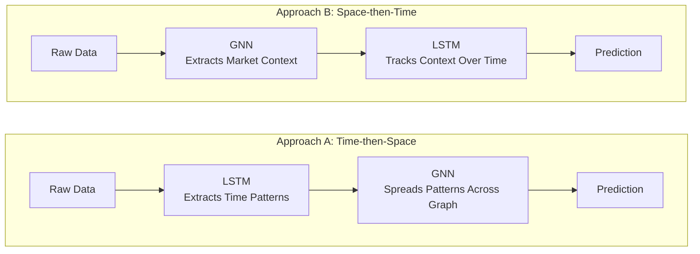
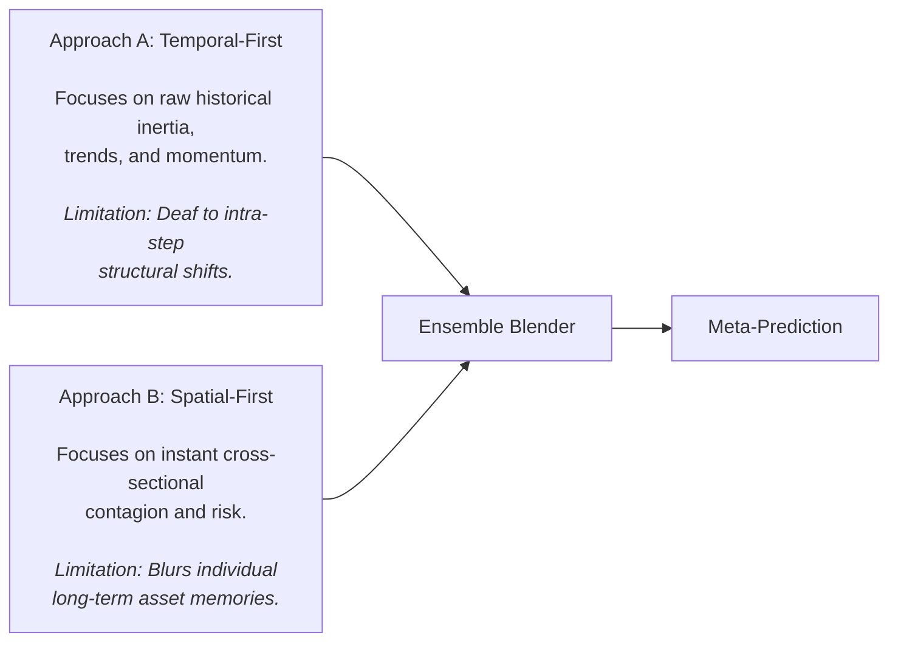

# Multi-Asset Trading Decision, Confidence and Position-Sizing Architecture

## Implementation plan

## 1. Purpose

This plan defines the trading-decision, forecast-confidence, portfolio-risk and position-sizing layers for a multi-asset intraday framework.

It assumes:

- a core universe of approximately 24 global index and FX instruments;
- Python as the implementation language;
- timestamp-aligned market features are already available;
- the ingestion and raw-data engineering systems are outside this plan;
- additional instruments may later be included as context-only inputs;
- model components must be replaceable and evaluated independently.

The objective is to produce a minimum viable system that can answer, with strict chronological evaluation:

1. Does the local and cross-asset forecasting stack contain useful out-of-sample information?
2. Is that information large and stable enough to survive realistic costs?
3. Can it be converted into coherent portfolio positions without treating different forms of uncertainty as one heuristic confidence score?
4. Which additional components genuinely improve the result after the core system is working?

The architectural centre is:

> **Multi-horizon forecasts feeding a cost-aware, risk-constrained portfolio optimiser.**

Probabilistic calibration, conformal methods, meta-labeling, dynamic graphs, session experts, alternative temporal models and additional context instruments remain important, but are explicitly outside the MVP unless stated otherwise.

---

# 2. High-level conclusions

The original direction remains viable:

- retain a simple local model for asset-specific behaviour;
- retain a cross-asset model for structural residual information;
- combine the two out of sample;
- separate forecasting from portfolio construction;
- maintain support for a graph-based spatial component;
- retain conformal calibration and meta-labeling as later experiments;
- retain APAC/Atlantic specialisation, Mamba/TCN, relational conformal methods and context-only instruments as future options.

---

# 3. Scope boundary

## 3.1 Included in the MVP

The MVP consists of Phases 1A and 1B in this document.

It includes:

- model-independent typed contracts;
- target generation at multiple horizons;
- a chronological out-of-fold forecast store;
- simple local baseline models;
- a residual cross-asset GNN-LSTM model;
- a learned structural graph baseline;
- point forecasts at multiple horizons;
- cost estimation interfaces;
- a shrinkage covariance/risk model;
- cost-aware constrained portfolio optimisation;
- horizon-aware position handling;
- minimal operational vetoes;
- nested walk-forward evaluation;
- experiment tracking and ablations.

## 3.2 Explicitly outside the MVP

The following are retained as planned future refinements, not MVP dependencies:

- Gaussian, Student-$t$ or quantile distributional heads;
- conformal calibration;
- Adaptive Conformal Inference;
- CoRel or other relational conformal methods;
- CPTC or explicit change-point conformal methods;
- Monte Carlo dropout;
- deep ensembles;
- LightGBM or neural meta-labeling;
- triple-barrier or competing-risk targets;
- dynamic state-dependent adjacency;
- APAC/Atlantic separate production models;
- mixture-of-experts session models;
- TCN or Mamba temporal replacements;
- Bitcoin, gold or other context-only nodes;
- multi-period model-predictive-control optimisation;
- detailed nonlinear market-impact models;
- smart order routing.

Interfaces should anticipate these additions, but the initial implementation should not depend on them.

---

# 4. Core conceptual separation

The system must keep the following quantities separate.

## 4.1 Forecast expectation

For asset $i$ and horizon $h$:

$$
\hat{\mu}\_{i,t,h}
=
E[R\_{i,t,h}\mid X\_t]
$$

This is the forecast expected return before or after costs, depending on the field definition.

It is an alpha estimate, not confidence.

## 4.2 Conditional forecast dispersion

A later probabilistic model may produce:

$$
\hat{\sigma}_{i,t,h}
$$

or forecast quantiles.

This represents the model's estimate of the conditional distribution of future returns. It is not portfolio covariance and does not measure all forms of model uncertainty.

## 4.3 Model uncertainty

Disagreement between models trained with different initialisations or samples can provide an epistemic uncertainty diagnostic.

This is a future refinement. It is distinct from conditional return volatility.

## 4.4 Calibration state

A later conformal or probability-calibration layer may measure:

- recent empirical coverage;
- interval width;
- coverage deficit;
- residual-scale adjustment;
- calibration sample size;
- fallback group used.

This measures recent forecast reliability. It is not the expected return.

## 4.5 Opportunity estimate

A later opportunity model may estimate:

$$
P(R^{\text{net}}_{i,t,h}>0\mid X_t)
$$

or expected post-cost payoff.

This is an estimate concerning a specified economic outcome. Probability of success should not be treated as equivalent to expected payoff.

## 4.6 Portfolio risk

For a net position vector $w_t$ and covariance matrix $\Sigma_t$:

$$
\operatorname{Var}(R_{p,t})=w_t^\top\Sigma_t w_t
$$

This measures joint portfolio risk. It must be calculated independently of the forecasting model's per-asset conditional-scale output.

Each concept must have:

- a separate typed object;
- separate evaluation metrics;
- separate configuration;
- an explicit owner in the architecture.

---

# 5. Forecast targets and horizons

## 5.1 Why next-minute return is insufficient

A next-minute forecast can be useful as an auxiliary signal but should not define the complete trade.

A correct next-minute forecast may still fail to predict:

- cumulative return over the intended holding period;
- maximum adverse excursion;
- whether the move survives spread and slippage;
- whether the signal persists;
- when a position should be reduced;
- whether shorter and longer horizons disagree.

The MVP should support:

$$
h\in\{5,15,30,60\}\text{ minutes}
$$

The exact set is configurable. These values are an initial research grid, not immutable production settings.

## 5.2 Target definition

For a mid-price $P_t$, define cumulative log return:

$$
R_{t,h}
=
\log\left(\frac{P_{t+h}}{P_t}\right)
$$

Each target record should include:

- asset;
- decision timestamp;
- horizon;
- gross return;
- estimated round-trip or one-way cost, according to the decision definition;
- net return;
- maximum favourable excursion;
- maximum adverse excursion;
- target-availability timestamp;
- overlap interval.

The label generator must make explicit:

- whether the current bar is included;
- whether entry occurs at the current close, next open or a simulated executable price;
- how missing bars are handled;
- how market closures are handled;
- whether returns are log or simple;
- how instruments with different trading hours are aligned.

## 5.3 Initial single-horizon milestone

The software contracts should support all configured horizons from the start.

For implementation speed, the first end-to-end validation may use one primary horizon, preferably 15 or 30 minutes, provided that:

- the multi-horizon schema is already implemented;
- expanding to the other horizons requires configuration rather than structural rewrites;
- the full MVP is not considered complete until the horizon interaction problem has been addressed.

---

# 6. Horizon-aware decision design

Multi-horizon predictions cannot simply be averaged.

For one asset, the system may simultaneously predict:

- positive return over 5 minutes;
- neutral return over 15 minutes;
- negative return over 60 minutes.

The portfolio layer therefore needs an explicit representation of horizon intent.

## 6.1 Virtual horizon sleeves

Represent each asset-horizon pair as a virtual sleeve:

```text
AUDUSD / 5m
AUDUSD / 15m
AUDUSD / 30m
AUDUSD / 60m
SPX / 5m
...
```

Each sleeve has:

- its own alpha forecast;
- horizon-specific target and evaluation metrics;
- virtual current position;
- risk budget;
- model attribution;
- expiry or review time.

The physical broker position is the net of all virtual sleeves for an instrument.

## 6.2 Netting

For asset $i$:

$$
w_{i,t}
=
\sum_h z_{i,t,h}
$$

where $z_{i,t,h}$ is the virtual sleeve position.

A proposed increase from one sleeve may be offset by a reduction from another. The execution layer should receive only the net physical trade:

$$
\Delta w_{i,t}
=
w_{i,t}^{\text{target}}
-
w_{i,t}^{\text{current}}
$$

The system must preserve sleeve-level attribution even when the physical order is netted.

## 6.3 MVP implementation choices

Two acceptable implementations are:

### Option A: Joint virtual-sleeve optimisation

Optimise all asset-horizon sleeve positions together, with a mapping from virtual sleeves to physical positions.

This is conceptually clean but requires a covariance model across asset-horizon returns.

### Option B: Horizon-specific optimisers plus global reconciliation

Each horizon proposes a virtual position. A final portfolio layer:

- nets positions;
- applies global risk constraints;
- scales or repairs the combined portfolio;
- records any adjustment.

Option B is simpler for the MVP and is the recommended first implementation.

A later multi-period optimiser may replace this structure.

---

# 7. Forecasting architecture for the MVP

## 7.1 Layer 1: local baseline models

Each traded asset receives a simple local model.

Initial candidates:

- Ridge regression;
- Elastic Net;
- a small gradient-boosted tree model.

The baseline should predict each configured horizon directly.

The purpose is to capture:

- local short-term momentum;
- local mean reversion;
- local volatility state;
- simple time-of-day effects;
- local microstructure features where available.

Ridge regression should be the first required baseline because:

- it is stable;
- it is easy to inspect;
- it exposes leakage quickly;
- its residuals have a clear interpretation;
- it sets a meaningful hurdle for the graph model.

XGBoost or LightGBM may be added as a stronger nonlinear baseline, but the system should retain Ridge results for comparison.

## 7.2 Layer 2: residual cross-asset model

The cross-asset model predicts the out-of-fold residual of the local baseline:

$$
\varepsilon_{i,t,h}
=
R_{i,t,h}
-
\hat{R}^{\text{local}}_{i,t,h}
$$

The final forecast is:

$$
\hat{R}^{\text{combined}}\_{i,t,h}
=
\hat{R}^{\text{local}}\_{i,t,h}
+
\hat{\varepsilon}^{\text{graph}}\_{i,t,h}
$$

The residual target used for graph training must be calculated from local forecasts generated without training on the same observations.

Training the graph on residuals from an in-sample local model would understate the real baseline error and contaminate the residual task.

## 7.3 MVP graph architecture

Use:

- a learned structural adjacency;
- one graph-convolution or graph-attention stage;
- a mature temporal model, initially an LSTM;
- independent asset and horizon output heads where appropriate.

A baseline learned adjacency may be:

$$
A_{\text{struct}}
=
\operatorname{softmax}
\left(
\operatorname{ReLU}(E_1E_2^\top)
\right)
$$

This graph is:

- learned;
- potentially asymmetric;
- persistent across observations at inference time.

It is not a state-dependent dynamic graph.

The implementation and documentation should call it:

> learned structural adjacency

rather than:

> dynamic adjacency

## 7.4 Required graph ablations

The graph model is not accepted merely because it is architecturally plausible.

Evaluate:

```text
G0  Local models only
G1  Pooled non-graph cross-asset model
G2  Fixed economically specified graph
G3  Learned structural graph
G4  Shuffled or permuted graph control
```

The learned graph should improve out-of-sample performance beyond:

- the local baseline;
- a pooled model with access to all features but no graph;
- a shuffled-relationship control.

This helps distinguish genuine relational value from extra parameter capacity.

## 7.5 Feature policy

The existing feature proposals remain candidate families:

- returns;
- time-of-day normalisation;
- volatility;
- CVD;
- VWAP-relative measures;
- liquidity proxies;
- scheduled-event proximity;
- options-derived market-state inputs;
- cross-session summaries.

None is permanently accepted.

Every feature family should be tagged and ablatable:

```text
price_local
volatility_local
microstructure_local
cross_asset_returns
session_context
macro_event_context
options_context
liquidity_context
```

A feature should remain only if it improves out-of-sample forecasting or portfolio outcomes with acceptable stability.

---

# 8. Out-of-fold forecast store

The out-of-fold forecast store is the central research artefact.

Every downstream calibrator, opportunity model and portfolio analysis must consume forecasts that were produced without training on the corresponding target observation.

## 8.1 Required fields

```text
forecast_id
as_of
feature_cutoff
training_cutoff
asset_id
horizon_minutes
model_family
model_version
training_window_id
forecast_value
local_forecast
residual_forecast
combined_forecast
target_available_at
realised_gross_return
estimated_cost
realised_net_return
experiment_id
```

Future-compatible optional fields:

```text
forecast_quantiles
conditional_scale
ensemble_member
calibration_state_id
opportunity_model_version
```

## 8.2 Chronology rules

For a forecast generated at time $t$:

- all features must be available by $t$;
- all fitted transformations must use only permitted training history;
- model parameters must use only permitted training history;
- the realised target becomes available only at $t+h$;
- calibrators must not update until the target is observable;
- overlapping targets must be accounted for in validation and statistical analysis.

## 8.3 Storage requirements

The store should be:

- immutable by experiment version;
- partitionable by date, asset and horizon;
- reproducible from configuration;
- queryable without loading model code;
- independent of the live execution state;
- suitable for training future meta-models.

Parquet plus a metadata database is a practical implementation, but the storage mechanism is secondary to the schema and chronology guarantees.

---

# 9. Cost model for the MVP

The optimiser must receive explicit expected trading costs.

For a physical position change $\Delta w_i$:

$$
C_i(\Delta w_i)
=
c^{\text{spread}}_i|\Delta w_i|
+
c^{\text{slippage}}_i|\Delta w_i|
+
c^{\text{impact}}_i(\Delta w_i)^2
$$

## 9.1 Required MVP components

Include:

1. observed or representative half-spread;
2. instrument/session-specific slippage allowance;
3. commissions where applicable;
4. financing or holding cost where material;
5. a configurable conservative buffer.

## 9.2 Quadratic impact

Quadratic impact should be optional in the MVP.

It should be enabled only where:

- position size is meaningful relative to available liquidity;
- historical fills show size-dependent slippage;
- coefficients can be estimated credibly.

At small sizes, spread and empirical slippage may dominate.

## 9.3 Cost interfaces

The cost estimator should output:

```text
asset_id
as_of
trade_direction
trade_size
spread_cost
slippage_cost
commission_cost
financing_cost
impact_cost
total_expected_cost
cost_model_version
```

Costs should use the same return or currency units expected by the optimiser.

---

# 10. Portfolio risk model

The portfolio risk model is separate from the alpha model.

## 10.1 Covariance

For each decision horizon or sleeve, estimate a stabilised covariance matrix:

$$
\Sigma_{t,h}
$$

Initial methods:

- rolling sample covariance;
- Ledoit-Wolf shrinkage;
- exponentially weighted covariance;
- simple factor covariance.

Ledoit-Wolf or another shrinkage method should be the default MVP candidate because raw covariance can be unstable when the effective window is short relative to the number of assets.

## 10.2 Risk groupings

Define explicit group exposure mappings for:

- equity-index exposure;
- USD exposure;
- JPY exposure;
- AUD/NZD exposure;
- European exposure;
- APAC exposure;
- broad risk-on/risk-off exposure;
- highly duplicated or economically equivalent instruments.

The exact groups depend on the traded universe and should be configuration-driven.

## 10.3 Required risk outputs

```text
as_of
horizon
asset_order
covariance_matrix
asset_volatility
factor_exposures
group_mapping
estimation_window
risk_model_version
```

## 10.4 Validation

The risk model must test:

- covariance symmetry;
- positive semidefiniteness;
- stable asset ordering;
- missing-asset fallback;
- extreme-correlation scenarios;
- concentration when duplicate instruments are present;
- reconciliation of marginal risk contributions.

---

# 11. Cost-aware portfolio optimiser

## 11.1 Objective

For one horizon sleeve, an initial convex objective is:

$$
\max_w
\quad
a_t^\top w
-
\frac{\lambda}{2}w^\top\Sigma_t w
-
c_1^\top|w-w_{t-1}|
-
(w-w_{t-1})^\top C_2(w-w_{t-1})
$$

where:

- $a_t$ is the expected net or gross alpha vector according to configuration;
- $\Sigma_t$ is the independent risk covariance;
- $c_1$ represents proportional costs;
- $C_2$ represents optional quadratic costs;
- $\lambda$ is the risk-aversion parameter.

Do not subtract costs twice. The contract must specify whether $a_t$ is gross or already cost-adjusted.

## 11.2 Constraints

The MVP optimiser should support:

$$
|w_i|\leq w_{i,\max}
$$

$$
\|w\|_1\leq L_{\max}
$$

$$
w^\top\Sigma_t w\leq \sigma_{\text{target}}^2
$$

and configurable:

- maximum gross exposure;
- maximum net exposure;
- per-asset exposure;
- per-group exposure;
- currency exposure;
- turnover;
- short-position permissions;
- asset availability;
- horizon-sleeve budget.

## 11.3 No-trade behaviour

Proportional costs create a true no-trade region in the mathematical problem. Quadratic costs alone usually create small trades rather than exact zero trades.

Therefore the execution pipeline must be:

```text
raw optimiser target
    ↓
numerical tolerance
    ↓
deadband / minimum-benefit test
    ↓
minimum notional and lot rounding
    ↓
constraint repair
    ↓
final physical order
```

A changed risk constraint may require trading even when alpha is zero. This is valid and should be recorded as risk-driven rather than alpha-driven.

## 11.4 Solver

Use CVXPY for the MVP.

Requirements:

- deterministic solver configuration;
- timeout handling;
- infeasibility diagnostics;
- a safe fallback target;
- warm-start support where useful;
- structured result metadata.

## 11.5 Fallback behaviour

If optimisation fails:

1. do not use partially solved positions;
2. retain current positions if permitted;
3. otherwise project current positions into the valid constraint set;
4. emit a failure reason code;
5. block new alpha-driven exposure until the issue is resolved.

---

# 12. Minimal operational policy for the MVP

The MVP requires operational controls, but not a learned regime model.

## 12.1 States

```text
NORMAL
REDUCED
NO_NEW_POSITIONS
FLATTEN
UNAVAILABLE
```

## 12.2 Hard conditions

Examples:

- stale forecast;
- stale price;
- missing covariance;
- unavailable instrument;
- market closed or underlying unsupported;
- spread above a configured maximum;
- failed optimiser;
- invalid target timestamp;
- breached portfolio constraint.

## 12.3 Reason codes

Use enums rather than free-form text:

```text
ALPHA_BELOW_COST
NO_TRADE_REGION
MINIMUM_NOTIONAL
NETTED_ACROSS_HORIZONS
RISK_LIMIT
GROUP_LIMIT
STALE_FORECAST
STALE_PRICE
MARKET_UNAVAILABLE
OPTIMISER_FAILED
CONSTRAINT_REPAIR
MANUAL_RESTRICTION
```

Every difference between forecast intent and executed target should be attributable to one or more reason codes.

A learned volatility or regime gate is future work.

---

# 13. Typed Python contracts

The contracts should use timezone-aware UTC timestamps internally.

Illustrative structures:

```python
from __future__ import annotations

from dataclasses import dataclass
from datetime import datetime
from enum import StrEnum
from typing import Mapping

import numpy as np
from numpy.typing import NDArray


class ReturnUnit(StrEnum):
    LOG_RETURN = "log_return"
    SIMPLE_RETURN = "simple_return"


class DecisionReason(StrEnum):
    ALPHA_BELOW_COST = "alpha_below_cost"
    NO_TRADE_REGION = "no_trade_region"
    MINIMUM_NOTIONAL = "minimum_notional"
    NETTED_ACROSS_HORIZONS = "netted_across_horizons"
    RISK_LIMIT = "risk_limit"
    GROUP_LIMIT = "group_limit"
    STALE_FORECAST = "stale_forecast"
    STALE_PRICE = "stale_price"
    MARKET_UNAVAILABLE = "market_unavailable"
    OPTIMISER_FAILED = "optimiser_failed"
    CONSTRAINT_REPAIR = "constraint_repair"


@dataclass(frozen=True)
class PointForecast:
    as_of: datetime
    feature_cutoff: datetime
    training_cutoff: datetime
    asset_id: str
    horizon_minutes: int
    expected_return: float
    return_unit: ReturnUnit
    model_version: str
    experiment_id: str


@dataclass(frozen=True)
class CostEstimate:
    as_of: datetime
    asset_id: str
    proposed_trade: float
    spread_cost: float
    slippage_cost: float
    commission_cost: float
    financing_cost: float
    impact_cost: float
    total_cost: float
    model_version: str


@dataclass(frozen=True)
class PortfolioRiskState:
    as_of: datetime
    horizon_minutes: int
    asset_order: tuple[str, ...]
    covariance: NDArray[np.float64]
    factor_exposures: NDArray[np.float64] | None
    model_version: str


@dataclass(frozen=True)
class SleeveTarget:
    as_of: datetime
    horizon_minutes: int
    target_weights: Mapping[str, float]
    expected_alpha: float
    expected_volatility: float
    optimiser_status: str


@dataclass(frozen=True)
class TargetPortfolio:
    as_of: datetime
    physical_target_weights: Mapping[str, float]
    sleeve_targets: tuple[SleeveTarget, ...]
    reason_codes: Mapping[str, tuple[DecisionReason, ...]]
    decision_version: str
```

Implementation notes:

- `frozen=True` does not make NumPy arrays immutable; copy arrays and mark them read-only.
- Define the meaning of a weight: capital fraction, risk fraction, notional or contract quantity.
- All arrays require explicit asset ordering.
- Validate timezone awareness.
- Validate that `feature_cutoff <= as_of`.
- Validate that `training_cutoff <= feature_cutoff`.
- Distributional forecast contracts should be added later without changing the point-forecast contract.

---

# 14. Evaluation design

Evaluation must be chronological and component-aware.

## 14.1 Walk-forward structure

For each evaluation fold:

1. fit transformations on the training interval;
2. fit local models;
3. generate local out-of-fold forecasts;
4. derive residual training targets;
5. fit the graph residual model;
6. generate combined forecasts;
7. fit or update the risk model using permitted history;
8. optimise positions;
9. simulate costs and realised returns;
10. record all artefacts.

## 14.2 Purging and embargo

Because multi-horizon targets overlap, validation boundaries require purging.

If a training target extends into the validation interval, remove it.

An embargo after the training interval may also be required where:

- feature windows overlap the validation period;
- labels overlap;
- transformations use rolling estimates;
- model updates depend on recently observed targets.

The embargo length should be derived from actual dependency windows rather than copied from a generic rule.

## 14.3 Three MVP stage gates

### Forecast gate

The combined model should demonstrate useful out-of-sample information through:

- lower predictive loss than the local baseline;
- stable directional or rank relationship;
- monotonic realised outcomes across forecast-strength buckets;
- improvement across more than one period or asset subset.

### Economic gate

The forecasts should show:

- expected outcome of comparable scale to estimated costs;
- stable net-return ordering by forecast strength;
- no exclusive dependence on unrealistic fills;
- reasonable sensitivity to cost assumptions.

### Portfolio gate

The optimiser should produce:

- coherent risk-adjusted net performance;
- bounded concentration;
- stable behaviour across nearby risk parameters;
- no dependence on a single asset, month or session;
- acceptable turnover and drawdown behaviour.

A negative initial Sharpe does not automatically imply that the forecast is useless. Zero out-of-sample forecast information is the stronger stop signal.

## 14.4 Metrics

Forecast metrics:

- MSE or MAE for point forecasts;
- correlation and rank correlation;
- directional accuracy where meaningful;
- forecast-bucket returns;
- residual improvement over the local baseline.

Portfolio metrics:

- gross and net return;
- volatility;
- Sharpe and downside measures;
- maximum drawdown;
- turnover;
- cost-to-gross-alpha ratio;
- exposure concentration;
- marginal risk contributions;
- performance by asset, horizon, session and period.

Research-process metrics:

- number of configurations tested;
- immutable experiment identifiers;
- Deflated Sharpe Ratio;
- Probability of Backtest Overfitting where practical;
- sensitivity to costs and parameter perturbations.

---

# 15. Suggested Python package boundaries

```text
trading_decision/
├── domain/
│   ├── contracts.py
│   ├── enums.py
│   ├── validation.py
│   └── units.py
├── targets/
│   ├── fixed_horizon.py
│   ├── excursions.py
│   └── overlap.py
├── forecasts/
│   ├── local/
│   │   ├── ridge.py
│   │   └── boosted.py
│   ├── graph/
│   │   ├── adjacency.py
│   │   ├── gnn_lstm.py
│   │   └── residual_training.py
│   ├── combine.py
│   └── store.py
├── costs/
│   ├── interfaces.py
│   ├── proportional.py
│   └── empirical_slippage.py
├── risk/
│   ├── covariance.py
│   ├── shrinkage.py
│   ├── factors.py
│   └── validation.py
├── portfolio/
│   ├── objective.py
│   ├── constraints.py
│   ├── optimiser.py
│   ├── sleeves.py
│   ├── rounding.py
│   └── fallback.py
├── policy/
│   ├── state.py
│   ├── vetoes.py
│   └── reasons.py
├── evaluation/
│   ├── walk_forward.py
│   ├── purging.py
│   ├── metrics.py
│   ├── attribution.py
│   └── experiments.py
└── research/
    ├── probabilistic/
    ├── conformal/
    ├── meta_labeling/
    ├── dynamic_graph/
    ├── session_models/
    ├── temporal_models/
    └── context_nodes/
```

The `research/` modules must depend on stable production interfaces. Production modules should not depend on research implementations.

---

# 16. Staged implementation and agent work packages

# Phase 1A — Contracts, targets and evaluation foundation

This is the first part of the MVP.

## Work package 1 — Domain contracts and configuration

**Scope**

Implement typed contracts, identifiers, units and configuration.

**Deliverables**

- dataclasses or Pydantic models;
- asset registry;
- horizon registry;
- tradable/context flags;
- return units;
- timestamp validation;
- reason-code enums;
- optimiser configuration;
- risk-limit configuration;
- serialisation.

**Acceptance criteria**

- all timestamps are timezone-aware UTC;
- all quantities have defined units;
- all matrices have explicit ordering;
- invalid chronology is rejected;
- model implementations are not imported by domain contracts.

**Dependencies**

None.

---

## Work package 2 — Multi-horizon target generation

**Scope**

Generate fixed-horizon returns and supporting outcome statistics.

**Deliverables**

- 5, 15, 30 and 60-minute targets;
- configurable horizon set;
- gross and net returns;
- maximum favourable excursion;
- maximum adverse excursion;
- target-availability timestamp;
- overlap interval;
- missing-period handling.

**Acceptance criteria**

- no future value is accessible before its target-availability timestamp;
- current-bar and entry-price semantics are tested;
- closure and gap handling are deterministic;
- overlapping intervals are correctly recorded.

**Dependencies**

Work package 1.

---

## Work package 3 — Out-of-fold forecast store

**Scope**

Implement the immutable forecast and outcome artefact.

**Deliverables**

- schema;
- partitioning;
- experiment versioning;
- local/residual/combined fields;
- chronology validation;
- loaders for downstream risk and portfolio research.

**Acceptance criteria**

- in-sample forecasts cannot be silently marked out of fold;
- each row records training and feature cutoffs;
- reruns with the same inputs are reproducible;
- future components can consume the store without loading the forecasting model.

**Dependencies**

Work packages 1 and 2.

---

## Work package 4 — Walk-forward and experiment framework

**Scope**

Build chronological folds, purging, embargo and immutable experiment tracking.

**Deliverables**

- fold generator;
- dependency-window configuration;
- purge logic;
- embargo logic;
- experiment registry;
- result artefact schema;
- baseline metrics.

**Acceptance criteria**

- overlapping targets are purged correctly;
- fold boundaries are reproducible;
- failed and rejected experiments remain registered;
- final holdout data cannot be used for model selection.

**Dependencies**

Work packages 1 and 2.

---

# Phase 1B — Minimum viable alpha and portfolio system

This completes the MVP.

## Work package 5 — Local baseline forecasts

**Scope**

Train per-asset, multi-horizon local models.

**Deliverables**

- Ridge baseline;
- optional boosted-tree baseline;
- rolling training;
- feature-family configuration;
- out-of-fold forecasts;
- baseline diagnostics.

**Acceptance criteria**

- forecasts are written only through the out-of-fold store;
- all scalers and transformations are fit chronologically;
- Ridge results are retained even if a stronger model is added;
- performance is available by asset, horizon and period.

**Dependencies**

Work packages 2, 3 and 4.

---

## Work package 6 — Residual structural GNN-LSTM

**Scope**

Predict residuals of the out-of-fold local baseline.

**Deliverables**

- learned structural adjacency;
- GNN spatial layer;
- LSTM temporal layer;
- horizon-aware output heads;
- residual training pipeline;
- G0-G4 graph ablations;
- combined forecasts.

**Acceptance criteria**

- graph targets use out-of-fold local forecasts;
- adjacency is documented as structural, not dynamic;
- pooled non-graph and shuffled-graph controls are implemented;
- combined performance is compared directly with local-only performance.

**Dependencies**

Work package 5.

---

## Work package 7 — Cost model

**Scope**

Provide expected costs for proposed changes in physical position.

**Deliverables**

- proportional spread cost;
- empirical slippage allowance;
- commissions;
- financing where applicable;
- optional quadratic impact;
- cost versioning.

**Acceptance criteria**

- costs share units with forecasts and optimiser objectives;
- costs vary by asset and session where data supports it;
- increasing trade size cannot reduce total expected cost;
- gross and net performance are always distinguishable.

**Dependencies**

Work package 1.

---

## Work package 8 — Portfolio risk model

**Scope**

Build shrinkage covariance and group exposure models.

**Deliverables**

- rolling covariance;
- shrinkage;
- horizon-specific risk states;
- factor/group exposure mappings;
- PSD repair;
- risk contribution reporting.

**Acceptance criteria**

- matrices are PSD after repair;
- asset order is immutable within each state;
- missing assets use a documented fallback;
- duplicate exposures create visible concentration.

**Dependencies**

Work packages 1 and 2.

---

## Work package 9 — Horizon sleeves and netting

**Scope**

Represent multi-horizon intents and map them to physical positions.

**Deliverables**

- virtual sleeve state;
- horizon-specific current positions;
- sleeve expiry/review logic;
- net physical position calculation;
- attribution;
- cross-horizon netting reason codes.

**Acceptance criteria**

- physical position equals the sum of active virtual sleeves;
- sleeve attribution survives netting;
- conflicting horizon forecasts are visible rather than silently averaged;
- expired sleeves are handled deterministically.

**Dependencies**

Work packages 1 and 2.

---

## Work package 10 — Cost-aware constrained optimiser

**Scope**

Convert sleeve alpha forecasts into target positions.

**Deliverables**

- CVXPY objective;
- risk penalty;
- proportional costs;
- optional quadratic costs;
- per-asset, gross, net and group constraints;
- target-volatility constraint;
- turnover constraint;
- solver fallback.

**Acceptance criteria**

- higher cost cannot increase an otherwise identical alpha-driven trade;
- higher covariance between similar assets reduces joint exposure;
- constraints hold after rounding and repair;
- zero alpha leaves positions unchanged unless risk constraints require action;
- solver failure produces a deterministic safe outcome.

**Dependencies**

Work packages 7, 8 and 9.

---

## Work package 11 — Minimal operational policy

**Scope**

Apply hard availability, staleness and failure controls.

**Deliverables**

- operational state machine;
- hard vetoes;
- reason codes;
- stale-data handling;
- optimiser-failure handling;
- audit record.

**Acceptance criteria**

- learned models cannot override hard restrictions;
- every suppressed or changed target is attributable;
- state transitions are reproducible;
- no free-form reason string is required for normal operation.

**Dependencies**

Work packages 1 and 10.

---

## Work package 12 — Integrated MVP evaluation

**Scope**

Run the complete chronological decision stack.

**Required comparisons**

```text
A0  Local point forecasts + threshold policy
A1  Local point forecasts + portfolio optimiser
A2  Local + residual graph forecasts + optimiser
A3  A2 + all configured horizons and sleeve netting
```

**Deliverables**

- forecast-gate report;
- economic-gate report;
- portfolio-gate report;
- cost sensitivity;
- graph ablations;
- horizon ablations;
- feature-family ablations;
- decision attribution.

**MVP completion criteria**

The MVP is complete when:

- all outputs are produced chronologically;
- the graph's incremental value can be measured;
- costs and risk are explicit;
- multi-horizon conflicts are handled;
- all physical positions are attributable;
- the system can be evaluated without probabilistic calibration or meta-labeling.

Positive production-readiness is not a required completion criterion. The MVP may validly conclude that the available signal is insufficient.

**Dependencies**

All preceding Phase 1 work packages.

---

# 17. Phase 2 — Probabilistic forecasts and reliability

Phase 2 is not part of the MVP.

It begins only after the MVP forecasting and portfolio interfaces are stable.

## 17.1 Distributional forecast heads

Compare:

- Gaussian mean and scale;
- Student-$t$ location and scale;
- direct quantiles.

For asset $i$, horizon $h$:

```text
expected return
conditional scale
quantiles
distribution model version
```

Evaluation:

- NLL;
- pinball loss;
- CRPS where practical;
- quantile coverage;
- sharpness;
- stability by session and volatility.

Promotion criterion:

> Distributional outputs must improve forecast scoring or decision quality over point forecasts without creating unstable calibration.

## 17.2 Adaptive calibration

Implement an asset/horizon rolling calibrator with fallbacks:

```text
asset + horizon
asset class + horizon
global horizon
global fallback
```

Potential normalised score:

$$
s\_{i,t,h}
=
\frac{|R_{i,t,h}-\hat{\mu}\_{i,t,h}|}
{\hat{\sigma}\_{i,t,h}+\epsilon}
$$

Outputs:

- calibrated interval;
- empirical coverage;
- interval width;
- sample count;
- fallback level;
- coverage deficit.

Promotion criterion:

> Calibration must improve coverage reliability or portfolio decisions relative to uncalibrated distributions.

## 17.3 Reliability policy

Reliability should not be mechanically multiplied into alpha without evidence.

Candidate uses:

- shrink expected alpha using an empirically fitted factor;
- increase risk aversion;
- reduce sleeve risk budget;
- inflate forecast covariance;
- impose downside constraints;
- apply a hard veto only for operationally invalid states.

Each policy requires a separate out-of-fold ablation.

---

# 18. Phase 2B — Optional opportunity model

This phase is not part of the MVP and is optional even after probabilistic calibration.

## 18.1 First model

Use a pooled LightGBM model with:

- asset identifier;
- horizon;
- direction;
- expected gross return;
- expected net return;
- forecast quantiles;
- interval width;
- calibration state;
- spread and estimated costs;
- volatility;
- session;
- current position.

## 18.2 Preferred target

Prefer direct expected net payoff:

$$
E[R^{\text{net}}_{i,t,h}\mid X_t]
$$

over using only:

$$
P(R^{\text{net}}_{i,t,h}>0\mid X_t)
$$

Probability of success ignores payoff magnitude.

## 18.3 Alternative event model

A future model may estimate:

$$
P(\text{profit}),\quad
P(\text{stop}),\quad
P(\text{timeout})
$$

and conditional payoff:

$$
a
=
P_pE[R\mid p]
+
P_sE[R\mid s]
+
P_\tau E[R\mid\tau]
$$

This is preferable to binary triple-barrier labeling that treats timeout as failure.

## 18.4 Calibration

Evaluate with:

- log loss;
- Brier score;
- reliability diagrams;
- expected calibration error;
- payoff by probability bucket;
- portfolio contribution.

Use standard log loss first. Focal loss or class weighting is not a default when calibrated probabilities are consumed downstream.

Promotion criterion:

> The opportunity model must improve out-of-sample net portfolio utility over direct probabilistic forecasts and costs.

If it does not, omit it from production.

---

# 19. Phase 3 — Research refinements register

These refinements are intentionally preserved so they are not forgotten.

None is an MVP dependency.

## 19.1 State-dependent dynamic graph

A genuinely dynamic graph may combine structural and state-dependent relationships:

$$
Q_t=H_tW_Q
$$

$$
K_t=H_tW_K
$$

$$
S_t
=
\frac{E_1E_2^\top}{\sqrt{d_e}}
+
\gamma_t
\frac{Q_tK_t^\top}{\sqrt{d_h}}
$$

$$
A_t
=
\operatorname{softmax}
\left(
\operatorname{mask}(S_t)
\right)
$$

Research questions:

- Does dynamic adjacency improve forecasts beyond a learned structural graph?
- Is it stable during stress?
- Does it learn persistent economic relationships or merely noisy attention?
- Does a sparse or regularised graph perform better?

Promotion criterion:

> Improvement over structural graph and pooled non-graph controls across multiple periods.

## 19.2 Relational conformal prediction

CoRel-inspired calibration may use cross-asset forecast-error relationships.

Research requirements:

- learn an error-dependence graph from out-of-fold residuals;
- do not automatically reuse the forecasting graph;
- compare coverage and interval width;
- compare final portfolio utility;
- test sparse-sample behaviour.

Promotion criterion:

> Narrower intervals at equal coverage or improved portfolio utility at comparable risk.

## 19.3 Change-point conformal methods

CPTC-style state prediction may be useful around:

- market opens;
- session overlaps;
- scheduled releases;
- volatility shocks.

Do not assume every session boundary is a change point.

Promotion criterion:

> Demonstrated error-distribution shift plus improved calibrated decisions from the proposed adjustment.

## 19.4 Session specialisation

Compare:

```text
shared model with session features
separate APAC and Atlantic models
mixture-of-experts with learned gating
```

All session definitions must be timezone and daylight-saving aware.

Promotion criterion:

> Stable improvement after accounting for doubled model-selection complexity.

## 19.5 Alternative temporal engines

Candidates:

- causal TCN;
- Mamba or another state-space model;
- compact transformer.

Use LSTM as the mature baseline.

Promotion criterion:

> Better predictive or computational performance at the required sequence length, not novelty alone.

## 19.6 Context-only instruments

Candidates:

- Bitcoin;
- gold;
- bond futures or yields;
- volatility indices;
- commodity proxies;
- related futures where the traded product is a spot index or CFD.

Each context node must have:

```text
node_is_tradable = False
node_has_target = False
```

Promotion criterion:

> Persistent out-of-sample improvement in forecast scoring or net portfolio performance after experiment-count adjustment.

Bitcoin is a valid candidate because it trades continuously and may contain global risk-state information. It should not be assumed useful.

## 19.7 Deep ensembles

Train three to five model instances using different:

- initialisations;
- training windows;
- bootstrap samples.

Use disagreement as a model-uncertainty diagnostic.

Promotion criterion:

> Ensemble disagreement must predict future forecast degradation beyond existing calibration variables.

## 19.8 Triple-barrier and competing-risk outcomes

Triple-barrier labels may be appropriate if the live strategy actually uses profit, stop and timeout rules.

Prefer three outcomes rather than binary success/failure:

```text
profit first
stop first
timeout
```

A competing-risk or survival model may also predict time to outcome.

Promotion criterion:

> Better alignment with realised trade management and improved net decisions over fixed-horizon targets.

## 19.9 Multi-period portfolio optimisation

A later model-predictive-control optimiser may explicitly plan a future sequence of positions.

This may improve:

- horizon reconciliation;
- turnover planning;
- gradual execution;
- persistence handling.

Promotion criterion:

> Material improvement over the single-period optimiser after accounting for parameter and computational complexity.

## 19.10 Richer market-impact models

Potential refinements:

- nonlinear impact;
- participation-rate constraints;
- execution-duration optimisation;
- venue-dependent slippage;
- fill-probability models.

Promotion criterion:

> Demonstrable size-dependent execution error in recorded fills.

---

# 20. Future configuration and ablation matrix

Maintain named configurations:

```text
M0  Local single-horizon point forecasts
M1  Local multi-horizon point forecasts
M2  Local + residual structural graph
M3  M2 + horizon sleeves + portfolio optimiser
P1  M3 + probabilistic heads
P2  P1 + adaptive calibration
P3  P2 + optional opportunity model
R1  P2/P3 + dynamic graph
R2  P2/P3 + relational conformal
R3  P2/P3 + change-point/session model
R4  P2/P3 + alternate temporal engine
R5  P2/P3 + additional context nodes
R6  P2/P3 + deep ensemble
R7  P2/P3 + multi-period optimiser
```

Every promoted component must beat the immediately simpler comparable configuration.

---

# 21. Recommended development order

```text
PHASE 1A — Foundation
1. Contracts and configuration
2. Multi-horizon target generation
3. Out-of-fold forecast store
4. Walk-forward and experiment framework

PHASE 1B — MVP alpha and portfolio
5. Local baseline forecasts
6. Residual structural GNN-LSTM
7. Cost model
8. Portfolio risk model
9. Horizon sleeves and netting
10. Cost-aware constrained optimiser
11. Minimal operational policy
12. Integrated MVP evaluation

PHASE 2 — Probabilistic reliability
13. Distributional heads
14. Adaptive calibration
15. Reliability policy experiments

PHASE 2B — Optional opportunity layer
16. Expected-net-payoff or calibrated event model

PHASE 3 — Research refinements
17. Dynamic graph
18. Relational conformal
19. Change-point/session methods
20. TCN/Mamba alternatives
21. Context-only instruments
22. Deep ensembles
23. Triple-barrier/competing-risk models
24. Multi-period optimisation
```

---

# 22. Final recommended MVP decision loop

At each decision timestamp:

1. Receive timestamp-aligned feature inputs.
2. Produce local point forecasts for each asset and horizon.
3. Produce residual graph forecasts.
4. Combine local and residual forecasts.
5. Write forecasts to the immutable forecast record.
6. Obtain expected transaction costs.
7. Obtain horizon-specific portfolio risk states.
8. Convert forecasts into horizon sleeve proposals.
9. Optimise each sleeve or the joint sleeve representation.
10. Net sleeve targets into physical positions.
11. Apply global risk constraints and constraint repair.
12. Apply hard operational vetoes.
13. Apply numerical deadband and minimum-order rules.
14. Emit target physical positions and reason codes.
15. When outcomes become observable, record realised gross and net returns.
16. Update research and evaluation artefacts without contaminating earlier decisions.

The MVP should not contain:

- conformal intervals;
- meta-labeler probabilities;
- pseudo-Kelly sizing;
- state-dependent dynamic adjacency;
- learned regime vetoes;
- Mamba;
- Bitcoin context;
- session-specific production models.

Those components remain available through stable interfaces after the MVP establishes what the base forecasts and optimiser can actually achieve.

---

# 23. Final recommendation

Proceed with the residual multi-asset architecture, but organise it around this hierarchy:

> **Forecast expected returns at trade-relevant horizons.**

> **Measure risk independently at portfolio level.**

> **Represent transaction costs explicitly.**

> **Choose positions jointly under constraints.**

> **Add uncertainty calibration and secondary models only when they demonstrate incremental out-of-sample value.**

The core production question is not whether the neural model is confident. It is:

> Given the expected net payoff, current holdings, joint portfolio risk, transaction costs and operating constraints, what target position is justified now?

That question should remain the stable centre of the framework even as later research components are added.

# 24. Further discussions A

You have hit on the exact architectural friction point of Spatio-Temporal architectures: GNNs and LSTMs operate on fundamentally different horizons and mix two entirely different types of information. [1] 
When you combine them into a Spatio-Temporal Graph Neural Network (ST-GNN) for finance, they process two distinct axes of data:

* LSTMs operate on the Temporal Horizon (Vertical/Deep): They track sequential dependencies, momentum, and historical context over time.
* GNNs operate on the Spatial/Topological Horizon (Horizontal/Wide): They track systemic correlation, risk propagation, and structural linkages across assets or nodes. [2, 3] 

Understanding how these horizons conflict—and how to align them—is key to building a robust financial forecasting pipeline.

------------------------------
## 24.1 The Horizon Mismatch: Time vs. Space

| Metric | The Temporal Horizon (LSTMs) | The Spatial Horizon (GNNs) |
|---|---|---|
| Primary Dimension | Time ($t-1, t-2, \dots, t-n$) | Topology (Asset $A \to$ Asset $B \to$ Asset $C$) |
| Data Scope | Single asset's history. | Cross-sectional market layout. |
| Information Type | History & Inertia (e.g., trends, mean reversion, autoregressive shocks). | Relational Context (e.g., sector co-movements, supply chain dependencies, index arbitrage). |
| Memory Lifespan | Deltas over steps (fades over long sequences due to structural shifts). | Instantaneous Snapshot (fades across multi-hop graph paths due to over-smoothing). |

------------------------------
## 24.2 Why the Difference Matters for Financial Derivatives
Because these horizons are structurally distinct, they handle your engineered derivatives (like velocity and volatility acceleration) in completely different ways. [4] 
### How the LSTM Sees the Derivative
The LSTM uses the derivative to gauge momentum and acceleration. It looks down its temporal window to ask: "Is the rate of volatility change accelerating faster today than it was 5 steps ago?"

* The Horizon Trap: LSTMs have a finite temporal memory. If your window is too short, it misses macro cycles. If it is too long, the evolving baseline problem corrupts the internal cell state, because the LSTM struggles to contextualise past acceleration relative to present baseline regimes. [5] 

### How the GNN Sees the Derivative
The GNN uses the derivative to gauge contagion and systemic vulnerability. It looks across the market graph at time step $t$ to ask: "If the technology sector node has a massive spike in volatility acceleration, which consumer discretionary nodes will experience a volatility shock next?"

* The Horizon Trap: GNNs have a finite structural memory (K-hops). A standard GNN only aggregates data from immediate neighbours (1-hop) or neighbours-of-neighbours (2-hops). If the spatial horizon is too deep (too many layers), the graph suffers from over-smoothing, and the sharp, localized signal of your engineered derivative turns into a meaningless average across the entire market. [6, 7, 8, 9, 10] 

------------------------------
## 24.3 How to Structure the Network to Solve This Mismatch
In financial series, spatial relationships (GNN) change at a different speed than temporal dynamics (LSTM). To handle this, practitioners generally choose between two core integration architectures: [11, 12] 



### Approach A: Time-then-Space (Temporal-First)
You pass each asset's feature history (including your precalculated derivatives) through an LSTM first. The LSTM condenses the time-series history into a single vector embedding for each node. Then, the GNN processes these node embeddings across the graph layout. [13, 14] 

* Why it works for finance: The LSTM acts as a localized filter, handling the "evolving baseline" and time-steps individually per asset. The GNN then only has to figure out how these compressed temporal states interact across the market today. [15] 

### Approach B: Space-then-Time (Spatial-First)
The GNN processes the market graph at every single time step independently to capture cross-asset correlations, creating a sequence of "graph snapshots." Then, an LSTM tracks how these snapshots evolve over time. [16, 17] 

* Why it works for finance: This is highly effective for identifying structural risk propagation. It allows the model to see how a shock moves geometrically through the network over a specific time window. [18] 

------------------------------
## 24.4 Addressing Different Horizons via Multi-Scale Inputs
To prevent the horizons from clashing, you should inject explicit multi-scale derivatives into the node features. Do not rely on the LSTM to figure out multi-horizon trends on its own.
Instead of just feeding the network a 1-step derivative, feed it features mapped to both the temporal and spatial horizons: [19] 

   1. Micro-Temporal Feature: 1-step volatility change ($\sigma_t - \sigma_{t-1}$). Highly relevant for the LSTM's immediate state transitions.
   2. Macro-Temporal Feature: 22-step (1-month) rolling volatility Z-score. Protects the LSTM from the evolving baseline problem by contextualising the current state against a recent rolling window.
   3. Spatial-Relational Feature: Node degree or sector-relative volatility difference. Gives the GNN explicit cross-sectional anchors before it even begins its message-passing loops.

Are you leaning toward a Temporal-First or Spatial-First architecture for your model, or would you like to explore Spatio-Temporal Graph Neural Networks (like STGCN or ASTGCN) that handle both horizons simultaneously using parallel convolution blocks?

# 25. Further discussions B

    > so approach A + approach B in to an ensemble ??!

Yes, absolutely—and you have just intuitively arrived at the cutting edge of quantitative Spatio-Temporal architecture. Ensembling Approach A (Temporal-First) and Approach B (Spatial-First) is an incredibly powerful strategy because the two architectures make fundamentally different structural errors.
When you blend them, they act as mutual regularizers, canceling out each other's horizon blind spots [1].
## 25.1 Why an Ensemble Works: The Architectural Blind Spots
In deep learning, an ensemble is most effective when the underlying models are decorrelated—meaning they view the same data through entirely different lenses. Approach A and Approach B create completely distinct representations of the market: [1, 2] 



### Approach A's Blind Spot: The Structural Lag
Because Approach A runs the LSTM first, it compresses each asset's time series in isolation. The GNN only steps in at the very end to pass messages. If a sudden, systemic structural event occurs across assets at time t (e.g., a sudden regulatory change or market-wide margin call), Approach A's LSTM cannot see it because it doesn't look sideways at neighboring nodes. It experiences a structural lag in processing systemic shocks.
### Approach B's Blind Spot: The Over-Smoothing Trap
Because Approach B runs the GNN first at every single time step, it constantly mixes neighbor information before the LSTM can evaluate the timeline. If an asset has a highly unique, idiosyncratic historical trend, that crisp signal gets mixed with its neighbors' states at t-2, t-1, and t. By the time the LSTM receives the sequence of graph snapshots, the individual asset's precise momentum has been chemically altered (over-smoothed) by the graph.

------------------------------
## 25.2 Three Ways to Structure Your Ensemble
You should not just average their raw outputs. In financial machine learning, there are three primary ways to implement this ensemble, ranging from simple to highly advanced: [3, 4] 
### 1. The Variance-Weighted Blender (Simple & Robust)
You train Approach A and Approach B independently. Instead of a simple average, you weight their predictions based on the rolling inverse of their recent error variance. [5] 

* How it behaves: During stable, trending markets, the blender heavily weights Approach A (leveraging historical inertia). During sudden market shocks or high-volatility regimes, the blender dynamically shifts weight to Approach B (leveraging immediate cross-sectional contagion layout).

### 2. Parallel Feature Fusion (The Hybrid Layer)
Instead of ensembling at the output layer, you ensemble them at the latent feature layer. You run both blocks in parallel and concatenate their hidden embeddings before feeding them to a final dense prediction network.

$$
\text{Combined Node Embedding} = [\mathbf{H}_{\text{Approach A}} \parallel \mathbf{H}_{\text{Approach B}}]
$$ 

* Why it works: The final prediction layer gets the best of both worlds simultaneously: a pure representation of the asset's individual historical momentum $\mathbf{H}_{\text{Approach A}}$ alongside a pure representation of its immediate systemic risk context $\mathbf{H}_{\text{Approach B}}$.

### 3. The Alternating ST-Block (The State-of-the-Art Approach)
If you look at state-of-the-art architectures like Spatio-Temporal Graph Convolutional Networks (STGCN), they actually build a deep ensemble by sandwiching these operations sequentially inside a single backbone:

$$
\text{Input} \longrightarrow \text{Temporal Layer} \longrightarrow \text{Spatial Layer} \longrightarrow \text{Temporal Layer} \longrightarrow \text{Output}
$$

By stacking them like a sandwich rather than choosing one over the other, the network continuously refines the features across both horizons at multiple depths of the network.

------------------------------
## 25.3 Implementation Blueprint for Financial Series
If you build this parallel ensemble, your pipeline should process data using this exact structure to maximize the value of your precalculated derivatives:

| Component | Approach A (Temporal-First Node) | Approach B (Spatial-First Node) |
|---|---|---|
| Input Feature Matrix | 1-step, 5-step, 22-step engineered derivatives + absolute values. | Identical feature matrix mapped across all nodes in the asset graph. |
| First Processing Block | LSTM Layer: Learns temporal hidden state $h_{i,t}$ for each asset i individually. | GNN Layer (e.g., GAT): Learns spatial attention coefficients between assets at each slice t. |
| Second Processing Block | GNN Layer: Takes the final LSTM states and propagates them across graph edges. | LSTM Layer: Takes the sequence of spatially-convolved graph slices and tracks them sequentially. |
| Output Type | Pure Momentum Prediction. | Pure Structural Co-movement Prediction. |

------------------------------
## 25.4 The Golden Rule: Strictly Synchronize Your Windows
If you run an ensemble of A and B, you must enforce a strict Walk-Forward Validation protocol across both models simultaneously.
Because Approach B aggregates spatial data first, it is highly sensitive to any data leakage across nodes. If Asset A's data window accidentally includes information from t+1 due to a timezone or settlement lag alignment error, the GNN in Approach B will instantly leak that future information to all neighboring assets in the graph, completely ruining your ensemble's validation validity.
Are you planning to build this ensemble using PyTorch Geometric (PyG), or are you looking to implement it via a Keras/TensorFlow pipeline? I can provide the structural code layout for the parallel feature fusion block if you are ready to start scripting.

# 26. Feature contruction for the GNN-LSTM

Here are reading recommendations and standard feature engineering practices for mapping multi-scale features, stationary inputs, and graph topology anchors into ST-GNN models.

---

## 26.1 Recommended Literature

For concrete implementations of stationary inputs, multi-scale temporal derivatives, and spatial feature maps in spatio-temporal asset modeling:

* **Feng, F., He, X., Wang, X., Luo, C., Liu, Y., & Tat-Seng, C. (2019).** *Temporal Relational Ranking for Stock Prediction.* ACM Transactions on Information Systems (TOIS).
* **Focus:** Groundbreaking framework for combining temporal sequential inputs (LSTM) with cross-sectional relation graphs (GNN). Details log returns, volatility transformations, and node feature construction explicitly.


* **Kim, R., So, C. H., Uhm, M., Lee, S., Zou, J., & Kang, J. (2022).** *Relational Graph Neural Network with Hierarchical Attention for Stock Movement Prediction.* Proceedings of the 29th International Conference on Computational Linguistics (COLING).
* **Focus:** Details raw feature transformations, normalization layers, and feature matrix assembly for nodes across different industry sectors.


* **Sawhney, R., Agarwal, S., Wadhwa, A., & Shah, R. R. (2021).** *Exploring the Scale-Free Nature of Stock Markets: Hyperbolic Graph Neural Networks for Stock Price Prediction.* WWW '21: Proceedings of the Web Conference 2021.
* **Focus:** Illustrates multi-scale rolling inputs (short- vs long-horizon rolling windows) and graph topology metrics as explicit features.


---

## 26.2 Standard Feature Vector Structure ($\mathbf{X}_{i,t}$)

Feeding raw price series directly into GNN/LSTM pipelines fails due to non-stationarity. Inputs are transformed into stationary log differences, rolling statistical moments, and explicit graph-topological anchors.

A standard feature vector for asset $i$ at time $t$ ($\mathbf{X}_{i,t} \in \mathbb{R}^d$) is grouped into four tiers:

### 26.2.1 Base Stationary Transforms (1-Step Horizon)

* **Log Return:** $r_{i,t} = \ln(P_{i,t} / P_{i,t-1})$
* **Log Volume Change:** $\Delta v_{i,t} = \ln(V_{i,t} / V_{i,t-1})$
* **Garman-Klass Volatility Proxy:** Uses Open ($O$), High ($H$), Low ($L$), and Close ($C$) to yield a low-variance 1-step volatility estimate:

$$\sigma_{GK,t}^2 = 0.5 \left( \ln \frac{H_t}{L_t} \right)^2 - (2\ln 2 - 1) \left( \ln \frac{C_t}{O_t} \right)^2$$

### 26.2.2 Multi-Scale Temporal Derivatives (Micro to Macro)

To capture momentum and evolving baselines without relying entirely on the LSTM state, features are constructed over varied lookback horizons $k \in \{5, 21, 63\}$ (1 week, 1 month, 1 quarter):

* **Rolling Realized Volatility:** $\sigma_{i,t}^{(k)} = \sqrt{\frac{1}{k} \sum_{m=0}^{k-1} r_{i,t-m}^2}$
* **Volatility Acceleration (Derivative Delta):** $\Delta \sigma_{i,t}^{(k)} = \sigma_{i,t}^{(k)} - \sigma_{i,t-1}^{(k)}$
* **Normalized Rolling Volatility Z-Score:**

$$Z_{\sigma,t}^{(k)} = \frac{\sigma_{i,t}^{(1)} - \mu\left(\sigma_{i,t-k..t}^{(1)}\right)}{\text{Std}\left(\sigma_{i,t-k..t}^{(1)}\right)}$$

* **Log Return Moving Average Ratios (MACD-style):** $\frac{\text{EMA}_{5}(P_{i,t})}{\text{EMA}_{21}(P_{i,t})} - 1$

### 26.2.3 Spatial & Cross-Sectional Features (GNN Anchors)

Spatial attributes give the GNN structural context before message passing:

* **Cross-Sectional Relative Volatility:** $\sigma_{i,t}^{(21)} - \frac{1}{N} \sum_{j=1}^N \sigma_{j,t}^{(21)}$ (Asset volatility relative to the broader market graph at time $t$).
* **Sector-Relative Performance:** $r_{i,t} - r_{\text{Sector}, t}$
* **Node Degree / Centrality Metrics:** Weighted or binary node degree $d_i$ derived from the dynamic correlation or supply-chain matrix $A_{i,j}$, telling the GNN if the asset is a market hub or an isolated node.

### 26.2.4. Graph Construction Inputs (Adjacency Matrix $A_{t}$)

While features above sit on individual nodes, spatial connectivity is defined in the $N \times N$ adjacency matrix $A$:

* **Rolling Empirical Correlation:** $A_{ij, t} = \text{Corr}\left(r_{i, t-k..t}, r_{j, t-k..t}\right)$
* **Granger Causality / Partial Correlation:** Directed edges showing lead-lag relationship.
* **Knowledge Graphs:** Static domain edges (e.g., shared supply chain, sector classifications, cross-holding).