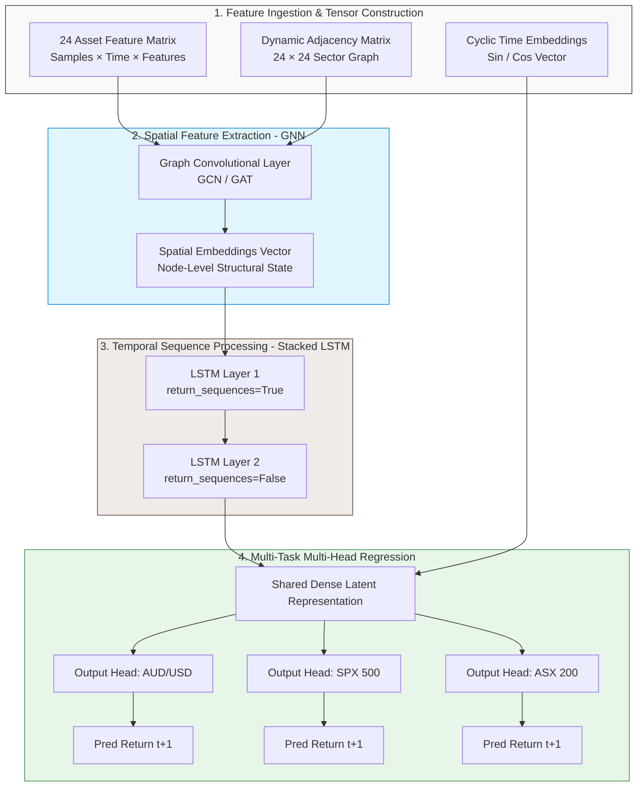
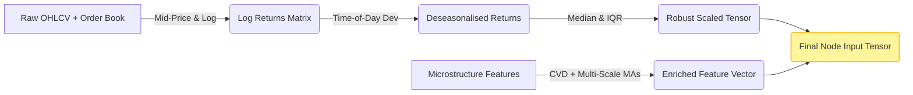
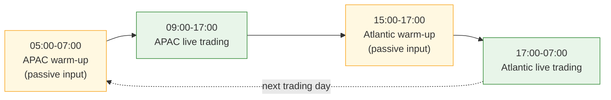
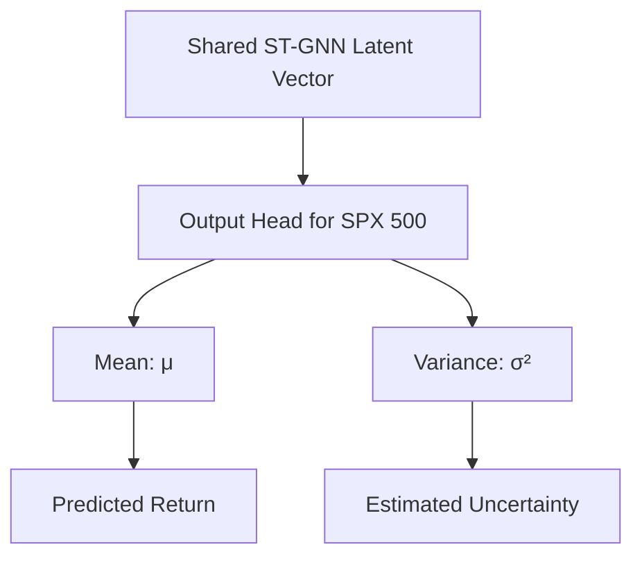
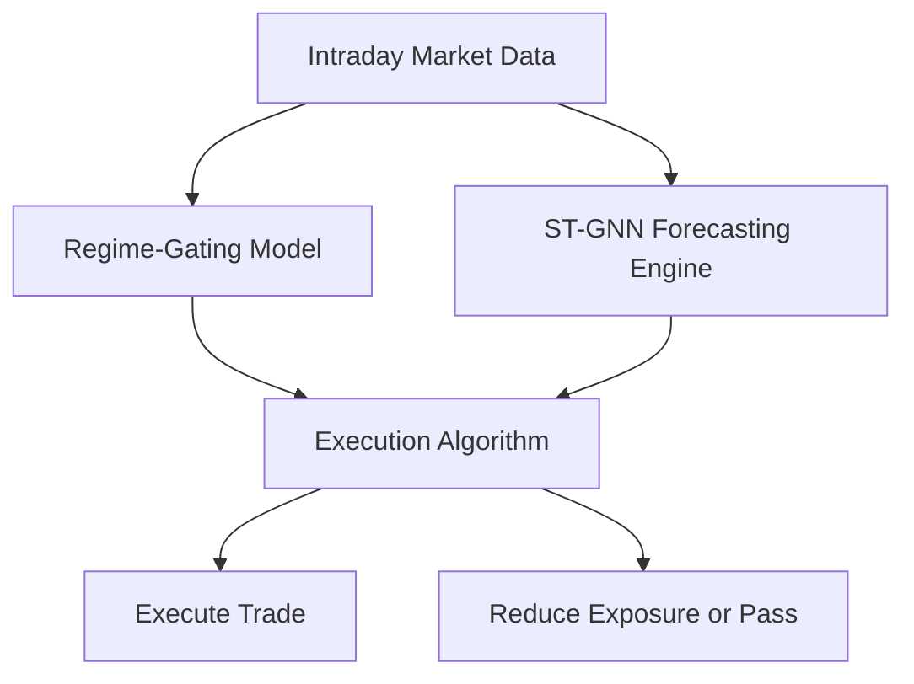
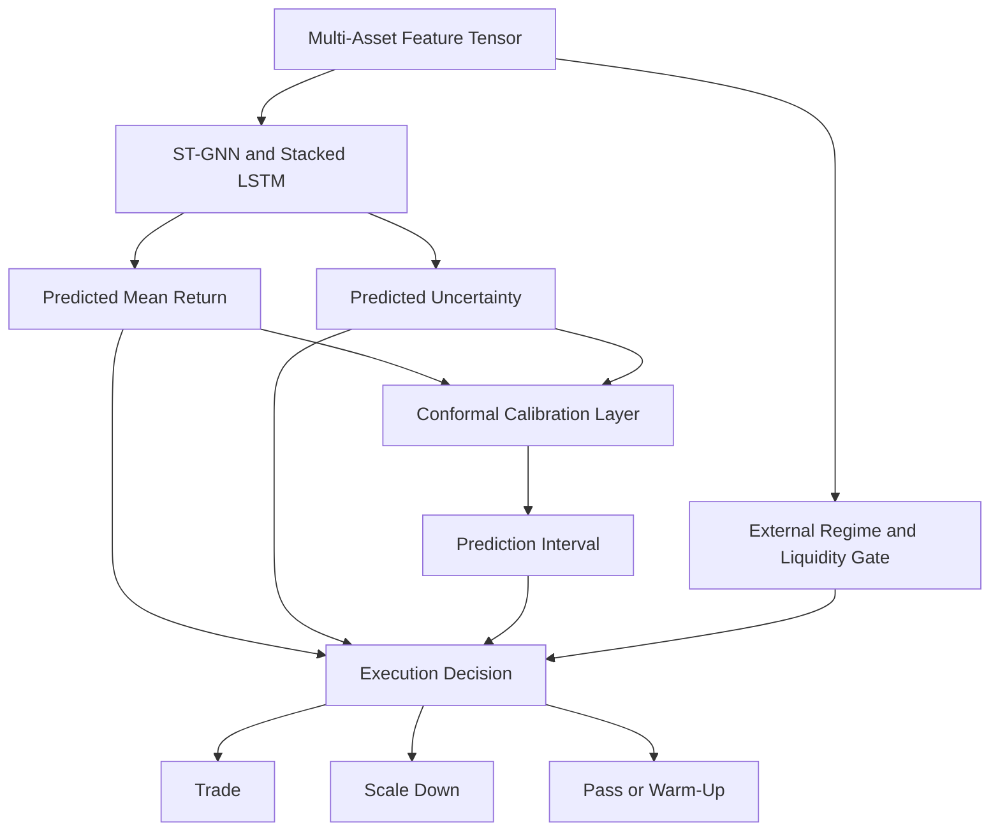
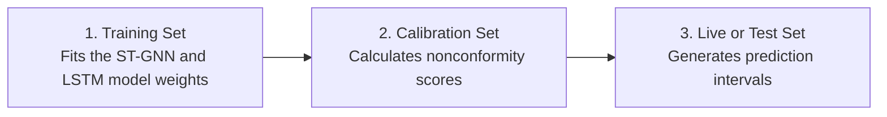

# Engineering Architecture Report: Spatio-Temporal Graph Neural Network & Stacked LSTM Framework for Multi-Asset Intraday Trading

---

## Executive Summary

This report outlines a deep learning framework designed to predict next-step log returns for a portfolio of 24 highly correlated global spot indices and major forex pairs.

Standard sequential architectures (like pure LSTMs) struggle to scale linearly when modeling large asset baskets due to a parameter explosion when tracking cross-asset correlations. Conversely, traditional statistical models fail to capture deep, non-linear temporal dynamics.

The proposed architecture solves these limitations by implementing a Spatio-Temporal Graph Neural Network (ST-GNN) combined with a Stacked Long Short-Term Memory (LSTM) network.

By treating the asset universe as a dynamic graph, the GNN isolates spatial cross-asset relationships, while the Stacked LSTM maps temporal momentum. To handle shifting global liquidity patterns without data contamination, the trading day is split into two specialized session models (APAC and Atlantic) that utilize an overlapping warm-up window.

---

## 1. Core Structural Architecture

The architecture models the asset universe as a dynamic graph $\mathcal{G} = (\mathcal{V}, \mathcal{E})$, where:

* **Nodes ($\mathcal{V}$):** The 24 tracked assets (spot indices and forex pairs).

* **Edges ($\mathcal{E}$):** The mathematical and structural linkages between those assets.

The network processes information in two distinct stages: spatial convolution (GNN) followed by temporal sequence learning (LSTM).

### Complete Network Data Flow



---

## 2. Intraday Data Massaging & Feature Engineering

Using raw, unadjusted 1-minute time bars introduces high kurtosis, extreme noise, and structural bias into deep learning architectures. The pipeline employs specific feature enrichment methods to mitigate these issues.

### Mathematical Pipeline and Tensor Shapes



### Proposed Inputs at Each Node (Feature Matrix Dimension)

Every node (asset) in the graph contains a feature vector consisting of 6 primary elements at each time step $t$:

1. Stationary Price Signal: Log Returns ($R_t = \ln(P_{\text{mid}, t} / P_{\text{mid}, t-1})$). Mid-price handles bid-ask bounces.
2. Deseasonalised Volatility Factor: $R_t / \sigma_{\text{minute}}$, where $\sigma_{\text{minute}}$ is the historical standard deviation for that specific minute of the trading day. This flattens the diurnal "U-shape" volatility curve.
3. Order Book Momentum: Cumulative Volume Delta (CVD). This metric captures net aggressive buying versus net aggressive selling inside the 1-minute bar to reveal hidden directional pressure.
4. Multi-Scale Trend Context: The ratio of the current price to the 1-hour Volume Weighted Average Price (VWAP) and 4-hour VWAP. This anchors the 1-minute bar within its broader macro trend.
5. Cyclic Time Embedding (Sin): $\sin(2\pi \cdot \text{Minute} / 1440)$.
6. Cyclic Time Embedding (Cos): $\cos(2\pi \cdot \text{Minute} / 1440)$.

---

## 3. Global Session Separation Strategy

To manage the shifting correlation structures and varying volatility regimes between Eastern and Western markets, the framework utilizes two distinct models. Rather than enforcing a hard boundary, an Overlapping Warm-Up Window is used to ensure temporal continuity.

### Session Lifecycle Handoff Architecture



### Operational Execution Protocols

#### 1. APAC Session Model (09:00–17:00 AEST)

* **Focus Assets:** ASX 200, Nikkei 225, Hang Seng, AUD/USD, NZD/USD, USD/JPY.

* **Graph State:** The GNN's adjacency matrix focuses heavily on regional Asian equity markets and commodities-linked currencies.

* **Warm-up:** Starts passively ingesting data at 05:00 AEST (during the late US session) to prime its LSTM hidden states before executing live trades at the 09:00 AEST Australian open.

#### 2. Atlantic Session Model (17:00–07:00 AEST)

* **Focus Assets:** DAX 40, FTSE 100, S&P 500, Nasdaq 100, EUR/USD, GBP/USD.

* **Graph State:** The GNN shifts its internal edge weights to reflect transatlantic treasury flows, index dependencies, and European liquidity pools.

* **Warm-up:** Starts passively ingesting data at 15:00 AEST (during the quiet Asian afternoon) to build market context prior to the London pre-open.

---

## 4. Multi-Asset Predictive Integrity

A common question in quantitative deep learning is whether predicting all 24 assets inside a single framework degrades individual performance compared to training 24 isolated models.

### Performance Mechanics: Shared vs. Isolated Networks

| Architecture Type | Structural Advantage | Major Operational Limitation | Risk of Overfitting |
|---|---|---|---|
| 24 Isolated Models | Tailored specifically to one asset's unique idiosyncrasies. | Zero visibility into cross-market lead-lag dynamics. | Extremely High. Prone to capturing noise instead of signal. |
| Unified ST-GNN Framework | Learns generalized market regimes and sector rotations. Shared weights provide regularisation. | Can introduce negative transfer if highly heterogeneous assets are mixed. | Low. Multi-task learning filters out asset-specific noise. |

### Architectural Mitigation via Multi-Head Node Regression

To prevent highly volatile assets from dominating the loss function, the system decouples its final layer.

After processing shared information through the GNN and Stacked LSTM layers, the single tensor branches out into 24 independent feedforward output heads. Each head is dedicated to a specific asset, allowing for customized linear scaling while retaining the benefits of shared feature extraction.

---

## 5. Architectural Caveats, Blind Spots & Production Risks

Before moving this framework into production, five specific engineering and market risks must be managed:

### 1. Data Leakage During Robust Scaling

* **The Trap:** Applying Robust Scaling or Z-score normalization across the entire dataset before splitting it into training and testing segments leaks future mean and variance metrics into the past.

* **The Solution:** The scaling parameters (Median and IQR) must be calculated on a rolling historical training window and applied out-of-sample forward.

### 2. Microstructure Noise and Virtual Liquidity

* **The Trap:** Forex spot prices sourced from standard retail brokers exhibit artificial "mean reversion" because of localized bid-ask bounces rather than genuine institutional order flow.

* **The Solution:** Use institutional-grade, volume-aggregated feeds (e.g., LMAX or Saxo Bank) and calculate all inputs based on the Mid-Price or VWAP, rather than the raw closing trade price.

### 3. Structural Graph Dissimilarity (Negative Transfer)

* **The Trap:** Forcing a currency pair like USD/CHF and an equity index like the Nasdaq 100 to share identical latent hidden features can degrade accuracy because they respond to fundamentally different economic drivers.

* **The Solution:** Implement a Multi-Relational Graph Neural Network (R-GNN). This framework uses distinct types of edges to separate equity-to-equity correlations from forex-to-index relationships.

### 4. Macroeconomic Regime Shifts

* **The Trap:** An ST-GNN model trained during a calm, low-volatility period will often generate inaccurate forecasts during a sudden macroeconomic event (e.g., an unexpected central bank interest rate decision).

* **The Solution:** Incorporate an explicit Volatility Regime Classifier or an adversarial loss component that forces the model to generate robust representations across both high-volatility and low-volatility conditions.

### 5. Overnight Session Gaps in Spot Indices

* **The Trap:** When cash index markets close, the underlying futures markets continue trading at lower liquidity volumes, which can create large pricing gaps at the opening bell.

* **The Solution:** Avoid cash index data feeds. Utilize continuous, 24-hour synthetic CFD or front-month futures contract data to maintain a continuous, uninterrupted time series.

---

## 6. Implementation Blueprint

For deployment, the following stack is recommended:

* **Graph Processing:** PyTorch Geometric (PyG) to construct the spatial graph layers.

* **Sequence Processing:** PyTorch LSTM modules to handle temporal learning.

* **Data Structures:** Custom DGL (Deep Graph Library) spatio-temporal data loaders to manage the `[nodes, time steps, features]` 3D tensor inputs.

Here is the complete implementation blueprint. Section 1 covers the mathematical design of the Dynamic Adjacency Matrix, and Section 2 provides the fully structured, production-ready PyTorch & PyG (PyTorch Geometric) script.

---

### 6.1 Designing the Dynamic Adaptive Adjacency Matrix

A static adjacency matrix (e.g., hardcoding a 1 if two stocks are in the same sector) is too rigid for intraday FX and Index markets. Correlations shift rapidly between the Asian open and the US close.

To solve this, we implement an Adaptive Spatial Graph Embedding. The model learns two low-dimensional node embedding matrices, $E_1$ and $E_2 \in \mathbb{R}^{N \times d}$ (where $N$ is the number of assets, and $d$ is a small bottleneck dimension, typically 10). The dynamic adjacency matrix $\mathcal{A}_{\text{dyn}}$ is generated directly during the forward pass:

$$\mathcal{A}_{\text{dyn}} = \text{Softmax}(\text{ReLU}(E_1 \cdot E_2^T))$$

### Why This Engine Wins

* **No Manual Correlation Input Needed:** You do not need to feed rolling Pearson correlation matrices into the model. The network discovers hidden lead-lag dynamics automatically via gradient descent.

* **Asymmetric Relationships Allowed:** Because \(E_1\) and \(E_2\) are distinct, \(\mathcal{A}_{i,j} \neq \mathcal{A}_{j,i}\). The network can natively learn that movements in the S&P 500, represented by node \(i\), strongly influence the AUD/USD pair, represented by node \(j\), while movements in AUD/USD may have little influence on the S&P 500.

---

### 6.2 Comprehensive PyTorch / PyG Script Template

This script constructs the spatial-temporal tensor, implements the adaptive graph generation layer, stacks the LSTM components, and routes them to multi-head node regression layers.

```python
import torch
import torch.nn as nn
import torch.nn.functional as F
from torch_geometric.nn import GCNConv

class AdaptiveSpatioTemporalGNN(nn.Module):
    """ST-GNN architecture for multi-asset intraday forecasting.

    Combines adaptive graph structures, GCN spatial convolution,
    stacked LSTMs, and multi-head output layers.
    """

    def __init__(
        self,
        num_nodes=24,
        in_features=6,
        seq_len=60,
        hidden_dim=64,
        node_emb_dim=10,
    ):
        super().__init__()

        self.num_nodes = num_nodes
        self.seq_len = seq_len
        self.hidden_dim = hidden_dim

        # 1. Learnable node embeddings for dynamic adjacency generation.
        self.node_emb1 = nn.Parameter(torch.randn(num_nodes, node_emb_dim))
        self.node_emb2 = nn.Parameter(torch.randn(num_nodes, node_emb_dim))

        # 2. Spatial graph convolution layer.
        self.spatial_gcn = GCNConv(
            in_channels=in_features,
            out_channels=hidden_dim,
        )

        # 3. Stacked temporal LSTM network.
        self.lstm_layer1 = nn.LSTM(
            input_size=hidden_dim,
            hidden_size=hidden_dim,
            num_layers=1,
            batch_first=True,
        )
        self.lstm_layer2 = nn.LSTM(
            input_size=hidden_dim,
            hidden_size=hidden_dim,
            num_layers=1,
            batch_first=True,
        )

        # 4. One dedicated regression head per asset node.
        self.output_heads = nn.ModuleList(
            [
                nn.Sequential(
                    nn.Linear(hidden_dim, 32),
                    nn.ReLU(),
                    nn.Linear(32, 1),
                )
                for _ in range(num_nodes)
            ]
        )

    def compute_adaptive_adjacency(self):
        """Generate a dynamic, directed adjacency matrix."""
        raw_affinity = torch.mm(
            self.node_emb1,
            self.node_emb2.transpose(0, 1),
        )
        return F.softmax(F.relu(raw_affinity), dim=-1)

    def forward(self, x):
        """Run the forward pass.

        Args:
            x: Tensor shaped [batch, nodes, sequence, features].

        Returns:
            Tensor shaped [batch, nodes] containing next-step predictions.
        """
        batch_size, num_nodes, time_steps, in_features = x.shape

        if num_nodes != self.num_nodes:
            raise ValueError(
                f"Expected {self.num_nodes} nodes, received {num_nodes}."
            )

        # Step A: Dynamically construct the graph structure.
        adj_matrix = self.compute_adaptive_adjacency()
        edge_index = adj_matrix.nonzero().t().contiguous()
        edge_weight = adj_matrix[edge_index[0], edge_index[1]]

        # Step B: Apply the GCN to each batch/time slice independently.
        x_spatial = x.permute(0, 2, 1, 3).reshape(
            batch_size * time_steps,
            num_nodes,
            in_features,
        )

        spatial_outputs = []
        for time_slice in x_spatial:
            spatial_node_features = self.spatial_gcn(
                time_slice,
                edge_index,
                edge_weight,
            )
            spatial_outputs.append(spatial_node_features)

        gcn_out = (
            torch.stack(spatial_outputs)
            .reshape(batch_size, time_steps, num_nodes, self.hidden_dim)
            .permute(0, 2, 1, 3)
        )

        # Step C: Process each node's sequence through the stacked LSTMs.
        x_temporal = gcn_out.reshape(
            batch_size * num_nodes,
            time_steps,
            self.hidden_dim,
        )
        lstm1_out, _ = self.lstm_layer1(x_temporal)
        _, (lstm2_final_hidden, _) = self.lstm_layer2(lstm1_out)

        latent_vectors = lstm2_final_hidden.squeeze(0).reshape(
            batch_size,
            num_nodes,
            self.hidden_dim,
        )

        # Step D: Route each node's latent vector through its own head.
        final_predictions = []
        for node_idx, output_head in enumerate(self.output_heads):
            node_latent = latent_vectors[:, node_idx, :]
            final_predictions.append(output_head(node_latent))

        return torch.cat(final_predictions, dim=-1)
```

#### Verification and Execution Test

```python
if __name__ == "__main__":
    # Structural verification parameters.
    batch_size = 8
    assets = 24
    lookback = 60
    inputs = 6

    # Construct a mock multi-asset intraday tensor.
    mock_input_tensor = torch.randn(batch_size, assets, lookback, inputs)

    # Initialize the network architecture.
    trading_model = AdaptiveSpatioTemporalGNN(
        num_nodes=assets,
        in_features=inputs,
        seq_len=lookback,
    )

    # Execute a forward pass.
    predicted_returns = trading_model(mock_input_tensor)

    print("Execution check successful!")
    print(
        f"Input shape: {list(mock_input_tensor.shape)} "
        "-> [batch, assets, time, features]"
    )
    print(
        f"Output shape: {list(predicted_returns.shape)} "
        "-> [batch, next-step predictions]"
    )
```

---

### 6.3 Operational Data Pipeline Verification Checks

Before connecting this script to a live pricing loop, run these verification steps on your input tensor `x`:
1. Verify Vector Shapes: Ensure your time series dataloader yields dimensions explicitly scaled to `[batch size, 24, 60, 6]`. Any inversion between the asset index and lookback sequences will result in incorrect spatial calculations during graph operations.
2. Prevent Look-Ahead Leakage: Confirm that your `edge_index` updates depend only on past historical states. If you compute node embeddings using information from the target prediction window $t+1$, the system will generate unrealistically high backtest accuracy that instantly breaks down in live trading.

Here is the cleaned Markdown, structured to match the previous document.

---

---

## 7. Confidence Estimation and Production Controls

Production-grade deep learning systems require more than a point forecast. They must also estimate uncertainty, detect unfamiliar market conditions, and determine when the execution layer should ignore a prediction.

Confidence can be extracted and managed at three levels:

1. Internal model uncertainty
2. External regime gating
3. Conformal prediction intervals

---

## 7.1 Internal Model Confidence

By default, the final linear layer in the PyTorch model produces a point estimate, such as a predicted next-step return of $+0.0012$.

A point estimate does not indicate how certain the model is. To estimate confidence internally, the output layer can be modified to predict a probability distribution rather than a single value.

### 7.1.1 Gaussian Maximum Likelihood Estimation

Instead of predicting one return value, each asset-specific output head predicts two parameters:

* Mean: $\mu$
* Variance: $\sigma^2$

The mean represents the expected return, while the variance represents the model's estimated uncertainty.



### Training Objective

The model is trained using a Gaussian Negative Log-Likelihood loss rather than standard Mean Squared Error.

For a target return $y$, predicted mean $\mu$, and predicted variance $\sigma^2$, the loss can be expressed as:

$$\mathcal{L}_{\text{NLL}} = \frac{1}{2} \left[ \log(\sigma^2) + \frac{(y-\mu)^2}{\sigma^2} \right]$$

A small predicted variance indicates that the model believes its forecast is precise. A large predicted variance indicates that the model considers the forecast uncertain.

### Execution Interpretation

Suppose the model predicts:

$$\mu = +0.02$$

If the associated variance is high:

$$\sigma^2 = 0.50$$

the execution algorithm should treat the forecast as low confidence and reduce the position size.

If the variance is comparatively small:

$$\sigma^2 = 0.01$$

the forecast is more concentrated, and the execution layer may permit a larger position, subject to the remaining risk controls.

---

### 7.1.2 Monte Carlo Dropout

Monte Carlo Dropout estimates uncertainty without requiring a probabilistic output head.

Dropout layers normally deactivate random neurons during training to reduce overfitting. Under Monte Carlo Dropout, dropout remains active during inference.

### Inference Procedure

For each input tensor:

1. Keep dropout enabled.
2. Run the same input through the model multiple times.
3. Collect the resulting predictions.
4. Calculate their mean and standard deviation.

For example, the system may perform 50 forward passes for the same 1-minute input window:

$$\hat{y}^{(1)}, \hat{y}^{(2)}, \ldots, \hat{y}^{(50)}$$

The final prediction is the sample mean:

$$\bar{y} = \frac{1}{K} \sum_{k=1}^{K} \hat{y}^{(k)}$$

The uncertainty estimate is the sample standard deviation:

$$s = \sqrt{ \frac{1}{K-1} \sum_{k=1}^{K} \left( \hat{y}^{(k)}-\bar{y} \right)^2 }$$

### Confidence Interpretation

* Tightly clustered predictions indicate higher confidence.
* Widely dispersed predictions indicate higher uncertainty.
* A sudden increase in prediction dispersion may indicate an unfamiliar market pattern or a regime shift.

The execution system can reduce exposure or decline the trade when the Monte Carlo standard deviation exceeds a predefined threshold.

---

## 7.2 External Regime Gating

A neural network should not be trusted solely because it reports high internal confidence.

Deep learning systems can remain highly confident when presented with market conditions that differ substantially from their training distribution. For this reason, production trading systems commonly use an independent regime-gating model.

The gating model acts as an operational engage or disengage switch for the ST-GNN.



### 7.2.1 Hidden Markov Models and Gaussian Mixture Models

A separate statistical model, such as a Hidden Markov Model or Gaussian Mixture Model, can be trained on market-state variables rather than directional return targets.

Potential regime features include:

* Implied volatility levels
* Realized volatility
* Rolling cross-asset correlations
* Bid-ask spreads
* Order-book depth
* Time-of-day volatility
* Liquidity measures
* Market-session indicators

The regime model may classify the market into states such as:

| Regime   | Description                   | Example Execution State      |
| -------- | ----------------------------- | ---------------------------- |
| Regime 0 | Quiet and mean-reverting      | Normal execution             |
| Regime 1 | High-volatility trend         | Reduced or adjusted exposure |
| Regime 2 | Illiquid or disorderly market | Trading disabled             |
| Regime 3 | Session transition            | Passive warm-up mode         |

### Operational Guardrail

If the gating model identifies a regime in which the ST-GNN has historically underperformed, it can override the neural network.

This override should apply even when the ST-GNN reports high internal confidence.

The regime gate can control:

* Whether trading is enabled
* Maximum permitted position size
* Required confidence threshold
* Minimum liquidity
* Maximum spread
* Permitted asset groups
* Session-specific execution rules

---

## 7.3 Conformal Prediction

Conformal Prediction is a post-processing framework that converts point forecasts into prediction intervals.

Rather than predicting only:

$$\hat{y} = 0.05\\%$$

the system produces an interval such as:

$$[0.02\\%, 0.08\\%]$$

The interval is calibrated to achieve a specified empirical coverage level, such as 95%, under the assumptions of the chosen conformal method.

### Calibration Process

Conformal Prediction uses a separate calibration dataset that was not used to train the model.

For each calibration observation, the system calculates a nonconformity score, such as the absolute forecast error:

$$s_i = \left| y_i-\hat{y}_i \right|$$

A selected quantile of these calibration errors is then used to construct the prediction interval:

$$
[\hat{y}\_{t\+1} - q, \hat{y}\_{t\+1} + q]
$$

Here, $q$ is the calibrated nonconformity threshold.

### Why It Is Useful for Trading

Conformal intervals respond to recent forecast errors.

When volatility increases or model accuracy deteriorates:

* Calibration errors increase.
* Prediction intervals widen.
* Fewer trades satisfy the execution threshold.
* The strategy naturally becomes more selective.

### Execution Logic

Assume the strategy requires a minimum expected return of $0.03\\%$ to cover transaction costs and execution risk.

A trade may be permitted when the entire interval exceeds the threshold:

$$[0.04\\%, 0.08\\%]$$

A trade should normally be rejected when the interval crosses zero:

$$[-0.01\\%, 0.06\\%]$$

It should also be rejected when only part of the interval exceeds the cost threshold:

$$[0.01\\%, 0.05\\%]$$

This prevents the system from trading solely because the point estimate appears attractive.

---

## 7.4 Combined Production Architecture

A robust multi-asset system should combine internal uncertainty estimates with external market-state controls.



The execution decision can be based on all of the following:

* Expected return
* Predicted variance
* Monte Carlo Dropout dispersion
* Conformal prediction interval
* Current market regime
* Available liquidity
* Bid-ask spread
* Transaction-cost threshold
* Session state
* Asset-specific risk limits

---

## 7.5 Recommended Production Standard

For the 24-asset index and FX framework, a practical implementation should use a layered confidence architecture.

### Internal Confidence Layer

Use Gaussian Maximum Likelihood output heads so that every asset predicts:

$$\mu_i, \sigma_i^2$$

where:

* $\mu_i$ is the expected next-step return for asset $i$
* $\sigma_i^2$ is the predicted uncertainty for asset $i$

### Calibration Layer

Apply Conformal Prediction to recent out-of-sample residuals so that every forecast is accompanied by an empirically calibrated prediction interval.

### External Control Layer

Apply an independent volatility, liquidity, and regime filter.

The filter should override the neural network when:

* Liquidity falls below a minimum threshold.
* Bid-ask spreads widen excessively.
* A major central-bank announcement is approaching.
* Cross-asset correlations become unstable.
* The system enters a session handoff period.
* Recent model residuals exceed their permitted range.
* The detected regime falls outside the model's validated operating conditions.

During these periods, the framework should enter one of the following states:

* Normal execution
* Reduced exposure
* Passive warm-up
* Trading disabled

---

## 7.6 Confidence-Aware Position Sizing

Confidence should affect position sizing rather than serving only as a binary trade filter.

A simplified confidence-adjusted signal can be defined as:

$$z_i = \frac{\mu_i}{\sigma_i + \epsilon}$$

where:

* $\mu_i$ is the predicted return
* $\sigma_i$ is the predicted standard deviation
* $\epsilon$ prevents division by zero

The execution system can then scale the position according to the magnitude of $z_i$:

$$w_i = \operatorname{clip} \left( k z_i, -w_{\max}, w_{\max} \right)$$

where:

* $k$ is a risk-scaling coefficient
* $w_{\max}$ is the maximum permitted asset exposure
* $w_i$ is the final target position

This allows the same directional forecast to produce different trade sizes depending on the associated uncertainty.

---

## 7.7 Key Production Principle

Confidence should never be sourced from a single metric.

A production-grade decision should combine:

1. Model-reported uncertainty
2. Recent out-of-sample calibration performance
3. Independent regime classification
4. Liquidity and transaction-cost constraints
5. Portfolio-level risk limits

The ST-GNN should therefore be treated as a forecasting component inside a wider risk-controlled execution architecture, rather than as an autonomous trading decision-maker.

---

## 8. Conformal Prediction for Return Intervals

Conformal Prediction converts a standard machine learning point estimate into a calibrated prediction interval.

It can be applied to nearly any regression model, including the Spatio-Temporal GNN and Stacked LSTM framework, without requiring a specific parametric distribution for forecast errors.

The method measures how inaccurate, or *non-conforming*, the model has been on unseen calibration data. It then uses those historical errors to construct boundaries around future predictions.

Under the appropriate exchangeability assumptions, the resulting intervals provide finite-sample marginal coverage at a user-defined level.

For intraday financial time series, those assumptions may be weakened by serial dependence and regime changes. Production implementations should therefore use rolling calibration windows, time-aware conformal methods, or adaptive conformal techniques.

---

## 8.1 The Three Operational Data Splits

To construct conformal prediction intervals without contaminating the evaluation process, the historical data pipeline must be divided into three distinct segments.



| Dataset          | Primary Purpose                        | Permitted Use                                   |
| ---------------- | -------------------------------------- | ----------------------------------------------- |
| Training set     | Train the base forecasting model       | Model fitting and hyperparameter development    |
| Calibration set  | Measure out-of-sample forecast errors  | Conformal threshold estimation                  |
| Live or test set | Evaluate or execute unseen predictions | Final interval generation and trading decisions |

The calibration set must not be used to update the base model after the nonconformity scores have been calculated unless the calibration procedure is also restarted.

---

## 8.2 Step-by-Step Mathematical Calculation

The following procedure describes split conformal prediction for a regression task such as next-step intraday log-return forecasting.

### 8.2.1 Step 1: Choose the Target Coverage Level

Define the desired marginal coverage level:

$$1-\alpha$$

where $\alpha$ is the permitted error rate.

For example, a target coverage level of 95% uses:

$$\alpha = 0.05$$

Under the required conformal assumptions, this means the generated interval is designed to contain the true future value with marginal probability of at least:

$$1-\alpha = 0.95$$

This does not mean that every rolling group of 100 financial predictions will contain exactly 95 correct intervals. The guarantee applies marginally across draws satisfying the conformal assumptions.

---

### 8.2.2 Step 2: Compute Calibration Nonconformity Scores

Pass the unseen calibration dataset through the already-trained ST-GNN model.

For each calibration observation $i$, calculate an absolute-error nonconformity score:

$$s_i = \left| y_i-\hat{y}_i \right|$$

where:

* $y_i$ is the observed log return for calibration sample $i$
* $\hat{y}_i$ is the model's point-estimate prediction
* $s_i$ is the corresponding nonconformity score

For a calibration set containing $n$ observations, the process produces:

$$s_1, s_2, \ldots, s_n$$

If the calibration dataset contains 1,000 time steps, the system calculates 1,000 nonconformity scores.

---

### 8.2.3 Step 3: Calculate the Quantile Threshold

Sort the calibration scores from smallest to largest:

$$s_{(1)} \leq s_{(2)} \leq \cdots \leq s_{(n)}$$

The finite-sample conformal rank is:

$$k = \left\lceil (n+1)(1-\alpha) \right\rceil$$

The conformal threshold is then selected as:

$$\hat{q} = s_{(k)}$$

When $k > n$, the threshold may be treated as infinite or handled according to the implementation's finite-sample convention.

An equivalent quantile level is:

$$\frac{\left\lceil (n+1)(1-\alpha) \right\rceil}{n}$$

using a higher-order empirical quantile rule.

### Example

Suppose:

$$n=999$$

and:

$$\alpha=0.05$$

Then:

$$k = \left\lceil (999+1)(0.95) \right\rceil = 950$$

The threshold is therefore the 950th smallest calibration error, not the 950th largest.

If:

$$s_{(950)}=0.0042$$

then:

$$\hat{q}=0.0042$$

---

### 8.2.4 Step 4: Construct the Live Prediction Interval

When the production model generates a new point estimate:

$$\hat{y}_{\text{new}}$$

construct a symmetric conformal interval:

$$\mathcal{C}_{\text{new}} = \left[ \hat{y}_{\text{new}}-\hat{q}, \; \hat{y}_{\text{new}}+\hat{q} \right]$$

For example, if:

$$\hat{y}_{\text{new}}=0.0015$$

and:

$$\hat{q}=0.0008$$

then:

$$\mathcal{C}_{\text{new}} = [0.0007, \; 0.0023]$$

---

## 8.3 Context-Aware Conformal Prediction

Basic split conformal regression produces a fixed-width interval.

If:

$$\hat{q}=0.0042$$

then every prediction receives a band of:

$$\pm 0.0042$$

This can be unsuitable for intraday trading because expected forecast uncertainty changes materially across:

* Quiet midday trading
* Market opens
* Session handoffs
* Macroeconomic announcements
* Volatility shocks
* Illiquid overnight periods

A context-aware implementation can combine Gaussian Maximum Likelihood output heads with normalized conformal scores.

---

### 8.3.1 Predict Conditional Scale

Modify each ST-GNN output head to predict:

* Expected return: $\hat{\mu}_i$
* Estimated standard deviation: $\hat{\sigma}_i$

The output for each asset becomes:

$$\hat{\mu}_i,\hat{\sigma}_i$$

The standard deviation must remain positive. A common implementation predicts a raw scale parameter and transforms it using a positive activation such as `softplus`.

---

### 8.3.2 Calculate Normalized Nonconformity Scores

For each calibration sample, calculate:

$$s_i = \frac{ \left| y_i-\hat{\mu}_i \right| }{ \hat{\sigma}_i+\epsilon }$$

where $\epsilon$ is a small numerical-stability constant.

These scores measure forecast error relative to the uncertainty predicted by the model.

---

### 8.3.3 Calculate the Scaled Quantile

Sort the normalized scores and calculate the conformal threshold:

$$\hat{q} = \operatorname{Quantile}_{1-\alpha} \left( s_1,\ldots,s_n \right)$$

using the finite-sample higher-rank correction described previously.

---

### 8.3.4 Generate a Dynamic Live Interval

For a new prediction, construct:

$$\mathcal{C}_{\text{new}} = \left[ \hat{\mu}_{\text{new}} - \hat{q}\hat{\sigma}_{\text{new}}, \; \hat{\mu}_{\text{new}} + \hat{q}\hat{\sigma}_{\text{new}} \right]$$

When the model estimates high uncertainty:

$$\hat{\sigma}_{\text{new}} \uparrow$$

the interval widens.

When the model estimates low uncertainty:

$$\hat{\sigma}_{\text{new}} \downarrow$$

the interval narrows.

This produces volatility-sensitive prediction bands rather than a constant-width interval.

---

## 8.4 Production Implementation Example

The following Python example calculates a split-conformal threshold and applies it to a live prediction.

```python
from __future__ import annotations

from typing import Tuple

import numpy as np
from numpy.typing import ArrayLike, NDArray

def calculate_conformal_threshold(
    calib_true: ArrayLike,
    calib_pred: ArrayLike,
    alpha: float = 0.05,
) -> float:
    """
    Calculate a split-conformal absolute-error threshold.

    Args:
        calib_true:
            Observed values from the calibration dataset.
        calib_pred:
            Point predictions for the calibration dataset.
        alpha:
            Target miscoverage rate. For example, alpha=0.05 requests
            a nominal 95% marginal coverage level.

    Returns:
        The finite-sample conformal error threshold.

    Raises:
        ValueError:
            If the arrays have different shapes, contain no observations,
            contain non-finite values, or alpha is outside (0, 1).
    """
    true_values: NDArray[np.float64] = np.asarray(
        calib_true,
        dtype=np.float64,
    )
    predictions: NDArray[np.float64] = np.asarray(
        calib_pred,
        dtype=np.float64,
    )

    if true_values.shape != predictions.shape:
        raise ValueError(
            "calib_true and calib_pred must have identical shapes."
        )

    if true_values.size == 0:
        raise ValueError("Calibration arrays must not be empty.")

    if not np.all(np.isfinite$true_values$):
        raise ValueError$"calib_true contains non-finite values."$

    if not np.all(np.isfinite(predictions)):
        raise ValueError$"calib_pred contains non-finite values."$

    if not 0.0 < alpha < 1.0:
        raise ValueError("alpha must be strictly between 0 and 1.")

    scores = np.abs$true_values - predictions$.reshape(-1)
    n_calibration = scores.size

    quantile_level = np.ceil(
        $n_calibration + 1$ * $1.0 - alpha$
    ) / n_calibration

    quantile_level = min$quantile_level, 1.0$

    q_hat = np.quantile(
        scores,
        quantile_level,
        method="higher",
    )

    return float$q_hat$

def generate_live_conformal_interval(
    live_prediction: float,
    q_hat: float,
) -> Tuple[float, float]:
    """
    Construct a symmetric conformal prediction interval.

    Args:
        live_prediction:
            Point prediction produced by the forecasting model.
        q_hat:
            Non-negative conformal calibration threshold.

    Returns:
        A tuple containing the lower and upper interval bounds.

    Raises:
        ValueError:
            If either input is non-finite or q_hat is negative.
    """
    if not np.isfinite$live_prediction$:
        raise ValueError$"live_prediction must be finite."$

    if not np.isfinite$q_hat$:
        raise ValueError$"q_hat must be finite."$

    if q_hat < 0.0:
        raise ValueError$"q_hat must be non-negative."$

    lower_bound = live_prediction - q_hat
    upper_bound = live_prediction + q_hat

    return lower_bound, upper_bound

if __name__ == "__main__":
    random_generator = np.random.default_rng(seed=42)

    # Simulate 1,000 out-of-sample 1-minute calibration targets.
    mock_calib_true = random_generator.normal(
        loc=0.0,
        scale=0.002,
        size=1_000,
    )

    # Add artificial model error to create calibration predictions.
    mock_calib_pred = mock_calib_true + random_generator.normal(
        loc=0.0,
        scale=0.0005,
        size=1_000,
    )

    # Calculate the nominal 95% conformal threshold.
    q_threshold = calculate_conformal_threshold(
        calib_true=mock_calib_true,
        calib_pred=mock_calib_pred,
        alpha=0.05,
    )

    # Simulate the next live ST-GNN return forecast.
    live_pred_return = 0.0015

    lower_bound, upper_bound = generate_live_conformal_interval(
        live_prediction=live_pred_return,
        q_hat=q_threshold,
    )

    print(
        "Calculated conformal threshold "
        f"$q_hat$: {q_threshold:.6f}"
    )
    print(
        "Live nominal 95% return interval: "
        f"[{lower_bound:.6f}, {upper_bound:.6f}]"
    )
```

---

## 8.5 Adaptive Conformal Implementation

The normalized version can be implemented by scaling calibration residuals using the predicted standard deviation.

```python
from __future__ import annotations

from typing import Tuple

import numpy as np
from numpy.typing import ArrayLike, NDArray

def calculate_scaled_conformal_threshold(
    calib_true: ArrayLike,
    calib_mean: ArrayLike,
    calib_std: ArrayLike,
    alpha: float = 0.05,
    epsilon: float = 1e-8,
) -> float:
    """
    Calculate a normalized conformal threshold using predicted scale.
    """
    true_values: NDArray[np.float64] = np.asarray(
        calib_true,
        dtype=np.float64,
    )
    predicted_means: NDArray[np.float64] = np.asarray(
        calib_mean,
        dtype=np.float64,
    )
    predicted_stds: NDArray[np.float64] = np.asarray(
        calib_std,
        dtype=np.float64,
    )

    if not (
        true_values.shape
        == predicted_means.shape
        == predicted_stds.shape
    ):
        raise ValueError(
            "Calibration arrays must have identical shapes."
        )

    if true_values.size == 0:
        raise ValueError("Calibration arrays must not be empty.")

    if not 0.0 < alpha < 1.0:
        raise ValueError("alpha must be strictly between 0 and 1.")

    if epsilon <= 0.0:
        raise ValueError("epsilon must be positive.")

    if np.any$predicted_stds < 0.0$:
        raise ValueError(
            "Predicted standard deviations must be non-negative."
        )

    if not all(
        np.all(np.isfinite(values))
        for values in (
            true_values,
            predicted_means,
            predicted_stds,
        )
    ):
        raise ValueError(
            "Calibration arrays must contain only finite values."
        )

    scaled_scores = (
        np.abs$true_values - predicted_means$
        / $predicted_stds + epsilon$
    ).reshape(-1)

    n_calibration = scaled_scores.size

    quantile_level = np.ceil(
        $n_calibration + 1$ * $1.0 - alpha$
    ) / n_calibration

    quantile_level = min$quantile_level, 1.0$

    q_hat = np.quantile(
        scaled_scores,
        quantile_level,
        method="higher",
    )

    return float$q_hat$

def generate_scaled_conformal_interval(
    predicted_mean: float,
    predicted_std: float,
    q_hat: float,
) -> Tuple[float, float]:
    """
    Construct a volatility-scaled conformal interval.
    """
    if predicted_std < 0.0:
        raise ValueError(
            "predicted_std must be non-negative."
        )

    values = $predicted_mean, predicted_std, q_hat$

    if not all(np.isfinite(value) for value in values):
        raise ValueError("All inputs must be finite.")

    if q_hat < 0.0:
        raise ValueError$"q_hat must be non-negative."$

    interval_width = q_hat * predicted_std

    lower_bound = predicted_mean - interval_width
    upper_bound = predicted_mean + interval_width

    return lower_bound, upper_bound
```

---

## 8.6 Execution Logic

The conformal interval can be used to reject trades whose expected return is not sufficiently separated from transaction costs and zero.

Assume the strategy requires a minimum net expected return of:

$$c=0.0010$$

where $c$ represents commissions, spreads, slippage, and the required safety margin.

### Long Entry Rule

Permit a long trade only when:

$$\text{Lower Bound}>c$$

For an interval:

$$[0.0012, \; 0.0028]$$

the long trade may proceed because the entire interval exceeds the required return threshold.

For an interval:

$$[0.0004, \; 0.0026]$$

the trade should be rejected because the lower bound does not cover the required cost threshold.

---

### Short Entry Rule

Permit a short trade only when:

$$\text{Upper Bound}<-c$$

For an interval:

$$[-0.0030, \; -0.0014]$$

the short trade may proceed.

For an interval:

$$[-0.0022, \; -0.0003]$$

the trade should be rejected because the entire interval does not exceed the negative cost threshold.

---

### Zero-Crossing Rule

If the interval contains zero:

$$\text{Lower Bound} \leq 0 \leq \text{Upper Bound}$$

the direction of the next return remains uncertain.

The default execution action should therefore be:

$$\text{Stay Flat}$$

---

## 8.7 Example Execution Filter

```python
from __future__ import annotations

from enum import Enum

class TradeDecision(str, Enum):
    LONG = "long"
    SHORT = "short"
    PASS = "pass"

def evaluate_conformal_trade(
    lower_bound: float,
    upper_bound: float,
    minimum_return: float,
) -> TradeDecision:
    """
    Convert a conformal interval into a directional trade decision.
    """
    if lower_bound > upper_bound:
        raise ValueError(
            "lower_bound must not exceed upper_bound."
        )

    if minimum_return < 0.0:
        raise ValueError(
            "minimum_return must be non-negative."
        )

    if lower_bound > minimum_return:
        return TradeDecision.LONG

    if upper_bound < -minimum_return:
        return TradeDecision.SHORT

    return TradeDecision.PASS
```

---

## 8.8 Production Considerations for Financial Time Series

Standard split conformal prediction assumes that calibration and future observations are exchangeable.

Intraday financial data commonly violates this assumption because of:

* Serial dependence
* Volatility clustering
* Structural breaks
* Intraday seasonality
* Session transitions
* Changing market microstructure
* Macroeconomic regime shifts

A production implementation should therefore consider:

1. Rolling calibration windows
2. Session-specific calibration sets
3. Asset-specific thresholds
4. Exponentially weighted calibration scores
5. Adaptive conformal inference
6. Block-based or time-series conformal methods
7. Coverage monitoring by asset and regime
8. Automatic execution shutdown when empirical coverage deteriorates

The system should continuously compare the nominal coverage level with realised out-of-sample coverage.

For a nominal target of 95%, a sustained realised coverage materially below 95% indicates that the calibration distribution no longer represents the live market environment.

---

## 8.9 Recommended Multi-Asset Configuration

For the 24-asset ST-GNN framework, conformal thresholds should not automatically be pooled across every asset.

A preferable hierarchy is:

* Asset-specific calibration where sufficient data is available
* Asset-class calibration for sparse instruments
* Session-specific calibration for APAC and Atlantic models
* Regime-specific calibration where adequate observations exist
* A global fallback threshold for operational continuity

This prevents a high-volatility instrument from producing excessively wide intervals for lower-volatility assets.

The final interval for asset $i$ at time (t) may therefore depend on:

$$\hat{\mu}\_{i,t}, \quad \hat{\sigma}\_{i,t}, \quad \hat{q}\_{i,s,r}$$

where:

* $i$ identifies the asset
* $s$ identifies the active trading session
* $r$ identifies the detected market regime
* $\hat{q}_{i,s,r}$ is the corresponding calibrated threshold

The resulting interval is:

$$\mathcal{C}\_{i,t} = \left[ \hat{\mu}\_{i,t} - \hat{q}\_{i,s,r}\hat{\sigma}\_{i,t}, \; \hat{\mu}\_{i,t} + \hat{q}\_{i,s,r}\hat{\sigma}\_{i,t} \right]$$

This produces prediction intervals that adapt to the asset, session, regime, and current forecast uncertainty.